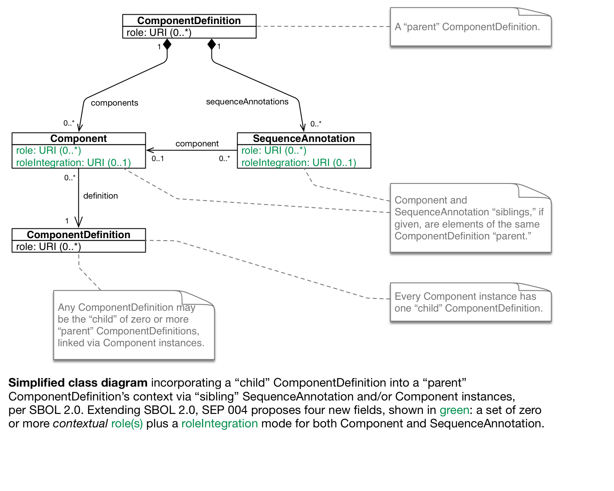

SEP 004 -- Add contextual role properties to SequenceAnnotation and Component
===================================
SEP                   | 004
----------------------|--------------
**Title**             | Add contextual role properties to SequenceAnnotation and Component
**Authors**           | Mike Bissell (bissell at amyris.com), Chris Macklin (macklin at amyris.com), Raik Gruenberg (raik dot gruenberg at gmail)
**Editor**            | Bryan Bartley
**Type**              | Data Model
**SBOL Version**      | 2.1.0
**Replaces**          |
**Status**            | Draft
**Created**           | 10-Oct-2015
**Last modified**     | 11-Aug-2016

Abstract
--------

We propose adding optional `roles` fields to both `SequenceAnnotation` and
`Component`. `SequenceAnnotation` and `Component` will each contain a set of
zero or more `role` members, which we call "contextual roles." Contextual roles
will allow users to specify the actual role(s) of a subcomponent or subsequence
in the context of a design.

SBOL already permits roles on `ComponentDefinition` instances, however the
declared roles that were originally imagined and encoded by the author of a
`ComponentDefinition` may not accurately reflect the roles of that
part in every biological and operational context. In practice, context often
takes precedence in the determination of a part's actual roles. For example, a
DNA sequence encoding a protein purification tag might, in a particular design,
be used merely as a benign spacer between two DNA elements.

1. Rationale
------------

### 1.1 Background: Roles Per SBOL 2.0

In [SBOL] 2.0, a non-contextual `roles` field already belongs to
`ComponentDefinition`. This optional field classifies an entity's *declared*
function(s) at the time of design. Roles *may* specify biological function, in
which case the roles *should* come from Table 3 (Sequence Ontology) if possible,
however [SBOL] does not strictly limit the application of roles to *biological*
ontologies. A `role` simply links the given `ComponentDefinition` to a term from
an external ontology.

### 1.2 Argument: Context Matters

Note, however, that in the context of a larger design, the *actual purpose* of
this `ComponentDefinition` may be rather different from that which was intended;
the original authors of a `ComponentDefinition` record cannot foresee all
possible applications of a biological part. In fact, outside of a host context,
a part in isolation most likely will fail to play its declared biological roles.
Moreover, genetic designers may want to annotate functions of a sequence that
are only locally relevant to their particular experiment or a specific
fabrication step. Consider, for example, sequences required in DNA assembly and
quality control, where the same DNA sequence could serve different purposes in
different locations of a design, or in different steps of an assembly workflow.

Importantly, when implementing a construction and testing service, or when
implementing genetic CAD software and the underlying genetic compilers, it
may become necessary to flag subcomponents in a design not only according to
their biological function, but also with non-biological classifications that
describe each subcomponent's logical role in each *specific assembly*.

During the automated planning of construction recipes, the intended biological
function of a physically isolated subcomponent is largely irrelevant, but it
may become necessary to classify logistical and compositional relationships in
order to manage the flow of templates, host strains, construction reagents,
and output products through a construction workflow. For example, a planning
algorithm might decide that one `Component` incorporating a PCR primer's
`ComponentDefinition` is to be implemented by ordering an oligo from a
particular vendor, while a second such `Component` is to be implemented by
retrieving an existing sample from inventory.

During computer aided design and compilation, certain algorithms may care about
the local, logical or compositional role of an entity while deliberately
ignoring its planned biological function in finished assemblies. Since modular
subcomponents are typically intended for reuse in multiple finished assemblies,
these subcomponents' eventual logical or biological roles may not even be
determined at the time of design or compilation, however the genetic compiler
will still need to classify subcomponents' relationships to various intermediate
build products containing them.

In both scenarios, non-biological roles are important because a subcomponent has
no relevant biological activity in isolation, during design and construction.
Therefore, contextual roles are needed.

### 1.3 Terminology and Model

According to [SBOL], a hierarchical affiliation of ComponentDefinitions may take
the following form. Please note how this SEP applies the position-relative
labels "parent," "child," and "sibling" in the context of the argument below.

(Additionally note that the UML notation in this class diagram employs a dialect
of UML 2.5. The UML class diagrams in [SBOL] use their own dialect. If this SEP
is approved, we assume that the SBOL editors will merge its contents into the
specification as needed, but not necessarily verbatim.)

### 1.4 Argument for Both Component.roles and SequenceAnnotation.roles

We propose to add contextual roles in two places: `Component` and
`SequenceAnnotation`.

Adding an optional `roles` field to `Component` will allow users to describe the
subcomponent's actual design purpose(s) with respect to the current assembly,
without reference to the specific details of its parent's sequence (if that
sequence is even known yet).

Adding an optional `roles` field to `SequenceAnnotation` will allow users to
describe the design purpose(s) of a subsequence and an optional subcomponent in
the context of a parent sequence, with respect to a specific location in that
sequence.

It is insufficient to put `roles` only on `SequenceAnnotation`; `roles` are
additionally needed on `Component`. There are two reasons. First, not all roles
pertain to a specific parent sequence or to a particular location on that
sequence. Second, SequenceAnnotations *must* refer to a sequence, but a parent
sequence is not always known at every moment in the lifetime of a design. For
instance, genetic compilers often compute the sequences of a parent assembly
from the sequences of its children in a bottom-up fashion. In this case, the
parent sequence would not be determined until the final compilation step, even
though the contextual roles of its subcomponents would have been determined
earlier in the build. Compilation of the parent ComponentDefinition's sequence
might even be deferred until later, when the host context is finally determined.
Between the time that the subcomponents were compiled and the moment of the
parent's compilation, subcomponents' *contextual* roles must be conveyed through
the compiler toolchain, and we propose that `Component.roles` is the
appropriate vehicle.

It is insufficient to put `roles` only on `Component`; `roles` are additionally
needed on `SequenceAnnotation`. There are, again, two reasons. First, when it is
possible to map a subcomponent with some contextual `role` (say, the promoter
http://identifiers.org/so/SO:0000167) onto a *specific location* in a parent
sequence, then users will want to do that. Only `SequenceAnnotation` gives us
that ability; `Component` does not refer to parent sequence details. Secondly,
users may choose not to model every aspect of a `ComponentDefinition`
hierarchically (using Components to link in sub-ComponentDefinitions), but our
users may still wish to annotate the genetic details of a ComponentDefinition's
sequence. For example, the user might tag one subsequence as an RBS, and another
sequence as a start codon, without making separate, heavyweight `Component` and
`ComponentDefinition` elements for the RBS and the start codon.

2. Specification
----------------

We specify the contents of `SequenceAnnotation.roles` and `Component.roles` in
analogy to `Participation.roles` ([SBOL] 7.9.4) and `ComponentDefinition.roles`
([SBOL] 7.1). We additionally specify the optional fields
`SequenceAnnotation.roleIntegration` and `Component.roleIntegration`.
Integration rules specify how to resolve
potential conflicts between competing sets of roles.

### 2.1.0 Component.roles

The `Component.roles` property comprises an OPTIONAL set of zero or more
URIs describing the purpose or potential function of a given child
`ComponentDefinition` in the context of its parent `ComponentDefinition`.

If provided, these `role` URIs MUST identify terms from appropriate ontologies.
Roles are not restricted to describing biological function; they may annotate
Components' function in any domain for which an ontology exists.

It is RECOMMENDED that these `role` URIs identify terms that are compatible with
the `type` properties of both the parent and child ComponentDefinitions. For
example, a `role` of a `Component` which belongs to a `ComponentDefinition` of
type DNA and points to a child `ComponentDefinition` of type DNA might refer to
terms from the Sequence Ontology. A table of recommended ontology branches is
given in the [SBOL] specification.

### 2.1.1 Component.roleIntegration

The `Component.roleIntegration` property has a data type of URI. A `Component`
instance with zero `roles` MAY OPTIONALLY specify a `roleIntegration`. A
`Component` instance with one or more `roles` MUST specify a `roleIntegration`
from the table below.

A `roleIntegration` specifies the relationship between a `Component` instance's
own set of `roles` and the set of `roles` on the child
`ComponentDefinition`.

| Integration URI                   | Description |
|-----------------------------------|-------------|
| http://sbols.org/v2#overrideRoles | In the context of this `Component`, ignore any role(s) given for the child `ComponentDefinition`. Instead use only the set of zero or more roles given for this `Component`. |
| http://sbols.org/v2#mergeRoles    | Use the union of the two sets: both the set of zero or more roles given for this `Component` as well as the set of zero or more roles given for the child `ComponentDefinition`. |

If zero `Component.roles` are given and no `Component.roleIntegration` is
given, then `http://sbols.org/v2#mergeRoles` is assumed.

It is RECOMMENDED to specify a set of `Component.roles` only if the integrated
result set of roles would differ from the set of `roles` belonging to the child
`ComponentDefinition`.

### 2.2.0 SequenceAnnotation.roles

The `SequenceAnnotation.roles` property comprises an OPTIONAL set of zero or
more URIs describing the purpose or potential function of a given subsequence
(and, if given, a child `ComponentDefinition`) in the context of its parent
`ComponentDefinition`.

If provided, these `role` URIs MUST
identify terms from appropriate ontologies. Roles are not restricted to
describing biological function; they may annotate Sequences' function in any
domain for which an ontology exists.

It is RECOMMENDED that these `role` URIs identify terms that are compatible with
the `type` properties of both the parent and child ComponentDefinitions (if
given). For example, a `role` of a `SequenceAnnotation` which belongs to a
`ComponentDefinition` of type DNA and incorporates a child
`ComponentDefinition` of type DNA might refer to terms from the Sequence
Ontology. A table of recommended ontology branches is given in the [SBOL]
specification.

### 2.2.1 SequenceAnnotation.roleIntegration

The `SequenceAnnotation.roleIntegration` property has a data type of URI. A
`SequenceAnnotation` instance with zero `roles` MAY OPTIONALLY specify a
`roleIntegration`. A `SequenceAnnotation` instance with one or more `roles` MUST
specify a `roleIntegration` from the table below.

Using `roleIntegration`, a `SequenceAnnotation` instance MAY specify the
relationship between its own set of roles and the set of roles computed for the
sibling `Component` (if given). The integrated result set of computed roles may
include `role` elements from the child `ComponentDefinition` if dictated by the
value of `Component.roleIntegration`. To determine the integrated role set for a
`SequenceAnnotation`, first compute the integrated set of roles for the sibling
`Component` (if given) according to the integration rules in section 2.1.1
above. If no sibling `Component` is given, then the sibling set is assumed to be
the empty set.

| Integration URI                   | Description |
|-----------------------------------|-------------|
| http://sbols.org/v2#overrideRoles | In the context of this `SequenceAnnotation`, ignore the integrated set of roles computed for the optional sibling `Component`. Instead use only the set of zero or more `roles` given for this `SequenceAnnotation`. |
| http://sbols.org/v2#mergeRoles    | Use the union of the two sets: both the set of zero or more `roles` given for this `SequenceAnnotation` as well as the integrated set of zero or more roles computed for the optional sibling `Component`. |

If zero `SequenceAnnotation.roles` are given and no
`SequenceAnnotation.roleIntegration` is given, then
`http://sbols.org/v2#mergeRoles` is assumed.

It is RECOMMENDED to specify a set of `SequenceAnnotation.roles` only if
the integrated result set of roles would differ from the integrated set of roles
computed for the sibling Component.

### 2.3.0 XML Serialization Details

For both proposed contextual `roles` properties, a set of zero or more `<role>`
child elements, if declared, MUST be contained within the parent element
in the XML serialized form.

For both proposed `roleIntegration` rule properties, either zero or one
`<roleIntegration>` child element, if declared, MUST be contained within the
parent element in the XML serialized form.

### 2.3.1 XML Serialization Example

    <sbol:ComponentDefinition rdf:about="...">

        ... properties specifed in [SBOL] 7.7 ...

        zero or more <sbol:component>

            <sbol:Component rdf:about="...">

                ... properties specified in [SBOL] 7.7.2 ...

                zero or more <sbol:role rdf:resource="..."/> elements
                zero or one <sbol:roleIntegration rdf:resource="..."/> element

            </sbol:Component> elements

        </sbol:component> elements

        zero or more <sbol:sequenceAnnotation>

            <sbol:SequenceAnnotation rdf:about="...">

                ... properties specified in [SBOL] 7.7.4 ...

                zero or one <sbol:component rdf:resource="..."/> element
                zero or more <sbol:role rdf:resource="..."/> elements
                zero or one <sbol:roleIntegration rdf:resource="..."/> element

            </sbol:SequenceAnnotation>

        </sbol:sequenceAnnotation> elements

    </sbol:ComponentDefinition>

    <sbol:ComponentDefinition rdf:about="...">

        ... properties specifed in [SBOL] 7.7 ...

        zero or more <sbol:role rdf:resource="..."/> elements

    </sbol:ComponentDefinition>

By providing a way to override roles, this data structure allows us to specify
that a child `ComponentDefinition` whose designer declared some role(s) actually
has different role(s) in the current context.

3. Examples
-----------

### 3.1 DNA Assembly and Cloning

A collection of DNA constructs for which DNA assembly is ordered from a
commercial provider may contain a short DNA sequence in different locations of
several constructs. In some constructs, this sequence may be included as a
forward sequencing primer binding site, in others as a reverse primer for the
amplification of a DNA segment during the DNA assembly process.

### 3.2 Protein Peptide Sequences

A given fusion protein design may contain a Hexahistidine tag which is commonly
used for protein purification. However, in a cell biology experiment, the His
tag may instead have been included as an antigen in order to localize the
protein with immunostaining. In both cases, the `SequenceAnnotation` should
(via `Component`) point to the same `ComponentDefinition` (His tag). As long as
the actual purpose is annotated in `SequenceAnnotation`, a third party could
automatically verify whether this immunotag is compatible with the antibodies
available in-house. Alternatively, a cell biologist may automatically remove all
protein purification tags from a given design but would want to keep any
sequence used for immunostaining.

4. Backwards Compatibility
--------------------------

There are no obvious backwards compatibility issues. Contextual roles require
additional fields on both `Component` and `SequenceAnnotation`. These fields
can be safely ignored by software tools written for [SBOL] 2.0.

5. Discussion
-------------

### 5.1 History

This proposal was advanced by Mike Bissell from Amyris in order to accommodate
two types of annotations that proved necessary to implement the Amyris genetic
compilers and DNA assembly processes. It was heavily revised in response to
community input during SBOL Workshop 14 (March 2016, Boston), and again in
response to a second round of reviews by Bryan Bartley, Chris Myers, Raik
Gruenberg, and Chris Macklin (March 23-24, 2016).

### 5.2 Role Inheritance, a.k.a. Role Integration

It is possible for there to be conflicts between the roles assigned explicitly
to a `Component` and the roles already assigned to the underlying child
`ComponentDefinition` to which that `Component` refers. It is likewise possible
for there to be conflicts between the roles assigned expliclty to a
`SequenceAnnotation` and the roles already assigned to either its optional
underlying sibling `Component` and/or the roles already assigned to its
sibling's underlying child `ComponentDefinition`.

Moreover, we discussed how there may arise situations where, up at the level of
a `Component` instance, users may wish to explicitly invalidate or override
roles declared down at the level of the child `ComponentDefinition`. For
example, whoever originally designed a part may have had no idea what it really
might eventually be used for, and a user of that part might therefore need to
discard, supplement, and/or replace the originally declared roles where that
part is incorporated into a parent `ComponentDefinition`.

After discarding other options, we settled on introducing an explicit property,
`roleIntegration`, which specifies whether roles on `Component` or
`SequenceAnnotation` should (1) be added to (`mergeRoles`), or (2) completely
replace (`overrideRoles`), any roles declared on the underlying object(s) to
which they may refer.

As an alternative, it was first proposed to re-use `MapsTo.refinement` types.
Per [SBOL] these are:
  * `useLocal` (akin to the proposed '`overrideRoles`' `roleIntegration`, meaning replace terms),
  * `useRemote` (ignore any terms declared on this instance),
  * `verifyIdentical` (see [SBOL] `MapsTo.refinement` for definition),
  * `merge` (akin to the proposed '`mergeRoles`' `roleIntegration`).

Both the use of `verifyIdentical` and `useRemote` were challenged as unnecessary
complications. The effect of `useRemote` is more obviously achieved by not
declaring any new roles on `Component`. `verifyIdentical` was criticized for
being an altogether different beast: `verifyIdentical` would impose a constraint
implying a validation rule, as opposed to `mergeRoles` and `overrideRoles`,
which simply name functions which, given multiple sets of roles, return a single
set of roles.

For compatibility with [SBOL] 2.0 documents, a `roleIntegration` is not required
if no contextual roles are given. Because [SBOL] avoids specifying default
values, an explicit `roleIntegration` is required if contextual roles are given.

### 5.3 Errata

On August 11, 2016, Mike Bissell deleted the following line from the second
`ComponentDefinition` above, at the end of the serialization example:

    zero or one <sbol:roleIntegration rdf:resource="..."/> element

This SEP does *not* specify a ComponentDefinition.roleIntegration property. The
deleted line was the result of a copy/paste error.

6. Competing SEPs
-----------------

There are currently no competing or conflicting SEPs.

References
----------

SBOL - http://sbolstandard.org/downloads/specification-data-model-2-0/
[SBOL]: http://sbolstandard.org/downloads/specification-data-model-2-0/

Copyright
---------

This document has been placed in the public domain.
