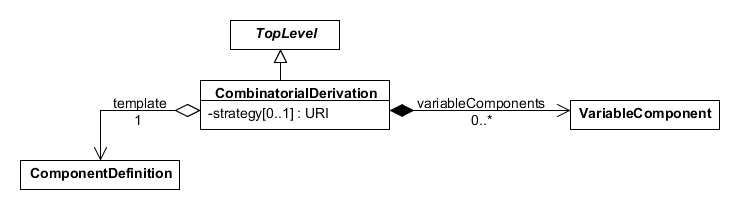
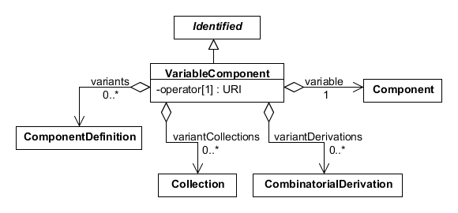

SEP 007 -- combinatorial design initial draft
===================================

SEP                     | <leave empty>
----------------------|--------------
**Title**                | combinatorial assemblies
**Authors**           | Matthew Pocock, Jacob Beal, Nicholas Roehner (nicholasroehner@gmail.com)
**Editor**            | Raik Gruenberg
**Type**               | Data Model
**SBOL Version** | 2.2
**Status**             | Draft
**Created**          | 19-Aug-2016
**Last modified**  |

Abstract
-----------

We propose adding two new classes, `CombinatorialDerivation` and `VariableComponent`, to allow users to represent basic combinatorial designs in SBOL without having to enumerate every possible design variant. For example, a user may wish to encode a library of reporter gene variants that have different promoters and ribosome binding sites (RBS) without having to create a `ComponentDefinition` for every possible combination of a promoter, RBS, and coding sequence (CDS) in their library. A `CombinatorialDerivation` refers to a single template `ComponentDefinition` from which new `ComponentDefinition` objects can be derived. Each `VariableComponent` in a `CombinatorialDerivation` specifies one or more possible definitions for any new sub-`Component` object derived from a `Component` in the template `ComponentDefinition`.

We also propose adding http://sbols.org/v2#differentFrom to the list of recommended URIs for the `restriction` property of the `SequenceConstraint` class. This would enable users to specify combinatorial designs in which the choice of a definition for one `Component` during a derivation can preclude the choice of that definition for another `Component` during the same derivation.

Rationale <a name="rationale"></a>
----------------

This SEP was initiated in response to [SBOL-Specification/#31]. Currently, there is no way to specify the composition of a genetic library or another combinatorial design for common use cases in synthetic biology, such as tuning the performance of a genetic circuit or biosynthetic pathway through combinatorial DNA assembly and screening. While a user could derive multiple `ComponentDefinition` objects from an abstract `ComponentDefinition` that lacks a `Sequence` or a total ordering of its sub-`Component` objects via `SequenceConstraint` objects, they would still be unable to use SBOL to specify a finite set of alternative structures to choose from during such a derivation. This SEP is intended to enable users of SBOL to explicitly denote the structural choices to be made and the basic strategy to be used (enumerate vs. sample) during the derivation of a `ComponentDefinition` in accordance with a combinatorial design. 

Specification <a name="specification"></a>
----------------------------------------------

Here we define two new classes, `CombinatorialDerivation` and `VariableComponent`, and provide an update to Table 9 of the SBOL 2.1.0 specification, adding http://sbols.org/v2#differentFrom to the list of recommended URIs for the `restriction` property of the `SequenceConstraint` class.

### 2.1 CombinatorialDerivation

The `CombinatorialDerivation` class can be used to specify a combinatorial design. `ComponentDefinition` objects that realize the design can be derived in accordance with the class properties `template`, `variableComponents`, and `strategy` (Figure 1).



**Figure 1:** Diagram of the `CombinatorialDerivation` class and its associated properties

#### 2.1.1 CombinatorialDerivation.template

The `template` property is REQUIRED and MUST contain a URI that refers to a `ComponentDefinition`. This `ComponentDefinition` is expected to serve as a template for the derivation of new `ComponentDefinition` objects. Consequently, its `components` property SHOULD contain one or more `Component` objects that describe its substructure (referred to hereafter as template `Component` objects), and its `sequenceConstraints` property MAY also contain one or more `SequenceConstraint` objects that constrain this substructure. 

When a `ComponentDefinition` is derived in accordance with a `CombinatorialDerivation`, the `wasDerivedFrom` property of the derived `ComponentDefinition` SHOULD refer to the `CombinatorialDerivation`. When multiple `ComponentDefinition` objects are derived in accordance with the same `CombinatorialDerivation`, they MAY be referred to by the `members` property of a `Collection`, in which case the `wasDerivedFrom` property of the `Collection` SHOULD also refer to this `CombinatorialDerivation`.

If the `types` property of the `template` `ComponentDefinition` contains one or more URIs, then the `types` property of the derived `ComponentDefinition` SHOULD also contain those URIs. The same holds true for the `roles` properties of these `ComponentDefinition` objects.

#### 2.1.2 CombinatorialDerivation.variableComponents

The `variableComponents` property is OPTIONAL and MAY contain a set of `VariableComponent` objects. These `VariableComponent` objects are expected to denote the choices available when deriving the substructure of a new `ComponentDefinition` in accordance with a `CombinatorialDerivation`. The `variableComponents` property MUST NOT contain two or more `VariableComponent` objects that refer to the same template `Component` via their `variable` properties.

If the `variable` property of one of these `VariableComponent` objects refers to a template `Component`, then the `components` property of the derived `ComponentDefinition` SHOULD contain as many `Component` objects derived from the template `Component` as specified by the `operator` property of the `VariableComponent` (see Section 2.2.5 and Table 2). In addition, the `definition` properties of these derived `Component` objects MUST refer to `ComponentDefinition` objects specified by the `variants`, `variantCollections`, or `variantDerivations` property of the `VariableComponent` (see Section 2.2.1). 

If no `variable` property of one of these `VariableComponent` objects refers to a template `Component`, then the `components` property of the derived `ComponentDefinition` SHOULD contain exactly one `Component` with a `wasDerivedFrom` property that refers to the template `Component`. The `definition` property of this derived `Component` MUST refer to the `ComponentDefinition` referred to by the `definition` property of the template `Component`.

Finally, all of these derived `Component` objects MUST follow the `restriction` properties of any `SequenceConstraint` objects that refer to their corresponding template `Component` objects.

#### 2.1.3 CombinatorialDerivation.strategy

The `strategy` property is OPTIONAL and has a data type of URI. Table 1 provides a list of REQUIRED strategy URIs. If the `strategy` property is not empty, then it MUST contain a URI from Table 1. This property recommends how many `ComponentDefinition` objects a user SHOULD derive from the `template` `ComponentDefinition`.

**Table 1:** REQUIRED URIs for the `strategy` property

| Strategy URI                   | Description |
|-----------------------------------|-------------|
| http://sbols.org/v2#enumerate | A user SHOULD derive all possible `ComponentDefinition` objects specified by the `Component` objects contained by the `template` `ComponentDefinition` and the `VariableComponent` objects contained by the `CombinatorialDerivation`. |
| http://sbols.org/v2#sample    | A user SHOULD derive a subset of all possible `ComponentDefinition` objects specified by the `Component` objects contained by the `template` `ComponentDefinition` and the `VariableComponent` objects contained by the `CombinatorialDerivation`. The manner in which this subset is chosen is for the user to decide. |

### 2.2 VariableComponent

The `VariableComponent` class can be used to specify a choice of `ComponentDefinition` objects for any new `Component` derived from a template `Component` in the `template` `ComponentDefinition`. This specification is made using the class properties `variable`, `variants`, `variantCollections`, and `variantDerivations` (Figure 2). While the `variants`, `variantCollections`, and `variantDerivations` properties are OPTIONAL, at least one of them MUST NOT be empty.



**Figure 2:** Diagram of the `VariableComponent` class and its associated properties

#### 2.2.1 VariableComponent.variable

The `variable` property is REQUIRED and MUST contain a URI that refers to a template `Component` in the template `ComponentDefinition`. If the `wasDerivedFrom` property of a `Component` refers to this template `Component`, then the `definition` property of the derived `Component` MUST refer to either (1) a `ComponentDefinition` referred to by the `variants` property of the `VariableComponent`, (2) a `ComponentDefinition` from a `Collection` referred to by the `variantCollections` property of the `VariableComponent`, or (3) a `ComponentDefinition` derived from a `CombinatorialDerivation` referred to by the `variantDerivations` property of the `VariableComponent`.

If the `roles` property of the template `Component` contains one or more URIs, then the `roles` property of the derived `Component` SHOULD also contain those URIs.

#### 2.2.2 VariableComponent.variants

The `variants` property is OPTIONAL and MAY contain zero or more URIs that each refer to a `ComponentDefinition`. The `variants` property MUST NOT contain duplicate URIs. This property specifies individual `ComponentDefinition` objects to serve as options when deriving a new `Component` from the template `Component`.

#### 2.2.3 VariableComponent.variantCollections

The `variantCollections` property is OPTIONAL and MAY contain zero or more URIs that each refer to a `Collection`. The `variantCollections` property MUST NOT contain duplicate URIs. The `members` property of each `Collection` referred to in this way MUST NOT be empty, MUST refer only to `ComponentDefinition` objects, and MUST NOT contain duplicate URIs. This property enables the convenient specification of existing groups of `ComponentDefinition` objects to serve as options when deriving a new `Component` from the template `Component`.

#### 2.2.4 VariableComponent.variantDerivations

The `variantDerivations` property is OPTIONAL and MAY contain zero or more URIs that each refer to a `CombinatorialDerivation`. The `variantDerivations` property MUST NOT contain duplicate URIs. This property enables the convenient specification of `ComponentDefinition` objects derived in accordance with another `CombinatorialDerivation` to serve as options when deriving a new `Component` from the template `Component`. The `variantDerivations` property of a `VariableComponent` MUST NOT refer to the `CombinatorialDerivation` that contains this `VariableComponent`. Furthermore, `VariableComponent` objects MUST NOT form a cyclical chain of references via their `variantDerivations` properties and the `ComponentDerivation` objects that contain them. For example, consider the `VariableComponent` objects *A* and *B* and the `ComponentDerivation` objects *X* and *Y*. The reference chain *X* contains *A*, *A* has variant derivation *Y*, *Y* contains *B*, and *B* has variant derivation *X* is cyclical.

#### 2.2.5 VariableComponent.operator

The `operator` property is REQUIRED and has a data type of URI. This property specifies how many `Component` objects SHOULD be derived from the template `Component` during the derivation of a new `ComponentDefinition`. The URI value of this property MUST come from the REQUIRED `operator` URIs provided in Table 2.

**Table 2:** REQUIRED URIs for the `operator` property

| Operator URI                   | Description |
|-----------------------------------|-------------|
| http://sbols.org/v2#zeroOrOne | No more than one `Component` in the derived `ComponentDefinition` SHOULD have a `wasDerivedFrom` property that refers to the template `Component`. |
| http://sbols.org/v2#one   | Exactly one `Component` in the derived `ComponentDefinition` SHOULD have a `wasDerivedFrom` property that refers to the template `Component`. |
| http://sbols.org/v2#zeroOrMore | Any number of `Component` objects in the derived `ComponentDefinition` MAY have `wasDerivedFrom` properties that refer to the template `Component`.  |
| http://sbols.org/v2#oneOrMore | At least one `Component` in the derived `ComponentDefinition` SHOULD have a `wasDerivedFrom` property that refers to the template `Component`. |

### 2.3 SequenceConstraint.restriction

In addition to the two new classes outlined above, we propose adding a new URI to the list of RECOMMENDED URIs for the `restriction` property of the `SequenceConstraint` class (Table 3). Previously, the `SequenceConstraint` class could be used to assert restrictions on the relative, sequence-based positions of a pair of `Component` objects, the `subject` and the `object`. This new URI raises the possibility of using the `SequenceConstraint` class to assert pairwise restrictions on `Component` identity and structure.

**Table 3:** RECOMMENDED URIs for the `restriction` property

| Restriction URI                   | Description |
|-----------------------------------|-------------|
| http://sbols.org/v2#differentFrom | The `definition` property of the `subject` `Component` MUST NOT refer to the same `ComponentDefinition` as that of the `object` `Component`. In addition, if the `sequence` properties of these `ComponentDefinition` objects are both not empty, then they MUST have different `elements` properties. |
  
Examples <a name='example'></a>
-------------------------------

### 3.1 Enumerating a Combinatorial Library of GFP Reporters

Here we will specify the combinatorial design for a library of GFP reporters and enumerate all possible `ComponentDefinition` objects in accordance with it.

Given an abstract `template` `ComponentDefinition` that contains four sub-`Component` objects and three `SequenceConstraint` objects to fix their ordering,

```
gfp_reporter_template : ComponentDefinition
  description = "An abstract GFP reporter"
  component : Component
    identity = p1_template
    definition = abstract_glucose-sensitive_promoter
  component : Component
    identity = r1_template
    definition = elowitz_rbs
  component : Component
    identity = c1_template
    definition = abstract_gfp
  component : Component
    identity = t1_template
    definition = double_terminator
  sequenceConstraint = p1_template precedes r1_template
  sequenceConstraint = r1_template precedes c1_template
  sequenceConstraint = c1_template precedes t1_template
```

a `Collection` of GFP CDS `ComponentDefinition` variants,

```
gfp_library : Collection
  description = "A library of various GFP CDSes"
  member = gfp1
  member = gfp2
  member = gfp3
```

two glucose-sensitive promoter `ComponentDefinition` variants,

```
glucose-sensitive_promoter1 : ComponentDefinition
  description = "Glucose-sensitive promoter"
  type = DNA
  role = Promoter

glucose-sensitive_promoter2 : ComponentDefinition
  description = "Glucose-sensitive promoter"
  type = DNA
  role = Promoter
```
a ribosome binding site, and a terminator,

```
elowitz_rbs : ComponentDefinition
  description = "Elowitz RBS"
  type = DNA
  role = Ribosome Entry Site

double_terminator: ComponentDefinition
  description = "Double terminator"
  type = DNA
  role = Terminator
```

we can define a `CombinatorialDerivation` that specifies a full enumeration using the GFP reporter as its template and the glucose-sensitive promoter and GFP library as its `variableComponents`.

```
gfp_reporter_derivation1 : CombinatorialDerivation
  description = "Derive various concrete designs from an abstract GFP reporter template by choosing replacements for the promoter and CDS."
  template = gfp_reporter_template
  strategy = enumerate
  variableComponent : VariableComponent
    operator = one
    variable = p1_template
    variant = glucose-sensitive_promoter1
    variant = glucose-sensitive_promoter2
  variableComponent : VariableComponent
    operator = one
    variable = c1_template
    variantCollection = gfp_library
```

This `CombinatorialDerivation` can then serve as the basis for deriving a `Collection` of all six possible GFP reporter variants:

```
expanderbot2000 : prov:Agent
  name = "Expanderbot 2000"
  version = "0.1.3"

gfp_reporter_expansion1 : Collection
  description = "Expansions of GFP reporter derivation"

  wasDerivedFrom = gfp_reporter_derivation1

  prov:wasGeneratedBy : prov:Activity
    identity = gfp_reporter_expansion1_activity
    prov:qualifiedUsage : prov:Usage
      hadRole = source
      entity = gfp_reporter_derivation1
    prov:qualifiedAssociation : prov:Association
      hadRole = enumerator
      prov:agent = expanderbot2000
        
  member : ComponentDefinition
    wasDerivedFrom = gfp_reporter_derivation1
    prov:wasGeneratedBy : prov:Activity
      prov:wasInformedBy = gfp_reporter_expansion1_activity
    type = DNA
    role = Gene
    component : Component
      identity = p1
      definition = glucose-sensitive_promoter1
      wasDerivedFrom = p1_template
    component : Component
      identity = r1
      definition = elowitz_rbs
      wasDerivedFrom = r1_template
    component : Component
      identity = c1
      definition = gfp1
      wasDerivedFrom = c1_template
    component : Component
      identity = t1
      definition = double_terminator
      wasDerivedFrom = t1_template
    sequenceConstraint = p1 precedes r1
    sequenceConstraint = r1 precedes c1
    sequenceConstraint = c1 precedes t1

  member : ComponentDefinition
    wasDerivedFrom = gfp_reporter_derivation1
    prov:wasGeneratedBy : prov:Activity
      prov:wasInformedBy = gfp_reporter_expansion1_activity
    type = DNA
    role = Gene
    component : Component
      identity = p1
      definition = glucose-sensitive_promoter2
      wasDerivedFrom = p1_template
    component : Component
      identity = r1
      definition = elowitz_rbs
      wasDerivedFrom = r1_template
    component : Component
      identity = c1
      definition = gfp1
      wasDerivedFrom = c1_template
    component : Component
      identity = t1
      definition = double_terminator
      wasDerivedFrom = t1_template
    sequenceConstraint = p1 precedes r1
    sequenceConstraint = r1 precedes c1
    sequenceConstraint = c1 precedes t1

  member : ComponentDefinition
    wasDerivedFrom = gfp_reporter_derivation1
    prov:wasGeneratedBy : prov:Activity
      prov:wasInformedBy = gfp_reporter_expansion1_activity
    type = DNA
    role = Gene
    component : Component
      identity = p1
      definition = sensitive_promoter1
      wasDerivedFrom = p1_emplate
    component : Component
      identity = r1
      definition = elowitz_rbs
      wasDerivedFrom = r1_template
    component : Component
      identity = c1
      definition = gfp2
      wasDerivedFrom = c1_template
    component : Component
      identity = t1
      definition = double_terminator
      wasDerivedFrom = t1_template
    sequenceConstraint = p1 precedes r1
    sequenceConstraint = r1 precedes c1
    sequenceConstraint = c1 precedes t1

  ...
```

The provenance objects are OPTIONAL, but ensure that there is a full history of how these entities were derived.

### 3.2 Enumerating CDS Order in an Operon

The operon `ComponentDefinition` has `SequenceConstraint` objects to position two CDSes between a promoter and terminator, but does not constrain the relative ordering of the CDSes themselves. For simplicity, the complete sub-`Component` objects and OPTIONAL provenance objects are omitted from this example.

```
operon_template : ComponentDefinition
  type = DNA
  role = Operon
  sequenceConstraint = p1_template precedes c1_template
  sequenceConstraint = p1_template precedes c2_template
  sequenceConstraint = c1_template precedes t1_template
  sequenceConstraint = c2_template precedes t1_template
```

This time we will specify a `CombinatorialDerivation` that does not contain `VariableComponent` objects since we only want to enumerate all possible orderings of these non-abstract `Component` objects.

```
operon_order_derivation : CombinatorialDerivation
  description = "Derive the various unambiguous orderings"
  template = operon_template
  strategy = enumerate
```

This `CombinatorialDerivation` will give us a `Collection` of two `ComponentDefinition` objects:

```
operon_order_expansion : Collection
  wasDerivedFrom = operon_order_derivation

  member : ComponentDefinition
    wasDerivedFrom = operon_order_derivation
    type = DNA
    role = Operon
    sequenceConstraint = p1 precedes c1
    sequenceConstraint = c1 precedes c2
    sequenceConstraint = c2 precedes t1

  member : ComponentDefinition
    wasDerivedFrom = operon_order_derivation
    type = DNA
    role = Operon
    sequenceConstraint = p1 precedes c2
    sequenceConstraint = c2 precedes c1
    sequenceConstraint = c1 precedes t1
```

The ordering of sub-`Component` objects within each newly derived `ComponentDefinition` is fixed with a new set of `SequenceConstraint` objects. Note that, instead of using `SequenceConstraint` objects to indicate sub-`Component` ordering in a derived `ComponentDefinition`, a user can associate the latter with a `Sequence` and a set of `SequenceAnnotation` objects that designate the `Location` of each sub-`Component`.

### 3.3 Different Enumerations from Same Template

We can have more than one derivation from the same `template` `ComponentDefinition`. Given the previous `ComponentDefinition` for a GFP reporter, we can specify two different derivations, one that varies the promoter sub-`Component`, and one that varies the CDS sub-`Component`.

```  
gfp_reporter_derivation2 : CombinatorialDerivation
  template = gfp_reporter_template
  strategy = enumerate
  variableComponent : VariableComponent
    operator = one
    variable = p1_template
    variant = glucose-sensitive_promoter1
    variant = glucose-sensitive_promoter2
  
gfp_reporter_derivation3 : CombinatorialDerivation
  template = gfp_reporter_template
  strategy = enumerate
  variableComponent : VariableComponent
    operator = one
    variable = c1_template
    variantCollection = gfp_library
```

These derivations give rise to two independent families of enumerations from the same template design (again omitting OPTIONAL provenance objects):

```
gfp_reporter_expansion2 : Collection
  wasDerivedFrom = gfp_reporter_derivation2
  member : ComponentDefinition
    wasDerivedFrom = gfp_reporter_derivation2
    component : Component
      identity = p1
      definition = glucose-sensitive_promoter1
      wasDerivedFrom = p1_template
    component : Component
      identity = r1
      definition = elowitz_rbs
      wasDerivedFrom = r1_template
    component : Component
      identity = c1
      definition = abstract_gfp
      wasDerivedFrom = c1_template
    component : Component
      identity = t1
      definition = double_terminator
      wasDerivedFrom = t1_template
    sequenceConstraint = p1 precedes r1
    sequenceConstraint = r1 precedes c1
    sequenceConstraint = c1 precedes t1
  member : ComponentDefinition
    wasDerivedFrom = gfp_reporter_derivation2
    component : Component
      identity = p1
      definition = glucose-sensitive_promoter2
      wasDerivedFrom = p1_template
    component : Component
      identity = r1
      definition = elowitz_rbs
      wasDerivedFrom = r1_template
    component : Component
      identity = c1
      definition = abstract_gfp
      wasDerivedFrom = c1_template
    component : Component
      identity = t1
      definition = double_terminator
      wasDerivedFrom = t1_template
    sequenceConstraint = p1 precedes r1
    sequenceConstraint = r1 precedes c1
    sequenceConstraint = c1 precedes t1

gfp_reporter_expansion3 : Collection
  wasDerivedFrom = gfp_reporter_derivation3
  member : ComponentDefinition
    wasDerivedFrom = gfp_reporter_derivation3
    component : Component
      identity = p1
      definition = abstract_glucose-sensitive_promoter
      wasDerivedFrom = p1_template
    component : Component
      identity = r1
      definition = elowitz_rbs
      wasDerivedFrom = r1_template
    component : Component
      identity = c1
      definition = gfp1
      wasDerivedFrom = c1_template
    component : Component
      identity = t1
      definition = double_terminator
      wasDerivedFrom = t1_template
    sequenceConstraint = p1 precedes r1
    sequenceConstraint = r1 precedes c1
    sequenceConstraint = c1 precedes t1
  member : ComponentDefinition
    wasDerivedFrom = gfp_reporter_derivation3
    component : Component
      identity = p1
      definition = abstract_glucose-sensitive_promoter
      wasDerivedFrom = p1_template
    component : Component
      identity = r1
      definition = elowitz_rbs
      wasDerivedFrom = r1_template
    component : Component
      identity = c1
      definition = gfp2
      wasDerivedFrom = c1_template
    component : Component
      identity = t1
      definition = double_terminator
      wasDerivedFrom = t1_template
    sequenceConstraint = p1 precedes r1
    sequenceConstraint = r1 precedes c1
    sequenceConstraint = c1 precedes t1
  member : ComponentDefinition
    wasDerivedFrom = gfp_reporter_derivation3
    component : Component
      identity = p1
      definition = abstract_glucose-sensitive_promoter
      wasDerivedFrom = p1_template
    component : Component
      identity = r1
      definition = elowitz_rbs
      wasDerivedFrom = r1_template
    component : Component
      identity = c1
      definition = gfp3
      wasDerivedFrom = c1_template
    component : Component
      identity = t1
      definition = double_terminator
      wasDerivedFrom = t1_template
    sequenceConstraint = p1 precedes r1
    sequenceConstraint = r1 precedes c1
    sequenceConstraint = c1 precedes t1
```

Since each `CombinatorialDerivation` is external to its `template` `ComponentDefinition`, we could use this template as the target of another `CombinatorialDerivation` to further expand it out.

### 3.4 Probabilistic Sampling of GFP Reporter Library

Starting again with the GFP reporter `template` `ComponentDefinition`, we can specify a `CombinatorialDerivation` that uses the `sample` `strategy` rather than the `enumerate` `strategy` that we have used so far.

```
gfp_reporter_derivation4 : CombinatorialDerivation
  template = gfp_reporter_template
  strategy = sample
  variableComponent : VariableComponent
    operator = one
    variable = p1_template
    variant = glucose-sensitive_promoter1
    variant = glucose-sensitive_promoter2
  variableComponent : VariableComponent
    operator = one
    variable = c1_template
    variantCollection = gfpLibrary
```

We can sample once to derive the following `ComponentDefinition`:

```
samplebot3000 : prov:Agent
  name = "samplebot3000"
  version = "9.1"
  randomSeed = "9837453"^^xs:long

sampled_gfp_reporter1 : ComponentDefinition
  wasDerivedFrom = gfp_reporter_derivation4
  prov:wasGeneratedBy : prov:Activity
    prov:qualifiedUsage : prov:Usage
      hadRole = source
      entity = gfp_reporter_derivation4
    prov:qualifiedAssociation : prov:Association
      hadRole = sampler
      prov:agent = samplebot3000
  component : Component
    identity = p1
    definition = glucose-sensitive_promoter1
    wasDerivedFrom = p1_template
  component : Component
    identity = r1
    definition = elowitz_rbs
    wasDerivedFrom = r1_template
  component : Component
    identity = c1
    definition = gfp2
    wasDerivedFrom = c1_template
  component : Component
    identity = t1
    definition = double_terminator
    wasDerivedFrom = t1_template
  sequenceConstraint = p1 precedes r1
  sequenceConstraint = r1 precedes c1
  sequenceConstraint = c1 precedes t1
```

Once again, the provenance objects are OPTIONAL, but ensure that there is a full history of how these entities were derived.

### 3.5 Sampling Eukaryotic Promoters with Variable Numbers of Operator Sites

Here we will specify the combinatorial design for a synthetic eukaryotic promoter that contains a variable number of upstream operator sites<sup>[1]</sup>.

Given an abstract `template` `ComponentDefinition` that contains two sub-`Component` objects and one `SequenceConstraint` object to fix their ordering,

```
synthetic_cmv_template : ComponentDefinition
  description = "Template for a synthetic eukaryotic promoter (CMV)"
  component : Component
    identity = o1_template
    definition = abstract_operator
  component : Component
    identity = p1_template
    definition = cmv
  sequenceConstraint = o1_template precedes p1_template
```
a `Collection` of operator site `ComponentDefinition` variants,

```
operator_library : Collection
  description = "A library of operator site variants"
  member = operator1
  member = operator2
  member = operator3
  member = operator4
```
and a CMV promoter `ComponentDefinition`,

```
cmv : ComponentDefinition
  description = "CMV promoter"
  type = DNA
  role = Promoter
```

we can define a `CombinatorialDerivation` that specifies a sampling using the synthetic CMV promoter `ComponentDefinition` as its `template` and the operator library as the `variantCollection` of a `VariableComponent` from which to derive one or more sub-`Component` objects.

```
synthetic_cmv_derivation1 : CombinatorialDerivation
  description = "Derive various concrete designs for the synthetic CMV promoter by choosing one or more upstream operator sites."
  template = synthetic_cmv_template 
  strategy = sample
  variableComponent : VariableComponent
    operator = oneOrMore
    variable = o1_template
    variantCollection = operator_library
```

This `CombinatorialDerivation` can then serve as the basis for deriving a `Collection` of synthetic CMV promoters with different numbers of upstream operator sites.

```
samplebot300 : prov:Agent
  name = "samplebot3000"
  version = "9.1"
  randomSeed = "9837453"^^xs:long

synthetic_cmv_expansion1 : Collection
  description = "Expansions of the synthetic CMV promoter"

  wasDerivedFrom = synthetic_cmv_derivation1

  prov:wasGeneratedBy : prov:Activity
    identity = synthetic_cmv_expansion1_activity
    prov:qualifiedUsage : prov:Usage
      hadRole = source
      entity = synthetic_cmv_derivation1
    prov:qualifiedAssociation : prov:Association
      hadRole = sampler
      prov:agent = samplebot3000
        
  member : ComponentDefinition
    identity = cmv1
    wasDerivedFrom = synthetic_cmv_derivation1
    prov:wasGeneratedBy : prov:Activity
      prov:wasInformedBy = synthetic_cmv_expansion1_activity
    type = DNA
    role = Promoter
    component : Component
      identity = o1
      definition = operator2
      wasDerivedFrom = o1_template
    component : Component
      identity = o2
      definition = operator3
      wasDerivedFrom = o1_template
    component : Component
      identity = o3
      definition = operator2
      wasDerivedFrom = o1_template
    component : Component
      identity = p1
      definition = cmv
      wasDerivedFrom = p1_template
    sequenceConstraint = o1 precedes o2
    sequenceConstraint = o2 precedes o3
    sequenceConstraint = o3 precedes p1

  member : ComponentDefinition
    identity = cmv2
    wasDerivedFrom = synthetic_cmv_derivation1
    prov:wasGeneratedBy : prov:Activity
      prov:wasInformedBy = synthetic_cmv_expansion1_activity
    type = DNA
    role = Promoter
    component : Component
      identity = o1
      definition = operator1
      wasDerivedFrom = o1_template
    component : Component
      identity = o2
      definition = operator4
      wasDerivedFrom = o1_template
    component : Component
      identity = o3
      definition = operator2
      wasDerivedFrom = o1_template
    component : Component
      identity = o4
      definition = operator3
      wasDerivedFrom = o1_template
    component : Component
      identity = o5
      definition = operator3
      wasDerivedFrom = o1_template
    component : Component
      identity = p1
      definition = cmv
      wasDerivedFrom = p1_template
    sequenceConstraint = o1 precedes o2
    sequenceConstraint = o2 precedes o3
    sequenceConstraint = o3 precedes o4
    sequenceConstraint = o4 precedes o5
    sequenceConstraint = o5 precedes p1

  ...
```
### 3.6 Composite Combinatorial Derivation of a Eukaryotic Transcriptional Unit 

Here we will specify the combinatorial design for a eukaryotic transcriptional unit (TU) by using our previous combinatorial design for a synthetic eukaryotic promoter. 

Given a `template` `ComponentDefinition` that contains three sub-`Component` objects and two `SequenceConstraint` objects to fix their ordering,

```
synthetic_eukaryotic_tu : ComponentDefinition
  description = "A synthetic eukaryotic transcriptional unit"
  component : Component
    identity = p1_template
    definition = abstract_promoter
  component : Component
    identity = c1_template
    definition = abstract_cds
  component : Component
    identity = t1_template
    definition = polyA
  sequenceConstraint = p1_template precedes c1_template
  sequenceConstraint = c1_template precedes t1_template
```
a `Collection` of enzyme CDS `ComponentDefinition` variants,

```
enzyme_cds_library : Collection
  description = "A library of enzyme CDS variants"
  member = enzyme1
  member = enzyme2
  member = enzyme3
  member = enzyme4
```
and a eukaryotic terminator `ComponentDefinition`,

```
polyA : ComponentDefinition
  description = "A poly-A sequence acting as a terminator signal"
  type = DNA
  role = Terminator
```
we can define a `CombinatorialDerivation` that specifies a sampling using the `ComponentDefinition` of a synthetic enzyme TU as its `template`, the enzyme CDS library as a `variantCollection` from which to choose one CDS, and the `CombinatorialDerivation` for the eukaryotic promoter as a `variantDerivation` from which to choose one promoter.

```
synthetic_eukaryotic_tu_derivation1 : CombinatorialDerivation
  description = "Derive various concrete designs for a synthetic eukaryotic TU by choosing one enzyme CDS and one promoter with a variable number of operator sites."
  template = synthetic_eukaryotic_tu
  strategy = sample
  variableComponent : VariableComponent
    operator = one
    variable = p1_template
    variantDerivation = synthetic_cmv_derivation1
  variableComponent : VariableComponent
    operator = one
    variable = c1_template
    variantCollection = enzyme_cds_library
```

This `CombinatorialDerivation` can then serve as the basis for deriving a `Collection` of synthetic eukaryotic TUs with different promoters and enzyme CDSes.

```
samplebot300 : prov:Agent
  name = "samplebot3000"
  version = "9.1"
  randomSeed = "9837453"^^xs:long

synthetic_eukaryotic_tu_expansion1 : Collection
  description = "Expansions of a synthetic eukaryotic TU"

  wasDerivedFrom = synthetic_eukaryotic_tu_derivation1

  prov:wasGeneratedBy : prov:Activity
    identity = synthetic_eukaryotic_tu_expansion1_activity
    prov:qualifiedUsage : prov:Usage
      hadRole = source
      entity = synthetic_eukaryotic_tu_derivation1
    prov:qualifiedAssociation : prov:Association
      hadRole = sampler
      prov:agent = samplebot3000
        
  member : ComponentDefinition
    wasDerivedFrom = synthetic_eukaryotic_tu_derivation1
    prov:wasGeneratedBy : prov:Activity
      prov:wasInformedBy = synthetic_eukaryotic_tu_expansion1_activity
    type = DNA
    role = Gene
    component : Component
      identity = p1
      definition = cmv1
      wasDerivedFrom = p1_template
    component : Component
      identity = c1
      definition = enzyme2
      wasDerivedFrom = c1_template
    component : Component
      identity = t1
      definition = polyA
      wasDerivedFrom = t1_template
    sequenceConstraint = p1 precedes c1
    sequenceConstraint = c1 precedes t1

  member : ComponentDefinition
    wasDerivedFrom = synthetic_eukaryotic_tu_derivation1
    prov:wasGeneratedBy : prov:Activity
      prov:wasInformedBy = synthetic_eukaryotic_tu_expansion1_activity
    type = DNA
    role = Gene
    component : Component
      identity = p1
      definition = cmv2
      wasDerivedFrom = p1_template
    component : Component
      identity = c1
      definition = enzyme4
      wasDerivedFrom = c1_template
    component : Component
      identity = t1
      definition = polyA
      wasDerivedFrom = t1_template
    sequenceConstraint = p1 precedes c1
    sequenceConstraint = c1 precedes t1

  ...
```

Backwards Compatibility <a name='compatibility'></a>
-----------------

New classes and RECOMMENDED property value, no issues anticipated.

Discussion <a name='discussion'></a>
-----------------

**Advantages:**

We have a complete log of the combinatorial expansion options and the individual expansions. We can also use provenance objects to document that a `CombinatorialDerivation` was executed using a specific software tool. The proposed extension also gives us a separation between an abstract design and the strategy used to refine it into a concrete design. We can take the same template and expand it in accordance with several `CombinatorialDerivation` objects that present different sets of `VariableComponent` objects.

Competing SEPs <a name='competing_seps'></a>
-----------------

Currently none.

References <a name='references'></a>
----------------

1. Brown et al., Synthetic promoters for CHO cell engineering, Biotechnol. and Bioeng., vol. 111, pp. 1638-1647, 2014.

[SBOL-Specification/#31]: https://github.com/SynBioDex/SBOL-specification/issues/31
[1]: https://www.ncbi.nlm.nih.gov/pubmed/24615264

Copyright <a name='copyright'></a>
-------------
<p xmlns:dct="http://purl.org/dc/terms/" xmlns:vcard="http://www.w3.org/2001/vcard-rdf/3.0#">
  <a rel="license"
     href="http://creativecommons.org/publicdomain/zero/1.0/">
    
  </a>
  <br />
  To the extent possible under law,
  <a rel="dct:publisher"
     href="sbolstandard.org">
    <span property="dct:title">SBOL developers</span></a>
  has waived all copyright and related or neighboring rights to
  <span property="dct:title">SEP 007</span>.
This work is published from:
<span property="vcard:Country" datatype="dct:ISO3166"
      content="US" about="sbolstandard.org">
  United States</span>.
</p>
