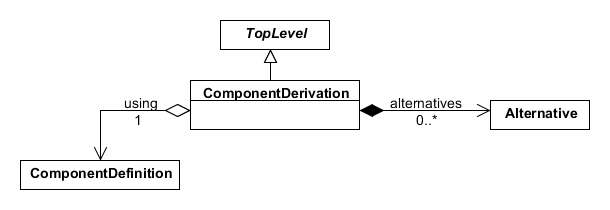
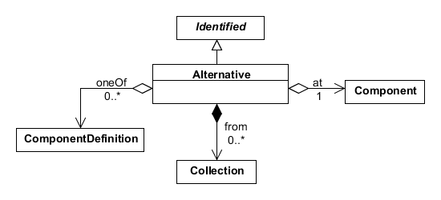

SEP 007 -- combinatorial assemblies initial draft
===================================

SEP                     | <leave empty>
----------------------|--------------
**Title**                | combinatorial assemblies
**Authors**           | Matthew Pocock, Jacob Beal, Nicholas Roehner (nicholasroehner@gmail.com)
**Editor**            | Raik Gruenberg
**Type**               | Data Model
**SBOL Version** | 2.2
**Status**             | Draft
**Created**          | 19-Aug-2016
**Last modified**  |

Abstract
-----------

We propose adding two new classes, `ComponentDerivation` and `Alternative`, to allow users to represent basic combinatorial designs in SBOL without having to enumerate every possible design variant. For example, a user may wish to encode a library of reporter gene variants that have different promoters and ribosome binding sites (RBS) without having to create a `ComponentDefinition` for every possible combination of a promoter, RBS, and coding sequence (CDS) in their library. A `ComponentDerivation` refers to a single template `ComponentDefinition` that can inform the derivation of other `ComponentDefinition` objects. Each `Alternative` in a `ComponentDerivation` then indicates one or more potential definitions for any `Component` derived from a specific `Component` in the template `ComponentDefinition`.

We also propose adding http://sbols.org/v2#differentFrom to the list of recommended URIs for the `restriction` property of the `SequenceConstraint` class. This would enable users to specify combinatorial designs in which the choice of a definition for one `Component` during a derivation can preclude the choice of that definition for another `Component`.

1. Rationale <a name="rationale"></a>
----------------

This SEP was initiated in response to [SBOL-Specification/#31]. Currently, there is no way to specify the composition of a genetic library or another combinatorial genetic design for common use cases in synthetic biology, such as tuning the performance of a genetic circuit or biosynthetic pathway through combinatorial DNA assembly and screening. While a user could derive multiple `ComponentDefinition` objects based on an abstract `ComponentDefinition` that lacks a complete `Sequence`, they would still be unable to use SBOL to specify a finite set of alternative structures to choose from during such a derivation. This SEP is intended to enable users of SBOL to explicitly denote the structural choices to be made during the derivation of a `ComponentDefinition` from a combinatorial biological design. 

2. Specification <a name="specification"></a>
----------------------------------------------

Here we define two new classes, `ComponentDerivation` and `Alternative`, and provide an update to Table 9 of the SBOL 2.1.0 specification, adding http://sbols.org/v2#differentFrom to the list of recommended URIs for the `restriction` property of the `SequenceConstraint` class.

### 2.1 ComponentDerivation

The `ComponentDerivation` class can be used to specify a combinatorial biological design, from which `ComponentDefinition` objects that realize the design can be derived in accordance with the class properties `using`, `alternatives`, and `strategy` (Figure 1).



*Figure 1:* Diagram of the `ComponentDerivation` class and its associated properties

#### 2.1.1 ComponentDerivation.using

The `using` property is REQUIRED and MUST contain a URI that refers to a `ComponentDefinition`. This `ComponentDefinition` (referred to hereafter as the template ``ComponentDefinition`) is expected to serve as a template for the derivation of new `ComponentDefinition` objects. Consequently, its `components` property SHOULD contain one or more `Component` objects that describe its substructure, and its `sequenceConstraints` property MAY also contain one or more `SequenceConstraint` objects that constrain this substructure. When a `ComponentDefinition` in accordance with a `ComponentDerivation`, the `components` property of the derived `ComponentDefinition` MUST contain the same number of `Component` objects as that of the template `ComponentDefinition`. The `wasDerivedFrom` property of the derived `ComponentDefinition` SHOULD also refer to the `ComponentDerivation`.

#### 2.1.2 ComponentDerivation.alternatives

The `alternatives` property is OPTIONAL and MAY contain a set of `Alternative` objects. These `Alternative` objects are expected to denote the choices available when deriving a new `ComponentDefinition` in accordance with a `ComponentDerivation`. Each `Component` referred to by the `at` properties of these `Alternative` objects MUST be contained by the `components` property of the template `ComponentDefinition`. In addition, the `alternatives` property MUST NOT contain two or more `Alternative` objects that refer to the same `Component` via their `at` properties.

#### 2.1.3 ComponentDerivation.strategy

The `strategy` property is OPTIONAL and has a data type of URI. Table 1 provides a list of REQUIRED strategy URIs. If the `strategy` property is nonempty, then it MUST contain a URI from Table 1. This property recommends how a user should derive one or more `ComponentDefinition` objects in accordance with a `ComponentDerivation`.

*Table 1:* REQUIRED URIs for the `strategy` property

| Strategy URI                   | Description |
|-----------------------------------|-------------|
| http://sbols.org/v2#enumerate | A user SHOULD derive all `ComponentDefinition` objects that are possible according to the `ComponentDerivation`. |
| http://sbols.org/v2#sample    | A user SHOULD derive a subset of all `ComponentDefinition` that are possible according to the `ComponentDerivation`. The manner in which this subset is chosen is left to the user. |

### 2.2 Alternative

The `Alternative` class can be used to specify a choice of `ComponentDefinition` objects for any `Component` derived from a target `Component` in the template `ComponentDefinition`. This specification is made using the class properites `at`, `oneOf`, and/or `from` (Figure 2). While the `oneOf` and `from` properties are optional, at least one of them MUST be nonempty.



*Figure 2:* Diagram of the `Alternative` class and its associated properties

#### 2.2.1 Alternative.at

The `at` property is REQUIRED and MUST contain a URI that refers to a `Component` in the template `ComponentDefinition` (referred to hereafter as the template `Component`. When a `Component` is derived based on the template `Component`, then the `definition` property of the derived `Component` MUST refer to one of the `ComponentDefinition` objects referred to by the `oneOf` property, or by the `members` property of a `Collection` referred to by the `from` property.

#### 2.2.2 Alternative.oneOf

The `oneOf` property is OPTIONAL and MAY contain zero or more URIs that each refer to a `ComponentDefinition`. This property specifies individual `ComponentDefinition` objects that are options when deriving a new `Component` based on the template `Component`.

#### 2.2.3 Alternative.from

The `from` property is OPTIONAL and MAY contain zero or more URIs that each refer to a `Collection`. The 'members' property of each `Collection` referred to in this way MUST be nonempty and MUST refer only to `ComponentDefinition` objects. This property enables the convenient specification of new or existing groups of `ComponentDefinition` objects to serve as options when deriving a new `Component` based on the template `Component`.

Combinatorial designs are described as follows:

 1. Define a ComponentDefinition with the skeleton of your design. Add subcomponents for each of the sub-parts. Add any feature constraints.

 2. Create a ComponentDerivation referring to this `ComponentDefinition` as its target to expand. 
  
 3. Provide an `Alternatives` object inside the `ComponentDerivation`.
 Each one links a single subcomponent from the expansion target to a bag of of `ComponentDefinitions` that are possible replacements.
 The bag can be explicitly enumerated, or can be a reference to a `Collection` of `ComponentDefinition` instances to be used.
  
 4. Generate any number of `ComponentDefinition`s from this by picking single alternatives from the ComponentDerivation.
  
 5. The expanded `ComponentDefinition`s SHOULD use `PROVO` annotations to point to the `ComponentDerivation` instance used, and to capture any parameters.
  
 6. If many expansions were made from a single `ComponentDerivation`, these MAY BE collected together in a `Collection`.
   This collection SHOULD use `PROVO` annotations to point to the `ComponentDerivation` instance used to generate the whole set of designs, and to capture any parmeters.
   
  
3. Example or Use Case <a name='example'></a>
-------------------------------

## Enumerating expansions of alternatives

Here we will do an all-vs-all combinatorial expansion of a template design.
The result is a more concrete design.

Given an abstract design with four sub-components:

```
gfpReporter : ComponentDefinition
  description = "An abstract GFP reporter"
  sequenceConstraint = glucoseSensitivePromoter precedes rbs1234
  sequenceConstraint = rbs1234 precedes gfp
  sequenceConstraint = gfp precedes terminator1234
```

Specify a library of GFPs:

```
gfpLibrary : Collection
  description = "A library of various GFP CDSes"
  member = gfp1
  member = gfp2
  member = gfp3
```

And we have two glucose-sensitive promoters:

```
gluP_ABC : ComponentDefinition
  description = "Glucose-sensitive promoter"
  type = DNA
  role = Promoter

gluP_XYZ : ComponentDefinition
  description = "Glucose-sensitive promoter"
  type = DNA
  role = Promoter
```

We could define a space of expansions:

```
gfpReporterDerv1 : ComponentDerivation
  descrption = "Derive various more concrete designs from gfpReporter by choosing some alternatives for the promoter and GFP."
  using = gfpReporter 
  strategy = enumerate
  alternative : Alternative
    at = glucoseSensitivePromoter
    oneOf = gluP_ABC
    oneOf = gluP_XYZ
  alternative : Alternative
    at = gfp
    from = gfpLibrary
```

This could then be used to generate a `Collection` of possible expansions, using a direct re-write:

```
gfpReporterExp1 : Collection
  description = "Expansions of gfpReporterDerv1"

  prov:wasGeneratedBy : prov:Activity
    identity = gfpReporterExp1Activity
    prov:used = gfpReporterDerv1
    prov:wasAssociatedWith : prov:SoftwareAgent
      name = "expanderbot 2000"
      version = "0.1.3"
  
  member : ComponentDefinition
    prov:wasGeneratedBy : prov:Activity
      prov:wasInformedBy = gfpReporterExp1Activity
      prov:used:gluP_ABC
      prov:used:gfp1
    type = DNA
    role = Operon
    sequenceConstraint = gluP_ABC precedes rbs1234
    sequenceConstraint = rbs1234 precedes gfp1
    sequenceConstraint = gfp1 precedes terminator1234

  member : ComponentDefinition
    prov:wasGeneratedBy : prov:Activity
      prov:wasInformedBy = gfpReporterExp1Activity
      prov:used:gluP_XYZ
      prov:used:gfp1
    type = DNA
    role = Operon
    sequenceConstraint = gluP_XYZ precedes rbs1234
    sequenceConstraint = rbs1234 precedes gfp1
    sequenceConstraint = gfp1 precedes terminator1234

  member : ComponentDefinition
    prov:wasGeneratedBy : prov:Activity
      prov:wasInformedBy = gfpReporterExp1Activity
      prov:used:gluP_ABC
      prov:used:gfp2
    type = DNA
    role = Operon
    sequenceConstraint = gluP_ABC precedes rbs1234
    sequenceConstraint = rbs1234 precedes gfp2
    sequenceConstraint = gfp2 precedes terminator1234

  member : ComponentDefinition
    prov:wasGeneratedBy : prov:Activity
      prov:wasInformedBy = gfpReporterExp1Activity
      prov:used:gluP_XYZ
      prov:used:gfp2
    type = DNA
    role = Operon
    sequenceConstraint = gluP_XYZ precedes rbs1234
    sequenceConstraint = rbs1234 precedes gfp2
    sequenceConstraint = gfp2 precedes terminator1234

  member : ComponentDefinition
    prov:wasGeneratedBy : prov:Activity
      prov:wasInformedBy = gfpReporterExp1Activity
      prov:used:gluP_ABC
      prov:used:gfp3
    type = DNA
    role = Operon
    sequenceConstraint = gluP_ABC precedes rbs1234
    sequenceConstraint = rbs1234 precedes gfp3
    sequenceConstraint = gfp3 precedes terminator1234

  member : ComponentDefinition
    prov:wasGeneratedBy : prov:Activity
      prov:wasInformedBy = gfpReporterExp1Activity
      prov:used:gluP_XYZ
      prov:used:gfp3
    type = DNA
    role = Operon
    sequenceConstraint = gluP_XYZ precedes rbs1234
    sequenceConstraint = rbs1234 precedes gfp3
    sequenceConstraint = gfp3 precedes terminator1234
```

The `prov` annotations are optional, but ensure that there is a full trace of how these entities were generated.

## Enumerating a `sequenceConstraint` space

This time we will sample a constraints-based design, to explore a space of possible orderings.

Thie `abstractOperon` design places two orfs between a promoter and terminator, but does not constrain the relative ordering of the orfs themselves.

```
abstractOperon : ComponentDefinition
  type = DNA
  role = Operon
  sequenceConstraint = p123 precedes orf1
  sequenceConstraint = p123 precedes orf2
  sequenceConstraint = orf1 precedes t567
  sequenceConstraint = orf2 precedes t567
```

We will derive their orderings.

```
abstractOperonDer1 : ComponentDerivation
  description = "Derive the various unambiguous orderings 
  using = abstractOperon
  strategy = enumerate
```

This will give us (eliding the provenance):

```
abstractOperonExp1 : Collection
  member : ComponentDefinition
    type = DNA
    role = Operon
    sequenceConstraint = p123 precedes orf1
    sequenceConstraint = orf1 precedes orf2
    sequenceConstraint = orf2 precedes t567
  member : ComponentDefinition
    type = DNA
    role = Operon
    sequenceConstraint = p123 precedes orf2
    sequenceConstraint = orf2 precedes orf1
    sequenceConstraint = orf1 precedes t567
```

## Two enumerations

We can have multiple different expansions for the same template design.

```
gfpReporter : ComponentDefinition
  description = "An abstract GFP reporter"
  sequenceConstraint = glucoseSensitivePromoter precedes rbs1234
  sequenceConstraint = rbs1234 precedes gfp
  sequenceConstraint = gfp precedes terminator1234
  
der1 : ComponentDerivation
  using gfpReporter
  strategy = enumerate
  alternative : Alternative
    at = glucoseSensitivePromoter
    oneOf = gluP_ABC
    oneOf = gluP_XYZ
  
der2 : ComponentDerivation
  using gfpReporter
  strategy = enumerate
  alternative : Alternative
    at = gfp
    from = gfpLibrary
```

These two derivations give rise to two independent families of enumerations from the same design (again with provenance elided):

```
exp1 : Collection
  member : ComponentDefinition
    sequenceConstraint = gluP_ABC precedes rbs1234
    sequenceConstraint = rbs1234 precedes gfp
    sequenceConstraint = gfp precedes terminator1234
  member : ComponentDefinition
    sequenceConstraint = gluP_XYZ precedes rbs1234
    sequenceConstraint = rbs1234 precedes gfp
    sequenceConstraint = gfp precedes terminator1234

exp2 : Collection
  member : ComponentDefinition
    sequenceConstraint = glucoseSensitivePromoter precedes rbs1234
    sequenceConstraint = rbs1234 precedes gfp1
    sequenceConstraint = gfp1 precedes terminator1234
  member : ComponentDefinition
    sequenceConstraint = glucoseSensitivePromoter precedes rbs1234
    sequenceConstraint = rbs1234 precedes gfp2
    sequenceConstraint = gfp2 precedes terminator1234
  member : ComponentDefinition
    sequenceConstraint = glucoseSensitivePromoter precedes rbs1234
    sequenceConstraint = rbs1234 precedes gfp3
    sequenceConstraint = gfp3 precedes terminator1234
```

As the derivation logic is external to the `ComponentDefinition`, we could take one of the expanded instances above and use it as the target of another `ComponentDerivation` to further expand it out.

## Probablistic sampling

Starting again with our gfp reporter, we could use the `sample` strategy rather than the `enumerate` one that we've used so far.

```
der1 : ComponentDerivation
  using gfpReporter
  strategy = sample
  alternative : Alternative
    at = glucoseSensitivePromoter
    oneOf = gluP_ABC
    oneOf = gluP_XYZ
  alternative : Alternative
    at = gfp
    from = gfpLibrary
```

We can sample this once to get:

```
sampled1 : ComponentDefinition
  prov:wasGeneratedBy : prov:Activity
    identity = gfpReporterExp1Activity
    prov:used = der1
    prov:wasAssociatedWith : prov:SoftwareAgent
      name = "samplebot G1"
      version = "9.1"
      randomSeed = "9837453"^^xs:long
  sequenceConstraint = gluP_ABC precedes rbs1234
  sequenceConstraint = rbs1234 precedes gfp2
  sequenceConstraint = gfp2 precedes terminator1234
```

4. Backwards Compatibility <a name='compatibility'></a>
-----------------

New class, no issues anticipated.

5. Discussion <a name='discussion'></a>
-----------------

**Advantages:**

We have a complete log of the expansion options and of the individual expansions. 
You can also use provo annotations to document that a ComponentDefinition was made by expanding
a ComponentDerivation. It also gives you a separation between the abstract design and the strategy 
used to refine it into a concrete design. You could take the same template and expand it with 
several different ComponentDerivation instances with different sets of alternatives, 
or expand out that same template manually.


6. Competing SEPs <a name='competing_seps'></a>
-----------------

Currently none.


References <a name='references'></a>
----------------

[SBOL-Specification/#31]: https://github.com/SynBioDex/SBOL-specification/issues/31
[SBOL]: http://sbolstandard.org
[1]: https://www.python.org/dev/peps/pep-0001

Copyright <a name='copyright'></a>
-------------
<p xmlns:dct="http://purl.org/dc/terms/" xmlns:vcard="http://www.w3.org/2001/vcard-rdf/3.0#">
  <a rel="license"
     href="http://creativecommons.org/publicdomain/zero/1.0/">
    
  </a>
  <br />
  To the extent possible under law,
  <a rel="dct:publisher"
     href="sbolstandard.org">
    <span property="dct:title">SBOL developers</span></a>
  has waived all copyright and related or neighboring rights to
  <span property="dct:title">SEP 007</span>.
This work is published from:
<span property="vcard:Country" datatype="dct:ISO3166"
      content="US" about="sbolstandard.org">
  United States</span>.
</p>
