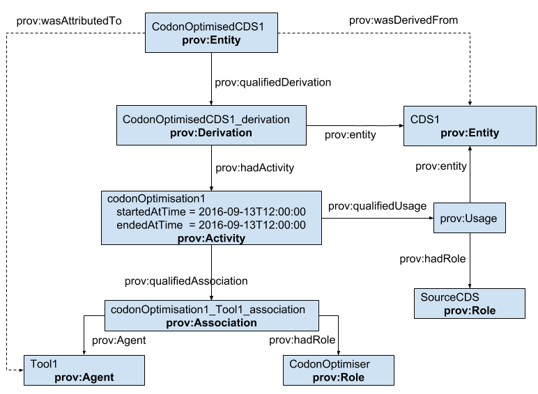

SEP 009 -- SBOL Provenance
==========================

SEP                     | 009
----------------------|--------------
**Title**                | SBOL Provenance
**Authors**           | Matthew Pocock (turingatemyhamster@gmail.com), James Alastair McLaughlin (j.a.mclaughlin@ncl.ac.uk), Goksel Misirli (goksel.misirli@ncl.ac.uk), Owen Gilfellon (o.gilfellon@ncl.ac.uk), Anil Wipat (anil.wipat@ncl.ac.uk)
**Editor**            |
**Type**               | Data Model
**SBOL Version** | 2
**Status**             | Draft
**Created**          | 20-Sep-2016
**Last modified**  | 

Abstract
--------

It is essential to track the provenance of designs, to track attribution and modification.
The PROV-O ontology is a mature data model for tracking provenance of digital artifacts.
SBOL 2 already uses the `prov:wasDerivedFrom` predicate to allow an `Identifiable` instance to point back to a resource that it was logically derived from.
This SEP describes an extended sub-set of PROV-O suitable for capturing a more detailed provenance trail for SBOL top-level entities.


Table of Contents
-----------------

* [1. Rationale](#rationale) <or, if you prefer, 'Motivation'>
* [2. PROV-O](#rationale)
* [3. Specification](#specification)
  * [3.1 light-weight provenance] (#lightweight)
  * [3.2 full provenance](#full)
* [4. Example or Use Case](#example)
* [5. Backwards Compatibility](#compatibility)
* [6. Discussion](#discussion)
  * 5.1 discussion point
  * 5.2 discussion point
* [7. Competing SEPs](#competing_seps)
* [References](#references)
* [Copyright](#copyright)

1. Rationale <a name="rationale"></a>
----------------

Provenance is central to a range of quality control and attribution tasks within the Synthetic Biology design process.
Tracking attribution and derivation of one resource from another is paramount for managing intellectual property purposes.
Source designs are often modified in systematic ways to generate derived designs, for example, by applying codon optimization or systematically removing all of a class of restriction enzyme sites, and documenting the transformation used, and any associated parameters, makes this explicit and potentially allows the process to be reproduced systematically.
If a design has been used within other designs, and is later found to be defective, it is paramount that all uses of it, including uses of edited versions of the design, can be identified, and ideally replaced with a non-defective alternative.
When importing data from external sources, it is important not only to attribute the original source (for example, GENBANK), but also the tool used to perform the import, as this may have made arbitrary choices as to how to represent the source knowledge as SBOL.
All these activities have in common that it is necessary to track what resource, and what transformation process was applied by whom to derive an SBOL design.

The PROV-O ontology (https://www.w3.org/TR/prov-o/) already defines a data model for provenance and can be adopted to describe these activities. 

2. PROV-O <a name="provo"></a>
----------

PROV-O defines three core classes: `Entity`, `Activity` and `Agent`. An agent runs an activity to generate one entity from another. Provenance can be captured at two levels of detail using these classes.

![Alt PROV-O data model] (images/sep_009_prov-o.png)

The more abstract level links the generated `Entity` directly to the `Agent` responsible for producing it with the `wasAttributedTo` relation, and to the `Entity` that it was generated from with the `wasDerivedFrom` relation.
In the more detailed representation, the generated `Entity` is linked through a `qualifiedDerivation` relation to a `Derivation`. This `Derivation` instance is then linked to an `Entity` that acts as the source in this process. The `Derivation` is also linked to `Activity` instances, which are used to provide more detailed information about activities, such as which `Agent` is used. 

Although, PROV-O is an ontology and provides machine access to provenance information, in order to simplify the relationshis between different PROV-O classes, a human redable notation, PROV-N, has also been developed. For simplicity, we will use PROV-N and diagrams to show different example.  


PROV-N example below shows how entity2 is derived from entity1 using activity1.  

```
entity (entity1)
entity (entity2)
wasDerivedFrom (derivationId; entity2, entity1, activity1)
```

This derivation example can be represented in the RDF/Turtle format as below:

```
:entity1 a prov:Entity.
:entity2 a prov:Entity;
   prov:qualifiedDerivation :derivationId.
   
 :derivationId a prov:Derivation ;
    prov:entity :entity1;
    prov:hadActivity :activity1 .
```


An `Activity` is used to qualify how an `Agent` was used. An `Activity` is linked through a `qualifiedAssociation` to an an `Association`. An `Association` is linked to an `Agent`  through the `agent` link and is linked to a `Role` through the `hadRole` link. The `Activity` can then be annotated with various other predicates to describe when and how the used entity was transformed into the generated one, together with other entities that are used. How different entities are used in an `Activity` is specified using the `Usage` class, which is linked from an `Activity` through the `qualifiedUsage`. A `Usage` is then linked to an `Entity` through the `entity` link and is linked to a `Role` through the `hadRole` link.

The PROV-N example shows an example activity, which was run between 10am and 11am on 9th September 2016. Agent1 with the role of 'modifier' was involved in the activity. The entity1 was used with the'source' role in this activity.

```
activity(activity1,2016-09-14T10:00:00, 2016-09-14T11:00:00)
wasAssociatedWith (associationId; activity1, agent1, - , [prov:role=”modifier”])
used (usage1; activity1, entity1, [prov:role=”source”])
```
This activity example can be represented in the RDF/Turtle format as below:

```
:activity1 a prov:Activity ;
   prov:startedAtTime  "2016-09-14T10:00:00"^^xsd:dateTime ;
   prov:endedAtTime  "2016-09-14T11:00:00"^^xsd:dateTime ;
   prov:qualifiedAssociation :associationId ;
   prov:qualifiedUsage :usage1 .

:associationId a prov:Association ;
   prov:agent :agent1 ;
   prov:hadRole :modifier.

:usage1 a prov:Usage ;
   prov:entity :entity1 ;
   prov:hadRole :source.
   
:modifier a prov:Role.

:source a prov:Role .

:agent1 a prov:Agent.   
```

The `wasDerivedFrom` relation can be inferred by following `qualifiedDerivation` then `entity`. The `wasAttributedTo` relation can be inferred by following the relationships between the derived `Entity` and the `Agent` used in the `Activity`.


So in the case that a `Derivation` and a `Acitivity` are explicitly provided, these direct relations are redundant.


Below is a more concrete example about preparing a cheese and tomatoe sandwich. `Bob`, the agent was involved in the `fillingthebread` activity with the `maker` role. `Cheese` and `tomatoe` were `used` in this activity as `fillings`. The `bread` entity was `used` as a `container`.

```
entity (sandwich)
entity (tomatoe)
entity (cheese)
entity (bread)
agent(Bob)

wasDerivedFrom(sandwich,-,fillingthebread)
activity(fillinthebread, 2016-09-14T10:00:00, 2016-09-14T11:00:00)
wasAssociatedWith (fillinthebread, Bob, - , [prov:role=”maker”])
used (fillinthebread, cheese, [prov:role=”filling”])
used (fillinthebread, tomatoe, [prov:role=”filling”])
used (fillinthebread, tomatoe, [prov:role=”container”])
```


3. SBOL Provenence Proposal <a name="specification"></a>
----------------------------------------------

This proposal suggests that all `sbol2:Identified` types to be potentially annotated with provenance information.
As such, the rdfs for `sbol2:Identified` would be extended with:

```turtle
sbol2:Identified a prov:Entity
```

Instances of the other following PROV-O classes are also imported into SBOL. 

Class|
-----|
prov:Derivation|
prov:Activity|
prov:Agent|
prov:Association|
prov:Usage|
 

### 3.1 light-weight provenance <a name="lightweight"></a>

The following data model properties are added to `sbol2:TopLevel` to support light-weight provenance capture:

Property | cardinality | type | description 
---------|-------------|------|-------------
prov:wasDerivedFrom | 0..1 | URI | the `Entity` was derived from this resource
prov:wasAttributedTo | 0..1 | URI | the `Entity` was derived by this agent


### 3.2 full provenance <a name="full"></a>

The following data model property is added to `TopLevel` to support rich provenance:


Property | cardinality | type | description 
---------|-------------|------|-------------
prov:qualifiedDerivation | 0..1 | Derivation | the `Entity` was derived by an activity

The `qualifiedDerivation` property contains a `Derivation` instance. 
#### 3.2.1 Derivation class

Property | cardinality | type | description 
---------|-------------|------|-------------
prov:entity | 0..1 | URI | the `Entity` was used to derive the new entity 
prov:hadActivity | 1..* | URI | Each hadActivity property points to an `Activity` instance that is used in the derivation of the new entity | https://www.w3.org/TR/prov-o/#hadActivity

#### 3.2.2 Activity class

Property | cardinality | type | description
---------|-------------|------|-------------
prov:qualifiedAssociation | 1 | URI | Points to an `Association` providing information about how an agent was used in the activity
prov:qualifiedUsage | 1 | URI | Points to a `Usage` providing information about how an `Entity` was used in the activity when deriving the new `Entity`
startedAtTime | 0..1 | DateTime | the `Activity` started at this time
endedAtTime | 0..1 | DateTime | the `Activity` ended at this time

When using `Activity` to capture how a `Toplevel` entity was derived, it is expected that any additional information needed will be attached to the `Activity` as annotations.
This may include software settings or textual notes.

#### 3.2.3 Association class
Property | cardinality | type | description
---------|-------------|------|-------------
prov:agent | 1 | URI | Points to an `Agent`
prov:hadRole | 1 | URI | Points to a role specifying how the agent was used in the activity

#### 3.2.4 Usage class
Property | cardinality | type | description
---------|-------------|------|-------------
prov:entity | 1 | URI | Points to an `Entity` that is used when deriving the new entity
prov:hadRole | 1 | URI | Points to a role specifying how the entity was used

### 3.3 Best practice

This specification does not state what the newly added properties must point to.
As long as they are resources that are consistent with the prov property domains, they are legal.

In the special case where the `wasDerivedFrom`  or `entity` URI is itself an SBOL `Identified` instance, the types should make sense.
For example, a `ComponentDefinition` may be derived from another `ComponentDefinition`, but it would probably not make sense for it to be derived from a `Collection`.

When the `Activity` is the result of running some software, the `Agent` pointed to by `agent` properties should refer to a resource representing the software.
This should in turn be annotated with any additional information, such as software version, needed to be able to run the same software again.

Providers of provenance information are free to make use of more of PROV-O than is described here.
This specification describes the minimal subset of PROV-O that a provenance-aware SBOL tool must be able to handle.
However, it is acceptable for tools that understand more than this subset and use as much as they are able.
Tools that only understand this sub-set must treat any additional data as annotations.
Tools that are not aware of SBOL provenance at all must maintain and provide access to this information as annotations.

When extending SBOL entities with provenance, instances of `Derivation`, `Activity`, `Usage` and `Association` classes that are imported from PROV-O should be embedded within those SBOL entities. However, agents should be serialized as `sbol2:GenericTopLevel` entities in order to allow their reuse in different `Activity` instances.

Where possible, the light-weight provenance scheme should be avoided and the proposed full provenance scheme should be used. This would ensure capturing detailed provanence information as much as possible. However, SBOL libraries can generate the light-weight provenance as a read-only attributes in order to simplify the tracking of provenance, and querying of related data.

4. Examples <a name='example'></a>
-------------------------------
### 4.1 Codon optimisation example 
As a practical real-world example where provenance predicates can be applied, consider codon optimization of a coding sequence.  In the current specification, the relationship between the original CDS and the codon-optimized version could simply be represented using a `prov:wasDerivedFrom` predicate.  However, this does not allow for additional information to be attached to the relation: for example, what was the software used to codon-optimize the reading frame, and what parameters were used?

With more comprehensive use of the PROV ontology, the codon optimization can be represented as a `prov:Activity`.  A codon-optimized CDS entity and the original CDS entity through a `Derivation`. An `Activity` is linked to this `Derivation` and specifies how the original CDS was used as a source. The `Activity` can then add additional information, such as the `prov:Agent` responsible (in this case, codon-optimizing software).  The `wasDerivedFrom` and `wasAttributedTo` predicates can be inferred from the relationships between `Entities`, the `Agent`, through the `Derivation` and the `Activity`.


As an RDF/XML serialization, this example can be represented as follows:

``` xml
<?xml version="1.0" encoding="UTF-8"?>
<rdf:RDF xmlns:rdf="http://www.w3.org/1999/02/22-rdf-syntax-ns#" xmlns:dcterms="http://purl.org/dc/terms/"
    xmlns:prov="http://www.w3.org/ns/prov#" xmlns:sbol="http://sbols.org/v2#">
    <sbol:ComponentDefinition rdf:about="http://cds/codon-optimized">
        <dcterms:title>Codon Optimized CDS</dcterms:title>
        <prov:qualifiedDerivation>
            <prov:Derivation rdf:about="http://cds/codon-optimized-derivation">
	            <prov:entity rdf:resource="http://cds/non-codon-optimized"/>
	            <prov:hadActivity>
		            <prov:Activity rdf:about="http://codon-optimization-activity">
		                <dcterms:title>Codon Optimization Activity</dcterms:title>
		                <prov:qualifiedUsage>
		                    <prov:Usage rdf:about="http://codon-optimization-activity/usage">
		                        <prov:entity rdf:resource="http://cds/non-codon-optimized"/>
		                        <prov:hadRole rdf:resource="http://sbols.org/v2/role/source"/>
		                    </prov:Usage>
		                </prov:qualifiedUsage>
		                <prov:qualifiedAssociation>
		                    <prov:Association rdf:about="http://codon-optimization-activity/usage">
		                        <prov:agent rdf:resource="http://codon-optimization-software"/>
		                        <prov:hadRole rdf:resource="http://sbols.org/v2/role/codonoptimiser"/>
		                    </prov:Association>
		                </prov:qualifiedAssociation>    
		            </prov:Activity>
		        </prov:hadActivity>    
            </prov:Derivation>
        </prov:qualifiedDerivation>
    </sbol:ComponentDefinition>
    <sbol:ComponentDefinition rdf:about="http://cds/non-codon-optimized">
        <dcterms:title>Non Codon Optimized CDS</dcterms:title>
    </sbol:ComponentDefinition>
    <prov:Agent rdf:about="http://codon-optimization-software">
        <dcterms:title>Codon Optimization Software</dcterms:title>
    </prov:Agent>
</rdf:RDF>
```

The same information is shown using PROV-N below:

```
wasDerivedFrom (codon-optimized,non-codon-optimized, codon-optimisation-activity)

activity (codon-optimisation-activity, 2016-9-13T10:00:00, 2016-9-13T11:00:00)

used (codon-optimisation-activity, non-codon-optimized, [prov:role=”source”])

wasAssociatedWith (codon-optimisation-activity, codon-optimization-software, - , [prov:role=”codonoptimiser”])

agent (codon-optimization-software, [prov:type=”prov:SoftwareAgent”])
```

### 4.2 Deriving strains 
Bacterial strains are often derived from parent strains through modifications such as gene knockouts or mutations. *Bacillus subtilis* 168 is a laboratory strain and has several advantages as a model organism in synthetic biology. *B. subtilis* 168 strains are easy to transform and are not motile, facilitating the analysis of engineered cells easily. This strain was derived from the Marburg strain in the 1940s through x-radiation. The Marburg strain, on the other hand, is motile and also more difficult to transform compared to the 168 strain. In this example, how the 168 was derived from the Marburg strain is shown.

```
entity (BacillusSubtilis168, [sbol:role=”ComponentDefinition”])
entity (BacillusSubtilisNcib3610, [sbol:role=”ComponentDefinition”])
wasDerivedFrom(BacillusSubtilis168,BacillusSubtilisNcib3610, xraymutagenesis)
activity(xraymutagenesis, 1947, -)
wasAssociatedWith (xraymutagenesis, x-ray, - , [prov:role=”mutagen”])
```

### 4.3 Provenance of annotating SBOL entities
It is important to capture how annotations are produced and the track these annotations between different software tools. In this example, a protein component definition is annotated with additional properties. An `Activity` is used to document the software generating the annotations and how this process was carried out. For simplicity, the relationships are only shown in PROV-N:

```
entity(protein_v1, [rdf:type=”sbol:ComponentDefinition”, sbol:type=”biopax:Protein”])
entity(protein_v2, [rdf:type=”sbol:ComponentDefinition”, sbol:type=”biopax:Protein”])
wasDerivedFrom(protein_v2,protein_v1, annotationActivity)
activity(ac1, 2016, 2016)
wasAssociatedWith (annotationActivity, pepstat, - , [prov:role=”calculatedpI”, prov:role=”addedAnnotations”])
agent(pepstat, [prov:type=prov:SoftwareAgent])
```

### 4.4 The Provenance of new SBOL entities
It is also important to track how SBOL entities are generated. In this example, a promoter component is searched for restriction sites for which SBOL's 'SequenceAnnotation' entities are created.

```
entity(promoterv1, [rdf:type=”sbol:ComponentDefiniton”])
entity(promoterv2, [rdf:type=”sbol:ComponentDefiniton”, sbol:sequenceAnnotation=seqAnnotation1])
entity(seqAnnotation1, [rdf:type=”sbol:SequenceAnnotation”,sbol:role=”so:restrictionSite”])
wasDerivedFrom(promoterv2,promoterv1, activity)
wasAssociatedWith (activity, rtsFinderSoftware, - , [prov:role=”predicted rts”, prov:role=”annotatedSequence”])
used (activity, seqAnnotation1, [prov:role=”generated”])
agent(rtsFinderSoftware, [prov:type=prov:SoftwareAgent])
```

### 4.5 Creating models for biological parts
In this example, a promoter model is created using two different parameter estimation activities. Each activity uses two different experimental data and parameters are fitted using the COPASI modelling tool. Parameter estimation was initially carried out using the first activity. The second activity was used to refine the results.

```
entity(promoterA, [rdf:type=”sbol:ComponentDefiniton”])
entity(experiment1, [rdf:type=”sybiont:Experiment”]
entity(experiment2, [rdf:type=”sybiont:Experiment”]
entity(experiment3, [rdf:type=”sybiont:Experiment”]
entity(experiment4, [rdf:type=”sybiont:Experiment”]

wasDerivedFrom(promoterA, - , activity1)
wasDerivedFrom(promoterA, - , activity2)

wasInformedBy(activity2, activity1)

wasAssociatedWith (activity1, COPASI, - , [prov:role=”parameterEstimation”])
used (activity1, experiment1, [prov:role=”experiment”])
used (activity1, experiment2, [prov:role=”experiment”])

wasAssociatedWith (activity2, COPASI, - , [prov:role=”parameterEstimation”])
used (activity2, experiment3, [prov:role=”experiment”])
used (activity2, experiment4, [prov:role=”experiment”])

agent(COPASI, [prov:type=prov:SoftwareAgent])
```


5. Backwards Compatibility <a name='compatibility'></a>
-----------------

Previously, the `wasDerivedFrom` was a property of the `Identified` type.
This specification deprecates that, instead only allowing it on `TopLevel`.
When `wasDerivedFrom` is later removed from `Identified`, any data files still making use of this are still legal SBOL, and the property and its value can be accessed as an annotation.


6. Discussion <a name='discussion'></a>
-----------------

### 5.1 discussion point

Summarize discussion, also represent dissenting opinions


### 5.2 discussion point

7. Competing SEPs <a name='competing_seps'></a>
-----------------

At the time of writing, there are no competing or conflicting SEPs.


References <a name='references'></a>
----------------

[PROV]: https://www.w3.org/TR/prov-o/

Copyright <a name='copyright'></a>
-------------

<p xmlns:dct="http://purl.org/dc/terms/" xmlns:vcard="http://www.w3.org/2001/vcard-rdf/3.0#">
  <a rel="license"
     href="http://creativecommons.org/publicdomain/zero/1.0/">
    
  </a>
  <br />
  To the extent possible under law,
  <a rel="dct:publisher"
     href="sbolstandard.org">
    <span property="dct:title">SBOL developers</span></a>
  has waived all copyright and related or neighboring rights to
  <span property="dct:title">SEP 002</span>.
This work is published from:
<span property="vcard:Country" datatype="dct:ISO3166"
      content="US" about="sbolstandard.org">
  United States</span>.
</p>
