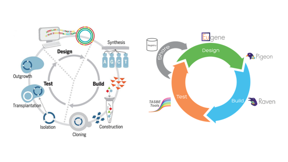
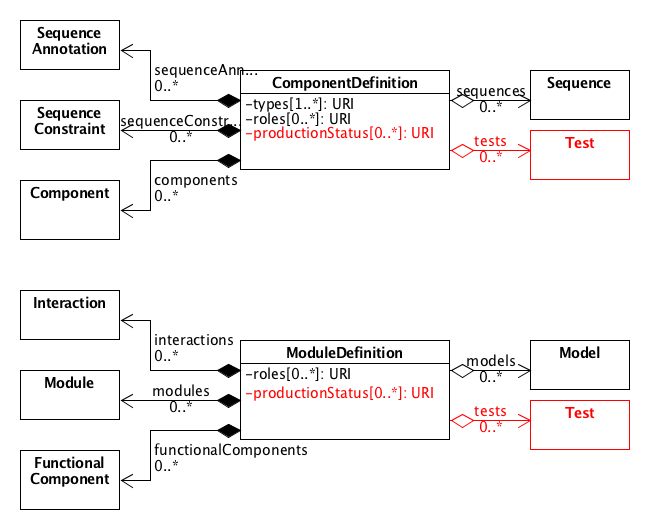
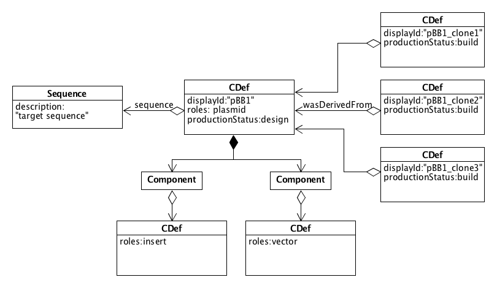
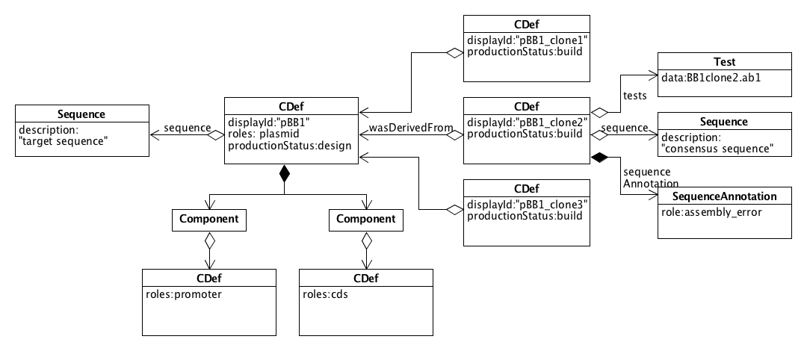
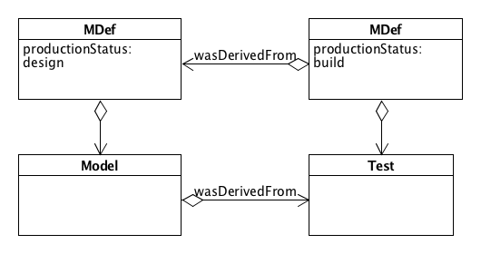
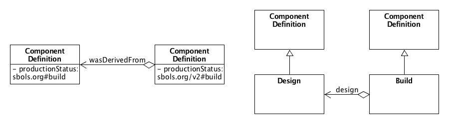

SEP 014 -- Using SBOL to Model the Design-Build-Test Cycle
===================================

SEP                     | <leave empty>
----------------------|--------------
**Title**                | Using SBOL to Model the Design-Build-Test Cycle
**Authors**           | Bryan Bartley (bartleyba@sbolstandard.org), Ali Humphries, James McLaughlin, Goksel Misirli, Matthew Pocock, James Skelton, Angel Goni-Moreno, Chris Myers, Jake Beal, and Anil Wipat
**Editor**            | <leave empty>
**Type**              | Data Model
**SBOL Version**      | 2.3
**Status**            | Withdrawn, Replaced by SEP 019
**Created**           | 20-Jun-2017
**Last modified**     | 19-Jul-2017
**Issue**          | [#31](https://github.com/SynBioDex/SEPs/issues/31)

Abstract
-----------

Linking experimental data with SBOL designs is becoming critical to a number of important synthetic biology projects. Therefore this SEP introduces a data model for SBOL that supports Design-Build-Test-Learn reasoning. As the synthetic biologist proceeds around the Design-Build-Test-Learn cycle, each iteration generates new understanding that must be integrated at each stage. This SEP will help synthetic biologists close the loop in the Design-Build-Test-Learn cycle.

Table of Contents  
---------------------

* [Motivation](#motivation)
* [Specification](#specification)
* [Example](#example)
* [Backwards Compatibility](#example)
* [Discussion](#discussion)
* [Relation to Other Proposals](#otherproposals)
* [References](#references)
* [Copyright](#copyright)

Motivation 
-------------

A critical bottleneck for many large-scale projects in synthetic biology is the inability to integrate data through successive stages of the design-build-test lifecycle. Up to now, SBOL has been used exclusively as a language for design, but in order to serve the advancement of synthetic biology, we must now extend SBOL to describe what happens when a design moves out of the designer's imagination and takes form in the lab as a real biological sample. Indeed a design may be realized in the lab as many distinct unique samples with distinct histories and biological variations. After building a design, experimentalists may run quality control and performance tests on their biological constructs. These procedures generate large volumes of data that can be difficult for a synthetic biologist to organize, track, and manage without automated tools. The SBOL standard could make a big impact in synthetic biology by implementing support for design-build-test automation. 

Many lines of evidence suggest that it is time for the SBOL community to act on this if it wants to stay relevant. [Recently, one SBOL developer brought attention to this issue, because linking experimental data with designs is becoming "critical" to his projects, such as inter-lab measurement standardization](https://groups.google.com/forum/?hl=us#!topic/sbol-dev/DxXJFVrqGyQ). In our own lab, linking designs with data about actual instances (or "clones") of plasmid constructs has also been an issue. From outside the SBOL community, our Chair has also been hearing from audiences about this problem at many international synthetic biology conferences. 

The field of synthetic biology borrows from more conventional engineering fields a framework for problem-solving known as the design-build-test cycle. The design-build-test cycle is essentially the scientific method applied in the context of engineering. Stages in the cycle include designing an inital prototype, testing that prototype, analyzing its performance against specific metrics, learning what worked and what did not work, designing a new prototype based on what was learned, and completing the cycle again. Ideally each cycle generates new understanding that feeds back into new cycles as alternative approaches or reformulated problems. Thus, this problem-solving strategy is also sometimes called the design-build-test-learn cycle.

The design-build-test cycle is especially important in the context of synthetic biology because trial and failure is an essential part of the process. Due to the unpredictability of biological systems, many prototypes (biological variants) of a genetic construct are often tested before arriving at the desired system behavior. Thus, synthetic biologists must routinely manage many cycles of designing, building, and testing genetic systems. The biodesign automation community was thus born out of a need to connect collaborators at different stages of synthetic biology with automated workflows. The synthetic biology cycle includes stages like mining DNA parts from online databases, assembling new genetic programs from DNA sequences, synthesizing and assembling DNA, quality control, quantitative characterization of a DNA part’s encoded behavior, and submitting characterized parts to inventories so that other engineers may reusethem. 

The origins of the design-build-test framework for engineering can be traced back to a business practice called product life-cycle management. In the 1980s the American Motor Corporation began developing a business practice called product life-cycle management (PLM) to help teams of engineers collaborate. Their automated PLM systems supported design-build-test workflows for engineers using off-the-shelf components, computer-aided design tools, and networked databases containing design specifications and documentation [1, 2]. The design-build-test cycle appears frequently in literature about PLM from the 1990s[1, 3]. Later, in the early 2000s, the design-build-test problem-solving framework became incorporated into educational pedagogy, especially in the context of engineering education[4, 5]. Nowadays, the design-build-test problem-solving framework has become a fundamental principle for synthetic biology [6, 7].  Two conceptualizations of this are shown below.

[As the SBOL Chair recently observed (on 6/17/17)](https://groups.google.com/forum/?hl=us#!topic/sbol-dev/DxXJFVrqGyQ), SBOL does not distinguish between designs that have been fabricated as DNA or subsequently tested. The design-build-test data model introduced in this SEP makes these stages explicit, and can be broadly understood inside and outside the SBOL community. As we expand the SBOL data model, it is important that we use simple and easy-to-understand concepts in order to promote broad interest and adoption. 

Specification 
----------------

This specification describes how the design-build-test cycle for synthetic biology may be represented using SBOL. Proposed changes to the data model include the introduction of two new properties, `productionStatus` and `tests`, which will be added to both `ComponentDefinition` and `ModuleDefinition`. The same properties must be duplicated in both classes in order to maintain symmetry between structural and functional layers of representation. In addition, a new class called `Test` is introduced. The `Test` class contains an external link to data files and some meta-data about those files. This specification clarifies where quality control and functional characterization data should be placed. Test data for quality control (eg, sequencing data) should be linked from a `ComponentDefinition` while functional data, (eg, flow cytometry) should be linked from a `ModuleDefinition`. Thus, this SEP establishes links between SBOL designs and experimental data.

## Indicating the Production Status

The `productionStatus` property of a `ModuleDefinition` or `ComponentDefinition` MAY optionally contain one of the following ontology terms, as defined in the table below. In the rest of this specification, we use `design` and `build` as shorthand to refer to any `ComponentDefinition` or `ModuleDefinition` that contains the corresponding URI in its `productionStatus` field. 

| **productionStatus**       | **Description**                                                                                                                  |
|----------------------------|----------------------------------------------------------------------------------------------------------------------------------|
| http://sbols.org/v2#design | Objects with this term represent the designer's *conceptual*   rendering of a synthetic construct expressed in SBOL           |
| http://sbols.org/v2#build  | Objects with this term describe a *real* biological sample   or physical artifact that currently exists or existed previously |

If no term is given, the object is assumed by default to represent a `design`. Hence, SBOL objects from versions prior to 2.3 will be grandfathered in as `designs`. In the future, SBOL developers may wish to add additional terms, or adopt extant ontologies, to describe different stages of production. 

For a given design many builds may be generated. In general, the design should serve as a reference to which builds are compared either for quality control (sequence verification) or comparison of observed versus expected output (experimental data vs. model predictions). Therefore, as a best practice, a user SHOULD NOT recursively copy all the Components and Modules which describe the compositional hierarchy of a design over to each new build generated, as this would be inefficient and redundant. A build object SHOULD be a simple `ComponentDefinition` or `ModuleDefinition` containing no subparts. If a `build` is augmented with any annotations or compositional elements, these should be interpreted as an empirical description of reality that describes the corresponding physical symbol. For example, one might add `Component` substructure to a `build` to indicate strucutural reorganization of a plasmid due to an unexpected recombination error. 

A `design` and `build` may be linked by `wasDerivedFrom` relationship.  A `design` and `build` may also be linked by PROV-O classes. This link however requires several degrees of indirection through `Activity` and `Usage` classes and may not be very intuitive for some users. An experimental protocol can be captured by a Plan object and the person who performed the protocol may be represented by an Agent. However, the preferred ontology terms and other fine details about how to represent experiments with PROV-O is still open for discussion and outside the scope of this SEP.

## Linking Experimental Data with `Test` Objects

The `Test` class is simply a wrapper object that provides a link to an external data file, with analogy to the `Model` class. A `Test` class represents empirical data, while a `Model` represents a simulation. For purposes of knowledge representation, the `Test` and `Model` concepts are considered distinct stages of production (see [Example 3](#example)) in synthetic biology workflows. However, the specification of `Test` and `Model` classes have some similarity because they both represent links to external files with meta-data about those files. Thus, the specification of these classes are similar, leading some in the SBOL development community to suggest abstracting out a general `Attachment` class to represent external data files. Specification of an `Attachment` class is beyond the scope of this SEP, but this proposal is compatible with that vision, as discussed in [Relation to Other Proposals](#otherproposals).

`Test` is subclassed from `Identified` .  A `Test` object contains two properties:

* `protocol`: The protocol contains a single URI which, in the simplest case, may refer to a file containing a written laboratory protocol. Alternatively, the URI may point to an instance of a provenance class, such as Plan or Activity. This specification is intentionally vague to allow users to experiment.
* `attachments`: A list of one or more data files that may be associated with this test. Data files might include .csv, .xlsx, .fcs, .abi, .png, etc. At this stage, tooling will have to infer the file type from a file extension. In the future, the URIs contained in this property may refer to `Attachment` objects.

Currently this specification does not require any further meta-data about the attachments, but this is discussed in [Relation to Other Proposals](#otherproposals).

## Validation Rules

* Objects in different stages of production (`design` vs `build`) MUST be related through PROV-O annotations. In other words, a `build` object MUST link back to a single `design` object, either through a simple `wasDerivedFrom` relationship, or through a more detailed provenance using Activity, Agent, and other classes to describe the assembly process. 
* The flag `design` or `build` MUST be assigned to the highest level object in an abstraction hierarchy (defined through `component` or `module` subpart relationships). This is where client tools should look for the term. It is OPTIONAL if other subparts in an abstraction hierarchy have a `productionStatus` specified. 
* Objects in different stages of production (`design` vs `build`) MUST NOT be mixed with each other in hierarchical compositions defined through `modules` and `components` subpart relationships.
* If the SBOL object at the highest level of a compositional hierarchy does not have a `productionStatus`, it is assumed to be `productionStatus: design`.
* A `ModuleDefinition` with `productionStatus:design` MUST NOT link to a `Test` object. In other words, the `tests` property MUST BE empty. It is appropriate for a `design` to link a `Model`, however.
* A `ModuleDefinition` with `productionStatus:build` MUST NOT link to a `Model` object. In other word, the `models` property MUST BE empty. It is appropriate, however, for a `build` to link to a `Test`. 

## Best Practices

* A `design` should be expect to describe an abstraction hierarchy of `Modules` or `Components` related through `modules` and `components` subpart relationships. In contrast, a `build` MAY be a flat data structure.  This is because it is redundant and inefficient to copy the full abstraction hierarchy for each `build` generated. A `design` may generate a large number of builds.

# Example 

For a given `design` many `builds` may be generated. In this example an abstraction hierarchy of `Components` is associated with the `design`.  The following shows an SBOL data structure representing a plasmid construct consisting of an insert and vector. Three distinct clones of this plasmid are represented.

Quality control data such as a sequencing trace file can be linked via a `Test` object. Sequence verification, no matter what the sequencing platform, generates a consensus `Sequence` for the `build`.  The `build` may then be augmented with quality control `SequenceAnnotations`. 

Some conceptualization of the Design-Build-Test cycle include a fourth step, Learn. Thus information gained through the process feeds back and informs new designs. To close the loop in the Design-Build-Test-Learn cycle, `Test` and `Model` must be connected. A `Test` may be linked to a `Model` by Provenance classes describing the data reduction and fitting procedure used to generate a Model.

Backwards Compatibility 
-------------------------
This SEP does not affect backwards compatibility.

To ensure reverse compatibility, all `ComponentDefinitions` are assumed to be a `design` unless explicitly indicated that is a `design`.  Thus any `ComponentDefinitions` current populating SBOL repositories such as JBEIR-ICE and SynBioHub should not be affected. Any `ComponentDefinitions` lacking a `productionStatus` property are grandfathered in as `design` objects.

Discussion 
----------
In the motivation section, I have included links to the original thread which motivated this SEP.

This proposal was robustly debated and discussed at the HARMONY workshop at University of Washington, Seattle, June 2017. Discussion was moderated according to formal guidelines which seemed to be successful in encouraging expression of different philosophical views and constructive problem-solving. In principle, all present consented to the shared view that the SBOL standard should support automation of design-build-test workflows. 

Based on group feedback, the Specification proposed here has been modified from the original SEP. In the original, `Design` and `Build` were explicitly represented by classes (subclassed from `ComponentDefinition`), while this modified proposal introduces internal SBOL ontology terms (`http://sbols.org/v2#design` and `http://sbols.org/v2#build`). The original proposal did not allow a `ModuleDefinition` to be distinguished as a design or build, while this proposal allows both `ComponentDefinitions` and `ModuleDefinitions` to be assigned a term indicating their production status. This was the most important deciding factor for the current approach, though other factors were considered. 

Our discussion searched out a compromise balance between pragmatism and idealism. Pragmatists value easy tool migration and minimal modifications to the data model, while idealists favor more explicit knowledge-representation and formalized approaches to ontology development. Ultimately these philosophical differences were bridged by a mutual desire for compromise and progress. 

The original proposal requires introducing new classes which presents some implementation challenges for library developers. In addition SynBioHub and ICE repositories already contain `ComponentDefinition` objects which would have to be redefined as `Design` or `Build` objects. Thus the introduction of two new terms `http://sbols.org/v2#design` and `http://sbols.org/v2#build` into the SBOL ontology provides a more expedient migration path that does not require implementing new classes. 

Thus, this proposal introduces new ontology terms rather than new classes, which also presents challenges worth discussing. The minimalist approach, which requires no changes to the data model, would be to put these new terms in the `ComponentDefinition::type` property, an approach similar to that taken for [SEP 011 -- Specify DNA / RNA topology with type fields](https://github.com/SynBioDex/SEPs/blob/master/sep_011.md).
* Overloading an existing field with too many different ontologies may be difficult for tooling to interpret and the semantics may become confusing for programmers
* If we choose to overload the `types` field, we would have to add a `types` field to `ModuleDefinition` (to maintain symmetry between structural and functional levels of representation)
* We shouldn't use the `roles` field either because that is used by client applications to determine the SBOL Visual symbol for display
* In other CAD standards, information about a product's development status is fundamental [8]
* In the field of ontology development, the difference between Concept vs Reality is fundamental
* Having a dedicated field for production status makes sense, as we may later want to introduce more granularity in describing stages of production, and there may be extant ontologies in the manufacturing domain that represent production stages 

Based on our best synthesis of all the views and concerns express, we, the authors, conclude that a new field indicating `productionStatus` should be added to both `ComponentDefinition` and `ModuleDefinition`.

It is also necessary to link data. Since quality control data, ie, DNA sequencing data, describes the structural features and manufacturing outcomes, it is appropriate to attach these data to ComponentDefinitions. Other data containing characterization data of functional behavior are more appropriate to attach to ModuleDefinitions. Therefore, we conclude that a property called `tests` should be added to both `ComponentDefinition` and `ModuleDefinition` which contains URIs to corresponding `Test` objects. This ensures consistency and symmetry between the structural and functional layers of representation in the SBOL data model. 

Discussion about where to put data describing `Context` was also important. Since `Context` is a broad concept, we discussed different kinds of `Context` such as `Host` and `Environment`. The reason that Context enters into this dicussion is because it is necessary to specify between an intended `Context` for a `design` versus the actual `Context` in which a synthetic biological construct is actually built and deployed. As a simple example, the repressilator was originally designed for the MG1655Z1 strain of *E. coli* while a researcher may choose to evaluate its behavior in another organism entirely, such as *Lactobacillus*.

Relation to Other Proposals  
----------
This SEP was devised to be consistent with future plans for developing a general `Attachment` class. `Attachment` objects would wrap external file links and provide meta-data that helps client tooling interface with the files. In anticipation of future plans, this SEP does not specify any metadata about files referenced by a `Test` class. That's because a constituency of SBOL developers now see justification for specifying a general `Attachment` class that includes meta-data about external data files. Some of the proposed propoerties of this class are as follows:

* `source`: The attached file
* `format`: An optional URI indicating the data format. The EDAM ontology, which is currently used to indicate `Model.language`, extends beyond modeling formats and includes a variety of experimental data formats as well.
* `size`: The byte size of the linked file. It is especially helpful to know this when operating over networks with large files.
* `hash`: A file hash used by databases like SynBioHub for caching files

Currently, specification of `Attachment` is beyond the scope of this proposal. An issue which is still open with regard to `Attachments` is where they belong in the data model. For example, some have argued that it would be helpful to attach to `Collections`. In the SynBioHub repository, `Attachments` (a generic annotation class used internally) can be associated with any object. In a future proposal, we recommend that `Attachment` be added as a new `TopLevel` class. In the future a `Test` could refer to `Attachment` objects through its `attachments` property. Thus this SEP is expected to be consistent with future development of an `Attachment` class.

References  
----------
[1] Gerald I Susman. Integrating design and manufacturing for competitive advantage.
Oxford University Press, 1992

[2] S Hill. How to be a trendsetter: Dassault and ibm plm customers swap tales from the
plm front. COE Newsnet, 2003.

[3] Wheelwright SC, Clark KB. Accelerating the design-build-test cycle for effective product development. International Marketing Review. 1994 Feb 1;11(1):32-46.

[4] Elger DF, Beyerlein SW, Budwig RS. Using design, build, and test projects to teach engineering. InFrontiers in Education Conference, 2000. FIE 2000. 30th Annual 2000 (Vol. 2, pp. F3C-9). IEEE.

[5] Hermon P, McCartan C, Cunningham G. Group design-build-test projects as the core of an integrated curriculum in product design and development. engineering education. 2010 Dec 1;5(2):50-8.

[6] Hutchison CA et al. `Design` and synthesis of a minimal bacterial genome. Science. 2016 Mar 25;351(6280).

[7] http://2014.igem.org/Team:BostonU/Chimera

[8] Sudarsan Rachuri, Eswaran Subrahmanian, Abdelaziz Bouras, Steven J Fenves, Sebti Foufou, and Ram D Sriram. Information sharing and exchange in the context of product lifecycle management: Role of standards. Computer-Aided Design, 40(7):789–800, 2008.

Copyright 
-------------

  
   
  To the extent possible under law,
  <a rel="dct:publisher"
     href="sbolstandard.org">
    SBOL developers</a>
  has waived all copyright and related or neighboring rights to
  SEP 013.
This work is published from:

  United States.

