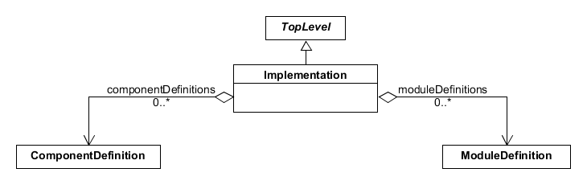
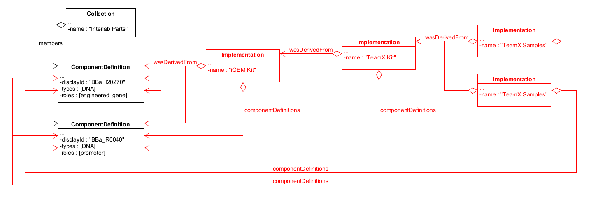

SEP 016 -- Experimental Implementations
======================================================

SEP                   | <leave empty>
----------------------|--------------
**Title**             | Experimental IUmplementations
**Authors**           | Jake Beal (jakebeal@gmail.com), Raik Gruenberg (raik.gruenberg@gmail.com), Nicholas Roehner (nicholasroehner@gmail.com)
**Editor**            | 
**Type**              | Data Model
**SBOL Version**      | 2.3
**Replaces**          | SEP 014
**Status**            | Draft
**Created**           | 04-Sep-2017
**Last modified**     | 25-Sep-2017

Abstract
-----------

We propose to add a new class, `Implementation`, to allow users to represent physical realizations of biological designs. For example, an `Implementation` could be used to
represent an aliquot of DNA, a cell clone, or the contents of a 96-well plate. `Implementation` will serve as the connection point between experimental results with theoretical design and a, often more detailed, description of the system as it was actually built.

Table of Contents
---------------------

* [1. Rationale](#rationale)
* [2. Specification](#specification)
  * 2.1 Implementation(#implementation)
* [3. Examples](#example)
  * 2.1 Implementation(#implementation)
    * 2.1 Implementation(#implementation)
* [4. Backwards Compatibility](#compatibility)
* [5. Discussion](#discussion)
* [6. Competing SEPs](#competing_seps)
* [References](#references)
* [Copyright](#copyright)

Rationale 
----------------

This SEP was initiated in response to 

Specification 
----------------------------------------------

Here we define one new class, `Implementation`.

### 2.1 Implementation 

TODO (Figure 1).

**Figure 1:** Diagram of the `Implementation` class and its associated properties

#### 2.1.1 Implementation.componentDefinitions

TODO

#### 2.1.2 Implementation.moduleDefinitions

TODO
  
Examples 
-------------------------------

### 3.1 Sample Derivation and Biological Replicates

### 3.2 Enumerating a Combinatorial Library of GFP Reporters

Backwards Compatibility 
-----------------

TODO

Discussion 
-----------------

**Advantages:**

TODO

Competing SEPs 
-----------------

TODO

References 
----------------

1. Brown et al., Synthetic promoters for CHO cell engineering, Biotechnol. and Bioeng., vol. 111, pp. 1638-1647, 2014.

[SBOL-Specification/#31]: https://github.com/SynBioDex/SBOL-specification/issues/31
[1]: https://www.ncbi.nlm.nih.gov/pubmed/24615264

Copyright 
-------------

  
   
  To the extent possible under law,
  <a rel="dct:publisher"
     href="sbolstandard.org">
    SBOL developers</a>
  has waived all copyright and related or neighboring rights to
  SEP 007.
This work is published from:

  United States.

