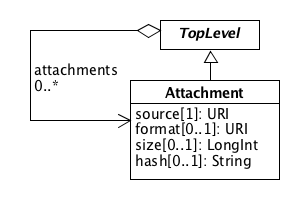

SEP 18 -- Attachment
===================================

SEP                     | <leave empty>
----------------------|--------------
**Title**             | Data Attachments
**Authors**           | Bryan Bartley (bartleyba@sbolstandard.org), Chris Myers (myers@ece.utah.edu), Nicholas Roehner (nicholasroehner@gmail.com), and SBOL Developers (authors, please opt in)
**Editor**            | Nicholas Roehner (nicholasroehner@gmail.com)
**Type**              | Data Model
**SBOL Version**      | 2.2
**Status**            | Final Draft
**Created**           | 13-Sep-2017
**Last modified**     | 13-Nov-2017

Table of Contents  
---------------------

* [1. Rationale](#rationale)
* [2. Specification](#specification)
	* [2.1 Attachment](#attach)
    	* [2.1.1 Attachment.source](#source)
    	* [2.1.2 Attachment.format](#format)
    	* [2.1.3 Attachment.size](#size)
    	* [2.1.4 Attachment.hash](#hash)
* [3. Examples](#example)
* [4. Backwards Compatibility](#compatibility)
* [5. Discussion](#discussion)
* [6. Relation to Other SEPs](#relation)
* [References](#references)
* [Copyright](#copyright)

Rationale 
----------
To specify a general container for a file attachment including metadata that helps tools interpret the file

Specification 
-------------

### 2.1 Attachment 

The `Attachment` class is a general container for data files, especially experimental data files. `Attachment` is a `TopLevel` object, and any other `TopLevel` object can refer to a list of `attachments`. `Attachment` has the following properties:

#### 2.1.1  Source 

The source is a link to the external file and is REQUIRED.

#### 2.1.2 Format 

The format is an ontology term indicating the format of the file. It is RECOMMENDED to use the EDAM ontology for file formats, which includes a variety of experimental data formats. The `format` is a REQUIRED field

#### 2.1.3 Size 

The size is a long integer indicating the file size in bytes. This may be used by client applications accessing files over RESTful APIs. This field is OPTIONAL.

#### 2.1.4 Hash 

The hash is a string used to retrieve files from a cache. This field is OPTIONAL.

**Figure 1:** Diagram of the `Attachment` class and its associated properties

Examples 
-------

### 3.1 Attachment 

**Example 1:** `Attachments` wrap an experimental data file and include important meta-data that helps tools interpret the data. This example attaches quality control data in the form of a gel image and sequencing results.

Backwards Compatibility 
-----------------------
This proposal does not affect backwards compatibility.

Discussion 
----------
This proposal has been discussed extensively at HARMONY 2017 and on the Github issue tracker. There is general consensus that an `Attachment` is needed.  

<!--- Some have proposed that any `TopLevel` object should be able to link an `Attachment`, but a concern raised with this approach is that it becomes difficult for developers to interpret when and where the `Attachment` should be added. Therefore this proposal specifies that only `Collections` may link to `Attachments`.  However, at a later date, there may be justifiable reasons to allow other core SBOL classes to link `Attachments`. --->

Relation to Other SEPs 
----------------------
This proposal relates to SEP 019, which deals with how experimental data should be linked to SBOL as part of encoding the provenance for design-build-test-learn cycles in synthetic biology.

References 
----------

Copyright 
---------

  
   
  To the extent possible under law,
  <a rel="dct:publisher"
     href="sbolstandard.org">
    SBOL developers</a>
  has waived all copyright and related or neighboring rights to
  SEP 013.
This work is published from:

  United States.

