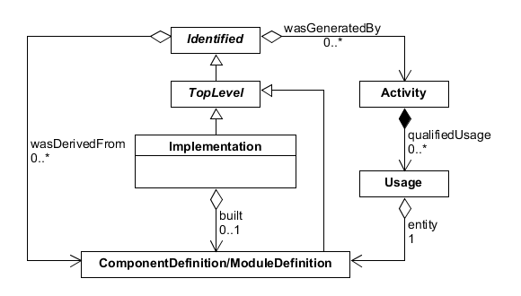
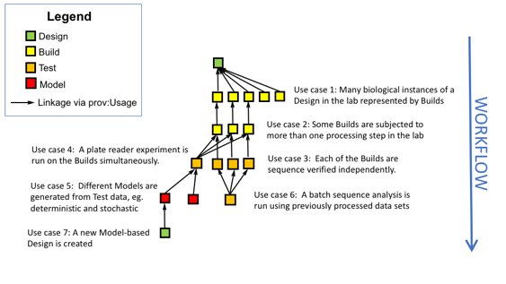
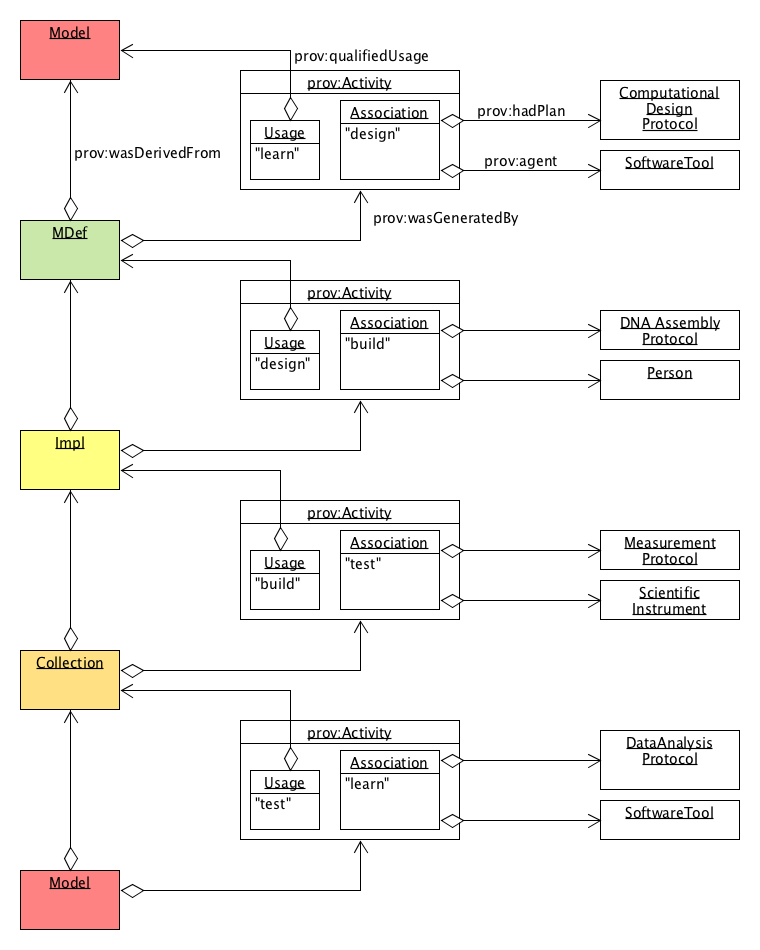
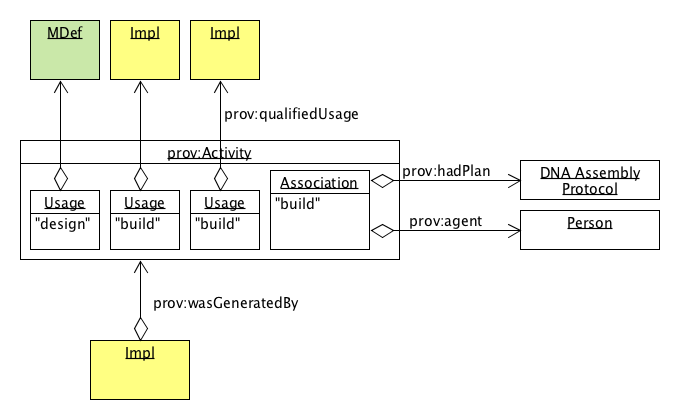
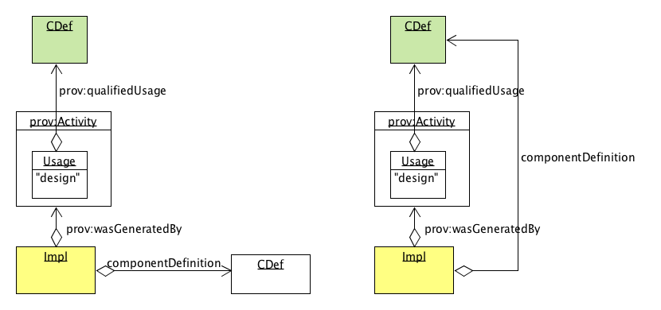
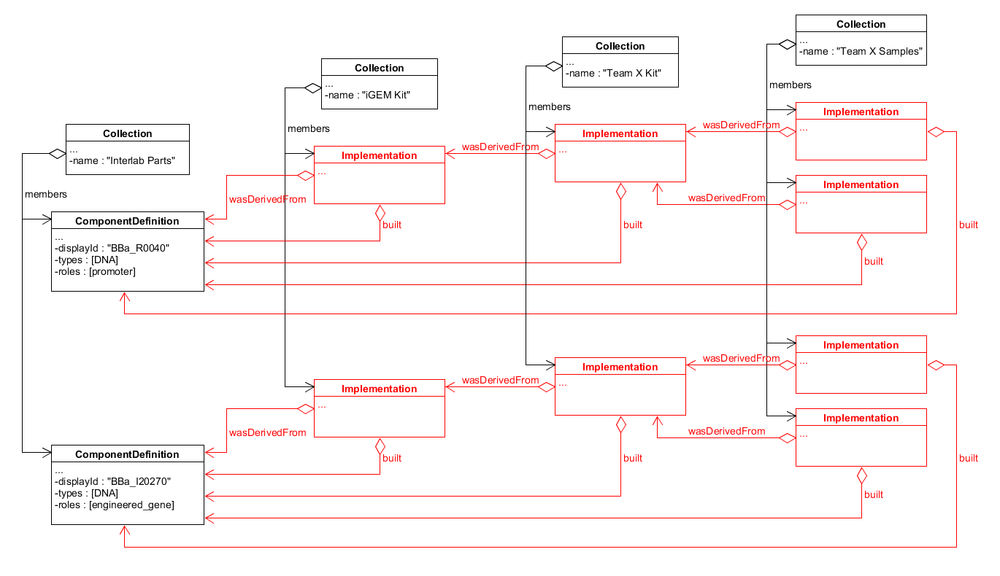
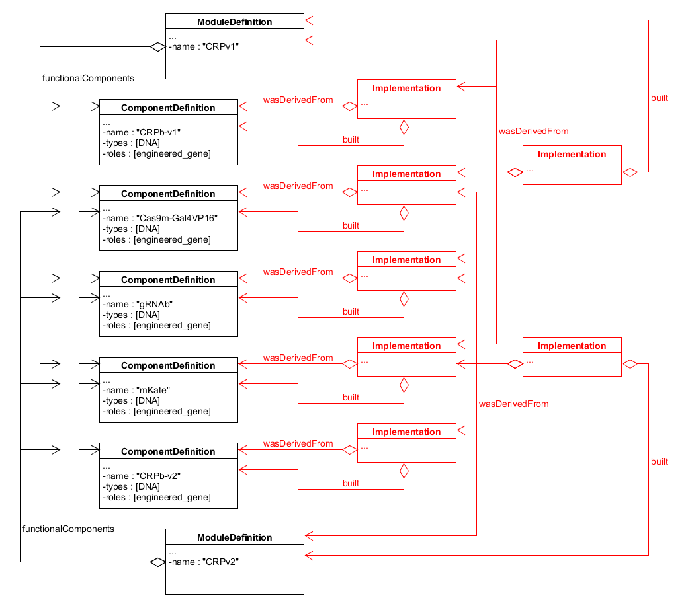

SEP 019 -- Using SBOL to model the Design-Build-Test-Learn Cycle
======================================================


SEP                   | <leave empty>
----------------------|--------------
**Title**             | SEP 019 -- Using SBOL to model the Design-Build-Test-Learn Cycle
**Authors**           | Bryan Bartley (bartleyba@sbolstandard.org), Jake Beal (jakebeal@gmail.com), Raik Gruenberg (raik.gruenberg@gmail.com), James McLaughlin (j.a.mclaughlin@newcastle.ac.uk), Chris Myers (myers@ece.utah.edu), Nicholas Roehner (nicholasroehner@gmail.com), and Anil Wipat (anil.wipat@newcastle.ac.uk)
**Editor**            | Nicholas Roehner (nicholasroehner@gmail.com)
**Type**              | Data Model
**SBOL Version**      | 2.3
**Replaces**          | SEP 014, SEP 016, SEP 017, SEP 018
**Status**            | Draft
**Created**           | 10-Nov-2017
**Last modified**     | 11-Dec-2017

Abstract
-----------

Linking experimental data with SBOL designs is becoming critical to a number of important synthetic biology projects. Therefore this SEP introduces a data model for SBOL that supports Design-Build-Test-Learn reasoning. As the synthetic biologist proceeds around the Design-Build-Test-Learn cycle, each iteration generates new understanding that must be integrated at each stage. This SEP will help synthetic biologists close the loop in the Design-Build-Test-Learn cycle.

Table of Contents
---------------------

* [1. Rationale](#rationale)
* [2. Specification](#specification)
  * [2.1 Implementation](#impl)
    * [2.1.1 Implementation.built](#built)
  * [2.2 Design, Build, Test, and Learn](#dbtl)
  * [2.3 Best Practices](#best_practices)
    * [2.3.1 Usage Roles](#usage_roles)
    * [2.3.2 Versioning versus Provenance Semantics](#provenance_semantics)
  * [2.4 Validation Rules](#validation_rules)
* [3. Examples](#examples)
  * [3.1 Use Cases](#example1)
  * [3.2 Design-Build-Test-Learn Provenance](#example2)
  * [3.3 Assembly Provenance](#example3)
  * [3.4 Implementation](#example4)
  * [3.5 Attachment](#example5)
* [4. Backwards Compatibility](#compatibility)
* [5. Discussion](#discussion)
* [6. Relation to Other SEPs](#competing_seps)
* [References](#references)
* [Copyright](#copyright)

Rationale <a name="rationale"></a>
----------------

* Decouple the design-build-test-learn process, according to the foundational principles for engineering biology.
* Specify where to add experimental data
* Provide an SBOL representation of biological instances of a design that can link to LIMS systems
* Provide clear guidance for using PROV-O with illustrative examples. 
* Capture workflow provenance, a description of the events of a workflow, which is crucial for scientific reproducibility
* Support model-based design.

This SEP was initiated in response to the ["Design-Build-Test" thread] on sbol-dev.

Specification <a name="specification"></a>
----------------------------------------------

Here we propose to add a new class, `Implementation`, to allow users to represent physical realizations of biological designs. For example, an `Implementation` could be used to represent an aliquot of DNA, a cell clone, or a lysate. The `Implementation` class is meant to serve as a connection point between theoretical designs of biological systems and descriptions of their actual structure and/or function following their physical construction.

Here we also define four new SBOL ontology terms (`sbol:design`, `sbol:build`, `sbol:test`, and `sbol:learn`) to serve as values for the `hadRole` properties of the PROV-O classes `Usage` and `Association`. In addition, we present tentative best-practice validation rules for the use of these ontology terms and PROV-O to represent design-build-test-learn cycles. These best practices will undergo continuing development to support new use cases as they arise.

### 2.1 Implementation <a name="impl"></a>

An `Implementation` represents a real, physical instance of a synthetic biological construct which may be associated with a laboratory sample. An `Implementation` describes the thing which was built during the Build phase of a D-B-T-L workflow. An `Implementation` may be linked back to its original design (either a `ModuleDefinition` or `ComponentDefinition`) using the `wasDerivedFrom` and/or `wasGeneratedBy` properties inherited from the Identified superclass. An `Implementation` may also link to a `ModuleDefinition` or `ComponentDefinition` that specifies its actual realized structure and/or function as described in [Section2.1.1](#built).



**Figure 1:** Diagram of the `Implementation` class and its associated properties

#### 2.1.1 Implementation.built <a name="built"></a>

The `built` property is OPTIONAL and MAY contain a URI that MUST refer to a `TopLevel` object that is either a `ComponentDefinition` or `ModuleDefinition`. This `ComponentDefinition` or `ModuleDefinition` is intended to describe the actual physical structure and/or functional behavior of the `Implementation`. When the `built` property refers to a `ComponentDefinition` that is also linked to the `Implementation` via PROV-O properties such as `wasDerivedFrom`, it can be inferred that the actual structure and/or function of the `Implementation` matches its original design. When the `built` property refers to a different `ComponentDefinition`, it can be inferred that the `Implementation` has deviated from the original design. For example, the latter could be used to document when the DNA sequencing results for an assembled construct do not match the original target sequence. 

### 2.2 Design, Build, Test, and Learn <a name="dbtl"></a>

The ontology terms `design`, `build`, `test`, and `learn` are OPTIONAL values of the `hadRole` properties of  the `Usage` and `Association` classes. These properties describe how entities (such as samples, data, or models) are used in an `Activity` and what role an `Agent` or `Plan` (such as a person, software tool, or protocol) plays in an `Activity`, respectively.

In natural language, these terms indicate the following:
* "design" describes a process by which a conceptual representation of an engineer's imagined and intended design is derived, possibly from a model or pre-existing design.
* "build" describes a process by which a sample is derived in accordance with a conceptual design, often from other samples.
* "test" describes a process by which raw data or observations are derived via experimental measurement of samples.
* "learn" describes a process by which a theoretical model, analysis, datasheet, etc. is derived, usually from experimental data or another model.

### 2.3 Best Practices <a name="best_practices"></a>

#### 2.3.1 Usage Roles <a name="usage_roles"></a>

To facilitate data exchange across different domains of synthetic biology, a user MAY use one of the terms "design", "build", "test", or "learn" to specify `Usage` roles.

A user MAY also specify additional Usage roles that correspond to their own home-made ontologies for specifying recipes and protocols.

#### 2.3.2 Versioning versus Provenance Semantics <a name="provenance_semantics"></a>

A new object which is the product of an `Activity` links back to the `Activity` which generated it via the `wasGeneratedBy` field. By the W3 PROV-O specification, generation is defined as:
```
...the completion of production of a new entity by an activity. This entity did not exist before generation and becomes available for usage after this generation.
```
Provenance semantics are somewhat different from the versioning semantics defined in the SBOL specification. The SBOL specification defines a new version of an object as an update of a previously published object (and therefore a previously existing object). In contrast, an SBOL object which is "generated" from another SHOULD BE regarded as a new entity, not a new version by the PROV-O specification above. However, this distinction is somewhat subjective (see Theseus paradox).  Therefore we RECOMMEND as a best practice that objects linked by Activities not be successive versions of each other, though we leave this at the discretion of users and library developers.

### 2.4 Tentative Validation Rules <a name="validation_rules"></a>

A design-build-test-learn process typically generates new SBOL objects in the order of one or more `ModuleDefinitions` and/or `ComponentDefinitions`, followed by one or more `Implementations`, followed by one or more `Collections` of `Attachments`, followed by one or more `Models`. This order of operations (among others) is compatible with the following best-practice validation rules:

* An `Activity` that contains an `Association` of role "design" SHOULD be referred to by the `wasGeneratedBy` property of at least one `ModuleDefinition` or `ComponentDefinition`. If this `Activity` contains one or more `Usage` objects, then at least one of them SHOULD be of role "learn" or "design".
* An `Activity`that contains an `Association` of role "build" SHOULD be referred to by the `wasGeneratedBy` property of at least one `Implementation`. If this `Activity` contains one or more `Usage` objects, then at least one of them SHOULD be of role "design" or "build".
* An `Activity`that contains an `Association` of role "test" SHOULD be referred to by the `wasGeneratedBy` property of at least one `Collection` of `Attachment` objects. If this `Activity` contains one or more `Usage` objects, then at least one of them SHOULD be of role "build".
* An `Activity` that contains an `Association` of role "learn" SHOULD be referred to by the `wasGeneratedBy` property of at least one `Model`, `Collection` of `Attachment` objects, `ModuleDefinition`, `ComponentDefinition`, or `Sequence`. If this `Activity` contains one or more `Usage` objects, then at least one of them SHOULD be of role "test".

* A `Usage` of role "design" SHOULD refer to a `ModuleDefinition` or `ComponentDefinition`.
* A `Usage` of role "build" SHOULD refer to an `Implementation`.
* A `Usage` of role "test" SHOULD refer to a `Collection` of `Attachment` objects. 
* A `Usage` of role "learn" SHOULD refer to a `Model`.

Examples <a name='examples'></a>
-------------------------------

See [Discussion](#discussion) for an in-depth explanation of these examples.

### 3.1 Use Cases <a name="example1"></a>



**Example 1:** A hypothetical workflow for model-based design that demonstrates a variety of use cases which are supported by this proposal

### 3.2 Design-Build-Test-Learn Provenance <a name="example2"></a>



**Example 2:** A reproducible workflow for model-based design represented using PROV-O classes and annotations

### 3.3 Assembly Provenance <a name="example3"></a>



**Example 3:** A detailed representation of assembly provenance. Assembly provenance allows a synthetic biologist to track all the physical components or samples which go into a DNA assembly protocol.

### 3.4 Implementation <a name="example4"></a>



**Example 4:** An Implementation links a design ComponentDefinition to its build. In the left example, the build does not match its design specification. In the right hand example, the build does match its specification.

### 3.5 Derivation of Biological Replicates for iGEM Interlab Study <a name='example1'></a>
 


**Example 5:** An initial sample kit based on part designs from the iGEM Registry is replicated and split into different samples.
 
### 3.6 Co-Transfection of Constructs for CRISPR Repression Module <a name='example2'></a>
 


**Example 6:** Two sets of overlapping constructs that implement the components of a CRISPR-based circuit are transfected to implement two different versions of the circuit.

Backwards Compatibility <a name='compatibility'></a>
-----------------

This proposal does not affect backwards compatibility.

Discussion <a name='discussion'></a>
-----------------

### 5.1 Design-build-test-learn

The design-build-test-learn cycle is a common theme in synthetic biology and engineering literature. The cycle is a generalized abstraction of an ideal engineering workflow and approach to problem-solving. Thefefore, the design-build-test-learn cycle is a de facto ontology upon which to base an SBOL data model for workflow abstraction. Other workflow activities in synthetic biology, such as analyzing, modeling, verifying, and evolving, by and large fit into the design-build-test-learn abstraction. 

This specification enables synthetic biologists to capture workflow provenance with SBOL. The aim is to
capture a complete description of evaluation and enactment of computational and laboratory protocols in a workflow. This is crucial to verification, reproducibility, and automation in synthetic biology. By specifying a coherent model for workflow provenance, we can also address other critical use cases such as specifying where to add experimental data and performing model-based design.

Provenance classes were previously adopted in SBOL 2.1, but a gap in the specification left some ambiguity in how these classes should be used.  The 2.1 specification indicates that the `hadRole` field on `Usage` and `Activity` classes MUST be provided, but does not define any terms to use in these fields. Because such terms are not specified, it is currently not possible for tool-builders to interpret or exchange provenance histories. It is expected that users will use their own ontology terms to specify how objects were used in a recipe, protocol, or computational analysis. However, these home-made ontologies will be very domain specific and may not be intelligible to users working in another domain. For example a modeler should not be expected to understand an ontology of Usage roles for DNA assembly. The terms "design", "build", "test", and "learn" provide a high level workflow abstraction that allows tool-builders to track provenance within their domain as well as to track the flow of data between domains.
 
[Example 1](#example1) illustrates the various use cases that are possible with this provenance representation. Use case 1 describes linking many biological instances (plasmid clones, cellular clones, etc.) to the design which generated them. Use case 2 describes linking sequential stages of a build process which requires more than one processing step in the laboratory. Use case 3 describes a simple case of linking experimental data, such as sequencing data, to a sample. Use case 4 describes performing an experimental test on multiple samples at once in batch, for example in a 96-well plate.
Use case 5 describes a scenario in which different models (eg. deterministic vs stochastic) are derived from experimental data. Use case 6 describes a case in which data from multiple experiments are integrated into a single analysis. Use case 7 describes the creation of a model-based design. 

The Design, Build, and Test objects illustrated in Example 1 are included for purposes of discussion, but this specification does not actually introduce new classes by these names. Rather, this specification introduces the `Implementation` class to represent "Builds". Also this specification introduces `Attachments` in order to wrap experimental data files generated by a "Test". A "Design" is represented by a `ModuleDefinition`.

[Example 2](#example2) shows explicitly how SBOL objects can be linked via PROV-O in an idealized design-build-test-learn workflow. This particular example represents model-based design. The workflow begins with a Model which is used to generate a `ModuleDefinition` ("Design") using a computational tool such as iBioSim. This ModuleDefinition is then used to generate a new `Implementation` ("Build") via an AssemblyProtocol. Now that a "Build" has been constructed in the laboratory, a "Test" may be performed by running a MeasurementProtocol on laboratory equipment, thus generating a `Collection` of data files or `Attachments`. Finally, a new `Model` might be derived from these data. This `Model` may not match the beginning `Model`, as our observation may not match the prediction.

For illustrative purposes, Example 2A shows how `Agent` or `Plan` might be extended to represent the important players in a synthetic biology worflow.  For example, a ComputationalDesignProtocol may document that a Python script was executed in order to optimize a DNA sequence for synthesis. An AssemblyProtocol may describe a laboratory protocol (for example, either manual or automated). A SoftwareTool or Person are `Agents` that assist in an `Activity`. These examples illustrate where a developer might want to hook in their own application-specific data model. The PySBOL and libSBOL libraries allow users to define their own extension classes to `Plan` and `Agent` through inheritance relationships.

In addition to specifying a procedural workflow, this specification also allows us to interpret other kinds of provenance. [Example 3](#example3) illustrates an example of "assembly provenance". This allows the user to track all of the physical instances of components which may be used in a DNA assembly procedure as well as the original design used to generate the new build. Other kinds of provenance are also possible. For example, provenance might also be used to track all the `Models` used to compose a more complicated `Model`.

[Example 4](#example4) illustrates how the `Implementation` class is used to differentiate a conceptual design from a realized design. In the left hand example, the `Implementation` links via PROV-O to the `ComponentDefinition` that represents the original design, while its `componentDefinition` property links to the `ComponentDefinition` which describes the structure of the actual physical implementation. The right hand example demonstrates a case where the `Implementation` matches its design specification.

[Example 5](#example5) provides an example of representing a sample history in SBOL. An initial sample kit based on part designs from the iGEM Registry is replicated and split into separate kits for each iGEM team. Multiple samples are then extracted from each team's kit for further construction and/or testing. Software tooling can trace the provenance of each sample to determine whether its original design (the `ComponentDefinition` from which its parent sample was derived) matches the description of what was built (the `ComponentDefinition` linked via its `built` property).

[Example 6](#example6) provides an example of representing physical composition with SBOL. Two sets of overlapping constructs that implement the components of a CRISPR-based circuit are transfected to implement two different versions of the circuit.Software tooling can confirm that a given circuit `Implementation` satisfies its original design in two ways. First, a tool can compare the `ModuleDefinition` objects referred to by the `wasDerivedFrom` and `built` properties of the circuit `Implementation`. Second, a tool can confirm that the `ComponentDefinition` objects composed by the `ModuleDefinition` are the same as those from which the circuit component `Implementation` objects are derived.   

Relation to Other SEPs <a name='competing_seps'></a>
-----------------

This proposal evolved from SEP 14 after discussion at 2017 HARMONY and COMBINE workshops, on the Github issue tracker, and on the ["Design-Build-Test" thread]: https://groups.google.com/forum/#!topic/sbol-dev/AnpwJP2_f5A

This proposal is competing with SEP 20. The most significant difference between these SEPs is that SEP 20 includes a mandatory design field on its Implementation class. This field is meant to serve as the primary means for documenting the intended structure and/or function of an Implementation, rather than PROV-O classes.

On the one hand, the design field could serve as a simpler, more explicit means of expressing these semantics. On the other hand, the design field could be seen as redundant given SBOL's adoption of a subset of PROV-O. In addition, the design field is currently mandatory as specified by SEP 20, which fails to account for use cases where there is no intended design, such as a sample of natural/unknown origin or one produced via directed evolution. 

If SEP 19 passes, it would not preclude the addition of an optional design field to the Implementation class in the future. 

References <a name='references'></a>
----------------

Copyright <a name='copyright'></a>
-------------
<p xmlns:dct="http://purl.org/dc/terms/" xmlns:vcard="http://www.w3.org/2001/vcard-rdf/3.0#">
  <a rel="license"
     href="http://creativecommons.org/publicdomain/zero/1.0/">
    
  </a>
  <br />
  To the extent possible under law,
  <a rel="dct:publisher"
     href="sbolstandard.org">
    <span property="dct:title">SBOL developers</span></a>
  has waived all copyright and related or neighboring rights to
  <span property="dct:title">SEP 007</span>.
This work is published from:
<span property="vcard:Country" datatype="dct:ISO3166"
      content="US" about="sbolstandard.org">
  United States</span>.
</p>
