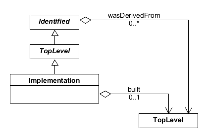

SEP 020 -- The Implementation class for biological clones and replicates
========================================================================

SEP                   | <leave empty>
----------------------|--------------
**Title**             | SEP 020 -- The Implementation class for biological clones and replicates
**Authors**           | Raik Gruenberg (raik.gruenberg@gmail.com)
**Editor**            | Nicholas Roehner (nicholasroehner@gmail.com)
**Type**              | Data Model
**SBOL Version**      | 2.3
**Replaces**          | SEP 014, SEP 016, SEP 017, SEP 018
**Status**            | Draft
**Created**           | 01-Dec-2017
**Last modified**     | 01-Nov-2017

Abstract
-----------

This proposal modifies the related SEP 19 ("Using SBOL to model the Design-Build-Test cycle").

Experimental information recorded for one engineered clone of cells or a batch of biomaterial is often not representative for the behavior of another clone or batch. The reason are additional variables (known or unknown) such as mutations or stochastic biochemical events that lie outside the scope of the actual design. Bioengineers are therefore used to tracking the identity of clones, batches or replicates of biological materials whenever experimental results are collected. The **Implementation** class defined in SEP 19 is here modified in order to allow a reliable and straightforward identification of cell lines, bacterial clones and other replicates of biomaterial *without* any requirement of provO (provenance ontology) vocabulary.

Table of Contents
---------------------

* [1. Rationale](#rationale)
* [2. Specification](#specification)
  * [2.1 Implementation](#impl)
    * [2.1.1 Implementation.componentDefinitions](#compDef)
    * [2.1.2 Implementation.moduleDefinitions](#modDef)
  * [2.2 Attachment](#attach)
    * [2.2.1 Attachment.source](#source)
    * [2.2.2 Attachment.format](#format)
    * [2.2.3 Attachment.size](#size)
    * [2.2.4 Attachment.hash](#hash)
  * [2.3 Design, Build, Test, and Learn](#dbtl)
  * [2.4 Best Practices](#best_practices)
    * [2.4.1 Usage Roles](#usage_roles)
    * [2.4.2 Versioning versus Provenance Semantics](#provenance_semantics)
  * [2.5 Validation Rules](#validation_rules)
* [3. Examples](#examples)
  * [3.1 Use Cases](#example1)
  * [3.2 Design-Build-Test-Learn Provenance](#example2)
  * [3.3 Assembly Provenance](#example3)
  * [3.4 Implementation](#example4)
  * [3.5 Attachment](#example5)
* [4. Backwards Compatibility](#compatibility)
* [5. Discussion](#discussion)
* [6. Relation to Other SEPs](#competing_seps)
* [References](#references)
* [Copyright](#copyright)

Rationale 
----------------

* Identify cell lines (clones, replicates, batches) while providing a direct link to the intented design
* Provide a clear and simple representation for biomaterials as they are routinely exchanged between labs or obtained from commercial vendors and collections such as AddGene, ACTC and others
* Provide an unambiguous and minimal representation for clone / cell line identity as currently required by Journals for experimental papers
* Allow tools to parse and generate `Implementation` records without having to deal with detailed workflow information
* Allow the addition of workflow & provenance information (as described in SEP 19) as an optional layer of meta information on top of the minimal clone identification
* More clearly separate actual biological / experimental provenance ("This clone was physically derived from that other clone by experiment X") from workflow and information history ("This clone is supposed to implement the following design and was assembled from component A and B using protocol z"). 

This SEP was initiated in response to the ["Design-Build-Test" thread] on sbol-dev and replaces SEP 16. 

Specification 
----------------------------------------------

We a new class `Implementation` in the core SBOL data model. 

### 2.1 Implementation class 

An `Implementation` represents a real, physical instance of a synthetic biological construct which may be associated with, typically more than one, actual laboratory samples. Note that the representation of individual samples (as in LIMS systems) remains outside the scope of SBOL. Whether or not two samples are considered to belong to the same batch or at which point they are split into separate `Implementation` instances is decided by the user and will be a matter of community best practices in a given area of bioengineering. 

`Implementation` MUST be linked back to its *intended* design, either a `ModuleDefinition` or `ComponentDefinition` using a mandatory field `design` (this is the main difference to SEP 19). An `Implementation` MAY also link, via an optional field `build`, to an additional `ModuleDefinition` or `ComponentDefinition` which represents a more current or a more detailed picture of its actual structure as it was realized in the laboratory. 

The `componentDefinition` and `moduleDefinition` properties of an `Implementation` are OPTIONAL, but if one of them is non-empty, then the other MUST be empty.

**Figure 1:** Diagram of the `Implementation` class and its associated properties

#### 2.1.1 Implementation.design 

The `design` property MUST always point to exactly one `ComponentDefinition`. This `ComponentDefinition` is interpreted as the *intended* design. Sister clones of a bioengineering experiment will therefore point to the same `design` `ComponentDefinition` regardless whether or not they accurately implement this design.

#### 2.1.2 Implementation.build 

This property references a `ComponentDefinition` that describes the, possibly deviating, actual physical composition of a realized construct. `build` SHOULD NOT reference the same `ComponentDefinition` that `design` points to. Instead, if no extra or deviating structural information exists for a given clone, the `build` field SHOULD simply not be used at all. [This is a difference to SEP 19]

Preferably, the `build` structure should indeed be specific for this particular `Implementation`. For example, it may be based on the sequencing of this particular clone. 

#### 2.1.3 Implementation Identity 

Once created, the `uri` identifier of an `Implementation` instance MUST NOT change. The `Implementation` record may change over time as new information is added or corrected. However, since `Implementation` represents a physical object in the real world, changes to the information *about* this physical object MUST NOT lead to a change of its unique identifier.

#### 2.1.4 Connection of Experimental Data 

As described in SEP 18 and 19, `Implementation` links to experimental data (represented by `sbol:Attachment`) via 0 or more `prov-O:Activity` records. See SEP 18 for the description of the `Attachment` class.

### 2.2 Best Practices 

#### 2.2.1 Integration with Prov-O and workflow information 

In contrast to SEP 19, the use of prov-O vocabulary together with `Implementation` is encouraged but optional. Parsing of prov-O information MUST NOT be needed for the simple identification of a clone and what structure (a.k.a. sequence) it is supposed to have. 

In order to avoid redundancy, prov-O `wasGeneratedBy` and `Activity` records should only be used for meta information that goes beyond this minimal statement. That means it is NOT RECOMMENDED to create `wasDerivedFrom` links from `Implementation` to its `design` `ComponentDefinition` as the two classes represent different types of things (an actual clone in the lab versus an intended sequence).

SEP 19 makes detailed suggestions how prov-O can be used to document workflow information. prov-O `Activity` records should be used to document:

  * the pedigree of an actual clone or batch, i.e. how was derived from another clone or batch by experimentation in the lab -- use `wasGeneratedBy` + `Activity` records. Additional `Usage` roles may need to be defined for bioengineering needs. Example activities in this sense are the simple splitting of cell lines, the generation of a bacterial clone by transformation with DNA or of DNA from a bacterial clone. 

  * DNA assembly protocols. These should link to source fragment `Implementation` (or `ComponentDefinition`?) records -- use `wasGeneratedBy` + `Activity` records with `sbol:build` `Usage` roles, See SEP 19)

I suggest to use a somewhat less interconnected layering of workflow information than currently described in SEP 19. That means, information related to physical assembly should be attached to `Implementation`. Information related to how and by whom something was designed should be attached to `ComponentDefinition`. There should then be no need for creating an `Activity` from the design `ComponentDefinition` to its `Implementation` (the `design` field suffices). However, the actual prov-O usage is left to developers and is expected to evolve over time.

#### 2.2.2 Versioning versus Provenance Semantics 

In line with SEP 19 (see detailed discussion in 2.3.2), we RECOMMEND as a best practice that objects linked by Activities not be successive versions of each other, though we leave this at the discretion of users and library developers.

### 2.3 Validation Rules 

Detailed validation rules for prov-O usage are given in SEP 19.

Not much is needed beyond the strict data model definition:

* `Implementation.build` SHOULD NOT point to the same `ComponentDefinition` as `Implementation.design` (Warning)

Examples 
-------------------------------

See [Discussion](#discussion) for an in-depth explanation of these examples.

### 3.1 ACTC cell line description

### 3.2 Design-Build-Test-Learn Provenance 

The interconnected "Design-Build-Test" provenance given in SEP 19 may still be used. But see discussion below.

### 3.3 Assembly Provenance 

**Example 3:** A detailed representation of assembly provenance. Assembly provenance allows a synthetic biologist to track all the physical components or samples which go into a DNA assembly protocol. The only difference to SEP 19 is that the link to the design is direct rather than being part of the `Activity`.

### 3.4 From Design to Implementation 

**Example 4:** An Implementation links a design ComponentDefinition to its build. In the left example, the build does not match its design specification. In the right hand example, the build does match its specification.

### 3.5 Attachment of Experimental data 

**Example 5:** `Attachments` wrap an experimental data file and include important meta-data that helps tools interpret the data. This example attaches quality control data in the form of a gel image and sequencing results.

Backwards Compatibility 
-----------------

This proposal does not affect backwards compatibility.

Discussion 
-----------------

[Example 2](#example2) I remain sceptical as to why `Implementation` should require any providence link to its design. In my view, a given `Implementation` either implements a design or it does not. It may nevertheless be useful to have DNA assembly activities also reference the design. However, I would argue that there should not be any "wasDerivedFrom" link between Implementation and design just as we do not introduce multiple "wasDerivedFrom" links to all the fragment components used during the assembly.

Relation to Other SEPs 
-----------------

This proposal evolved from SEP 16 after discussion on the Github issue tracker, and on the ["Design-Build-Test" thread]: https://groups.google.com/forum/#!topic/sbol-dev/AnpwJP2_f5A

SEP 020 can either replace or complement SEP 19.  

References 
----------------

Copyright 
-------------

  
   
  To the extent possible under law,
  <a rel="dct:publisher"
     href="sbolstandard.org">
    SBOL developers</a>
  has waived all copyright and related or neighboring rights to
  SEP 020.
This work is published from:

  United States.

