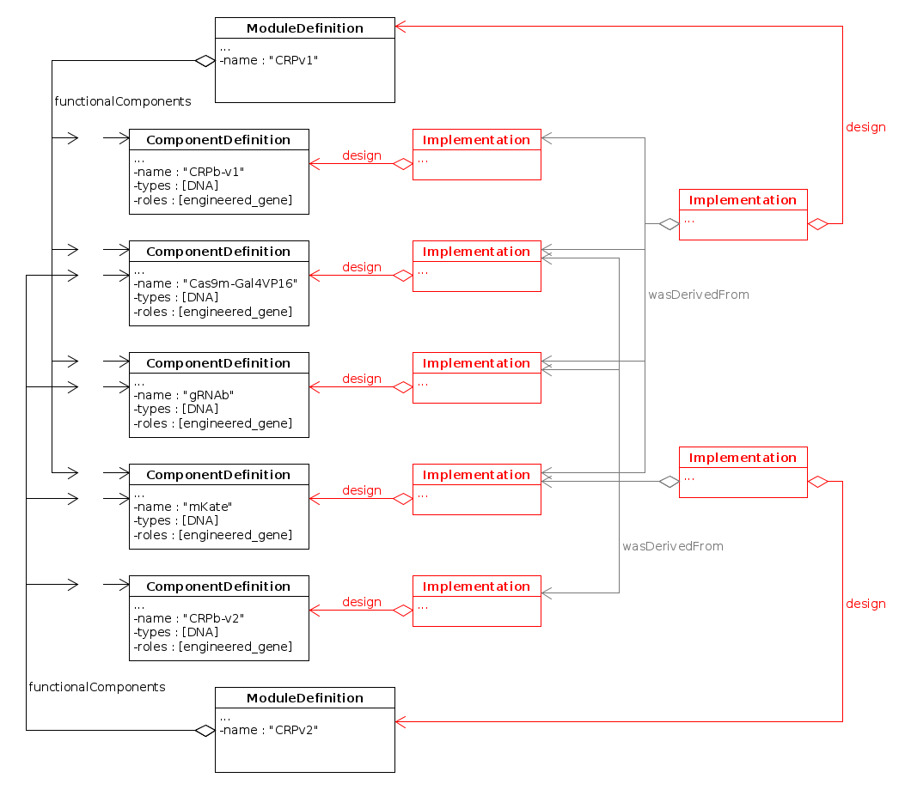

SEP 020 -- The Implementation class for biological clones and replicates
========================================================================

SEP                   | <leave empty>
----------------------|--------------
**Title**             | SEP 020 -- The Implementation class for biological clones and replicates
**Authors**           | Raik Gruenberg (raik.gruenberg@gmail.com)
**Editor**            | Nicholas Roehner (nicholasroehner@gmail.com)
**Type**              | Data Model
**SBOL Version**      | 2.3
**Replaces**          | SEP 014, SEP 016, SEP 017, SEP 018, SEP 019
**Status**            | Draft
**Created**           | 01-Dec-2017
**Last modified**     | 01-Nov-2017

Abstract
-----------

Experimental information recorded for one engineered clone of cells or a batch of biomaterial is often not representative for the behavior of another clone or batch. The reason are additional variables (known or unknown) such as mutations or stochastic biochemical events that lie outside the scope of the actual design. Bioengineers are therefore used to tracking the identity of clones, batches or replicates of biological materials whenever experimental results are collected. The **Implementation** class (as defined in SEP 19) is here modified in order to allow a reliable and straightforward identification of cell lines, bacterial clones and other replicates of biomaterial without any requirement of prov-O (provenance ontology) vocabulary. This moreover allows for a more direct and unambiguous connection from Experimental data, via clone/batch identification to the sequence of a design.

Table of Contents
---------------------

Rationale 
----------------

* Identify cell lines (clones, replicates, batches) while providing a direct link to the intented design
* Provide a clear representation for biomaterials as they are routinely exchanged between labs or obtained from commercial vendors and collections such as AddGene, ACTC and others
* Provide an unambiguous and minimal representation for clone / cell line identity as currently required by Journals for experimental papers
* Allow to attach experimental results to clones/batches

This proposal is mostly identical and complementary to SEP 19 but differs in the following aspects:
* Allow tools to parse and generate `Implementation` records without having to deal with detailed workflow information or the prov-O ontology
* Workflow & provenance information form an *additional layer* of meta information rather than being required
* Ensure that the link from Experimental data through clone/batch to (intended) design is as direct and unambiguous as possible and does not require iterations over chains of events / activities (with the associated risk of missing links)

Specification 
----------------------------------------------

### 2.1 Implementation class 

An `Implementation` represents a real, physical instance of a synthetic biological construct which may be associated with, typically more than one, actual laboratory samples. Note that the representation of individual samples (as in LIMS systems) remains outside the scope of SBOL. Whether or not two samples are considered to belong to the same batch or at which point they are split into separate `Implementation` instances is decided by the user and will be a matter of community best practices in a given area of bioengineering. 

`Implementation` MUST be linked back to its *intended* design, either a `ModuleDefinition` or `ComponentDefinition` using a mandatory field `design` (this is the main difference to SEP 19). An `Implementation` MAY also link, via an optional field `build`, to an additional `ModuleDefinition` or `ComponentDefinition` which represents a more current or a more detailed picture of its actual structure as it was realized in the laboratory. 

**Figure 1:** Diagram of the `Implementation` class and its associated properties

#### 2.1.1 Implementation.design 

Each `Implementation` record MUST have exactly one `design` property which MUST point to a `ComponentDefinition` or a `ModuleDefinition`. This `Component/ModuleDefinition` is interpreted as the *intended* design. Sister clones of a bioengineering experiment will therefore always point to the same `design` `ComponentDefinition` regardless of whether or not they accurately implement this design.

If, after creation of a clone, additional design information becomes available that equally applies to all clones of an experiment, then the design `ComponentDefinition` instance may be updated in-place. Alternatively the `design` field of all affected `Implementations` may be changed to point to a new version of the `Component/ModuleDefinition`. In both cases, previous versions and reasons for the change can, optionally, be tracked using established prov-O versioning (e.g. `ComponentDefinition.wasDerivedFrom`) as already prescribed by SBOL.

#### 2.1.2 Implementation.build 

An optional `Implementation.build` property references one `ComponentDefinition` that describes the, possibly deviating, actual physical composition of a realized construct. `build` MUST NOT reference the same `ComponentDefinition` that `design` points to. Instead, if no extra or deviating structural information exists for a given clone, the `build` field is simply not to be used at all. [This is a difference to SEP 19]

Preferably, the `build` structure should indeed be specific for this particular `Implementation`. For example, it may be based on the sequencing of this particular clone. `Implementation.build` SHOULD NOT be used to introduce general corrections to the original design (see 2.1.1 above).

#### 2.1.3 Implementation Identity 

Once created, the `uri` identifier of an `Implementation` instance MUST NOT change. The `Implementation` record is mutable and may change over time as new information is added or corrected. However, since `Implementation` represents a physical object in the real world, changes to the information *about* this physical object MUST NOT lead to a change of its unique identifier.

### 2.2 Best Practices 

#### 2.2.1 Link to Experimental Data 

`Implementation` links to experimental data using the `attachment` field approved in SEP 18. It is RECOMMENDED that `sbol:Attachment` instances containing experimental data are further annotated by prov-O activity records as shown in the following Figure.

**Figure 2:** Association of experimental data with `Implementation` (Clones/Batches) and Design.

Such `Attachments` MAY instead also be grouped into `Collections`. Detailes will have to be determined by practical use.

#### 2.2.2 Link to assembly method 

Detailed information about how a given construct or organism was built in the lab can be encoded in a `prov-O:Activity` record. [Arguably, this should be described in a separate SEP. The detailed description of experiments and protocols is beyond the scope of this SEP]. All sister clones of a construction experiment SHOULD point to the same `Activity` record. Clones that implement the same design but were produced independently (e.g. in a different lab) SHOULD NOT point to the same `Activity` record, even if the assembly protocol happened to be identical.

**Figure 3:** Representation of Assembly method and provenance.

The Assembly `Activity` MAY also have a `Usage:design` record pointing to the design `ComponentDefinition`. This link is redundant with the `Implementation.design` field and therefore optional [A difference to SEP 19]. If present, it MUST point to the same `Component/ModuleDefinition` instance as the `Implementation.design` field.

#### 2.2.3 Link to ancestral clones or batches 

`prov:wasDerivedFrom` references are used to express that one batch or clone was directly created from another one. It is RECOMMENDED that this should be accompanied by a `prov:Activity` record that outlines how one batch was derived from the other. However, we do not yet have a standard for formulating these Activity records. Examples are: transformation of DNA into bacteria to generate a new cell stock or purification of DNA or proteins from a given cell stock. Also the simple splitting of cell lines or inoculation of a new culture from a given bacterial stock may or may not warrant the definition of a new `Implementation` record. 

**Figure 4:** Documentation of simple cell line or clone ancestry.

It is RECOMMENDED that `Implementation.wasDerivedFrom` is exclusively used for experimental strain/batch ancestry relations. This is in contrast to SEP 19, where the same term is also used to link `Implementation` to its design `ComponentDefinition`.

#### 2.2.4 Integration with Prov-O and workflow information 

In contrast to SEP 19, the use of prov-O vocabulary together with `Implementation` is encouraged but optional. Parsing of prov-O information MUST NOT be needed for (1) the simple identification of a clone, (2) neither for determining what structure (a.k.a. sequence) it is supposed to have. 

#### 2.2.5 Versioning versus Provenance Semantics 

In line with SEP 19 (see detailed discussion in 2.3.2), we RECOMMEND as a best practice that objects linked by Activities not be successive versions (of the computational record) of each other, though we leave this at the discretion of users and library developers.

### 2.3 Validation Rules 

Not much is needed beyond the strict data model definition:

* `Implementation.build` SHOULD NOT point to the same `ComponentDefinition` as `Implementation.design` (Warning)

* If a "Build" `Activity` referenced by `Implementation.wasGeneratedBy` contains a `Usage:design` record, then this `Usage:design` MUST point to the same `ComponentDefinition` or `ModuleDefinition` as `Implementation.design`. (Error)

SEP 19 prescribes a host of additional validation rules related to prov-O usage. Some of these may apply here as well.

Examples 
-------------------------------

### 3.1 Bacterial clone with custom plasmid

SBOL currently has no clear rule for the identification of organisms. Presumably, a plasmid within a cell will be represented by a `ComponentDefinition` for the plasmid, contained within a `ModuleDefinition` representing the cell.

There are three main scenarios. (1) The clone has been validated by sequencing and is assumed to have the exact same plasmid as specified in the design. (2) A particular clone has been shown to contain a mutation outside the region of interest. (3) The clone has not been validated yet.

### 3.2 Design-Build-Test workflow

Competing SEP 19 is putting all emphasis on documenting an idealized design - build - test workflow. I am sceptical as to how realistic this is at this point. For example, automated model building or automated sequence design from models is still the exception. In my experience, models are (if at all) built after a design has been made. I therefore find it problematic to connect Experimental Results -> Implementation, Implementation -> Design and Design -> Model with `prov:wasDerivedFrom` links as suggested in SEP 19. In 95% of use cases, this will be confusing or outright false. Moreover, SBOL *already* specifies proper fields for connecting Design and Model as well as Attachment. 

The following is therefore the *minimal* representation of the actual result of a design - build - test workflow:

**Example 2a:** A minimal workflow representation without use of prov-O meta data. This example provides the essential link from experimental result to clone, design and theoretical model.

Rich meta data may naturally be added to annotate the factual workflow result with "activity" records:

**Example 2b:** A tentative full workflow representation. Prov-O activities provide an orthogonal layer of meta information on top of the native SBOL chain of objects. Note: the prov:usage terms "design", "build", "test", "learn" have been suggested in sboldev discussions and are defined in SEP 19. "biomaterial" would be a new term which, in my view, better represents the relation between experimental protocols and clones/batches.

### 3.3 Assembly Provenance 

Please refer to section 2.2.2

### 3.4 Pedigree of bacterial clones in iGEM Interlab Study 

The following example is taken 1:1 from SEP 19. There is only two modifications: (1) designs are linked via `design` rather than `build`., (2) there is no "wasDerivedFrom" link between Implementation and design.

**Example 4:** An initial plasmid kit based on part designs from the iGEM Registry is replicated and split into different samples. **Note**, contrary to the use (in blue) in this example, `Implementation` is *not* actually supposed to be equaled to "Sample". `Implementation` defines clones or batches that are typically distributed over many samples and only occasionally will each sample be unique enough to warrant its own `Implementation`. However, as SBOL currently does not have a term for "Sample", the given scheme is a workaround.

### 3.5 Co-Transfection of Constructs for CRISPR Repression Module

The following example is taken 1:1 from SEP 19 (Example 6). As before, the data model is somewhat simplified by the fact that there is only one link between `Implementation` and `ComponentDefinition`. In other words, `design` replaces the redundant use of `prov:wasDerivedFrom` and `built`.

**Example 5:** Two sets of overlapping constructs that implement the components of a CRISPR-based circuit are co-transfected to implement two different versions of the circuit.

Note: Arguably, the `wasDerivedFrom` links (shown in gray color) from the CRISPR construct "mixture" or circuits on the right to the individual genes on the left can be removed. The same information is already provided by the ModuleDefinition. Alternatively, the sub-implementations should be linked together through a more expressive gene assembly "prov:Activity" activity (as outlined in section 2.2.2).

Backwards Compatibility 
-----------------

This proposal does not affect backwards compatibility.

Discussion 
-----------------

### `Implementation.wasDerivedFrom` versus versioning

The use of `Implementation.wasDerivedFrom` for strain ancestry (section 2.2.3) creates a potential conflict with versioning: `wasDerivedFrom` is currently also used to link different (computational) versions of SBOL records. Here are different suggestions for distinguishing between the two usages:

  (1) Always associate an "Activity" record if a `wasDerivedFrom` is describing physical ancestry. Never associate an "Activity" record for simple versioning.

  (3) Define a new "sbol:ancestor" (or similar) term to be associated with a `prov:Usage` record within the activity.

  (2) Invent a custom SBOL term for physical ancestry of batches and strains.

### `design` link from Assembly Activity to `ComponentDefinition`

As mostly philosophical difference between this proposal and SEP 19 is that SEP 19 considers the `Implementation` to be "generated" or "derived" from the design. In my view, a given `Implementation` either implements a design or it does not. It may nevertheless be useful to have DNA assembly `Activity` also reference the design. Although this duplicates the `design` field and requires an additional validation rule, it turns the Assembly `Activity` into a more self-contained object that can be more easily exchanged.

However, I would argue that there should not be any `wasDerivedFrom` link between Implementation and design just as we do not introduce multiple `wasDerivedFrom` links to all the fragment components used during the assembly.

Relation to Other SEPs 
-----------------

This proposal evolved from SEP 16 after discussion on the Github issue tracker, and on the ["Design-Build-Test" thread]: https://groups.google.com/forum/#!topic/sbol-dev/AnpwJP2_f5A

SEP 020 can either replace or complement SEP 19.  

References 
----------------

Copyright 
-------------

  
   
  To the extent possible under law,
  <a rel="dct:publisher"
     href="sbolstandard.org">
    SBOL developers</a>
  has waived all copyright and related or neighboring rights to
  SEP 020.
This work is published from:

  United States.

