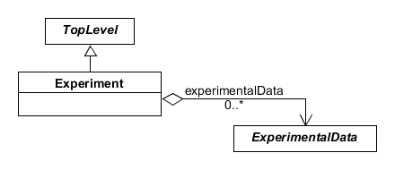
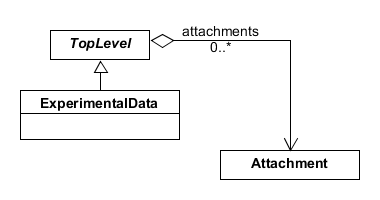

SEP 021 -- Experiments and Experimental Data
======================================================

SEP                   | <leave empty>
----------------------|--------------
**Title**             | SEP 021 -- Experiments and Experimental Data
**Authors**           | Nicholas Roehner (nicholasroehner@gmail.com), Jake Beal (jakebeal@gmail.com)
**Editor**            | Nicholas Roehner (nicholasroehner@gmail.com)
**Type**              | Data Model
**SBOL Version**      | 2.3
**Replaces**          | N/A
**Status**            | Draft
**Created**           | 21-Feb-2018
**Last modified**     | 21-Feb-2018
**Issue**          | [#50](https://github.com/SynBioDex/SEPs/issues/50)

Abstract
-----------

Linking experimental data to samples and genetic designs is becoming critical to many synthetic biology projects, including the DARPA program Synergistic Discovery and Design (SD2).

Table of Contents
---------------------

* [1. Rationale](#rationale)
* [2. Specification](#specification)
  * [2.1 Experiment](#exp)
    * [2.1.1 experimentalData](#exp_expData)
  * [2.2 ExperimentalData](#expData)
  * [2.4 Validation Rules](#validation_rules)
* [3. Examples](#examples)
  * [3.1 Flow Cytometry](#example1)
  * [3.2 Interlab](#example2)
* [4. Backwards Compatibility](#compatibility)
* [5. Discussion](#discussion)
* [6. Relation to Other SEPs](#competing_seps)
* [References](#references)
* [Copyright](#copyright)

Rationale 
----------------

* Queries for experimental results will benefit from grouping `Attachment` objects with an `ExperimentalData` class that is more domain-specific than `Collection`.
* We will eventually need a class like `ExperimentalData` that can be extended with indices into experimental data files.
* We will eventually need a class like `Experiment` that can be extended to specify or link to an experimental design (factors, levels, conditions etc.).

Specification 
----------------------------------------------

Here we propose to add two new classes, `Experiment` and `ExperimentalData`, to enable users to group `Attachment` objects (for linking experimental data files) in a more domain-specific manner than using the SBOL `Collection` class.

We also propose to modify the best-practice validation rules that govern the specification of provenance relationships between objects in a design-build-test-learn cycle.

### 2.1 Experiment 

The `Experiment` class represents a set of experimental results that were collected in accordance with an experimental design (currently not specified by this class).

**Figure 1:** Diagram of the `Experiment` class and its associated properties

#### 2.1.1 Experiment.experimentalData 

The `experimentalData` property is OPTIONAL and MAY contain zero or more URIs that refer to `ExperimentalData` objects.

### 2.2 ExperimentalData 

The `ExperimentalData` class represents a set of experimental data files that are typically (but not always) associated with a single sample, experimental condition, and/or lab instrument.

**Figure 2:** Diagram of the `ExperimentalData` class and its associated properties

### 2.3 Modified Validation Rules for Design-Build-Test-Learn Cycles 

* sbol-12506 should be changed from

"A `Usage` that has a `roles` property that contains the URI http://sbols.org/v2#test SHOULD refer to an `Attachment` or `Collection` of `Attachment` objects."

to

"A `Usage` that has a `roles` property that contains the URI http://sbols.org/v2#test SHOULD refer to an `ExperimentalData` object."

* sbol-10226 should be changed from

"A `Identified` with a `wasGeneratedBys` property that includes a reference to an `Activity` with a child `Association` that has a `roles` property that contains the URI http://sbols.org/v2#test SHOULD be an `Attachment` or a `Collection` of `Attachment` objects."

to

"A `Identified` with a `wasGeneratedBys` property that includes a reference to an `Activity` with a child `Association` that has a `roles` property that contains the URI http://sbols.org/v2#test SHOULD be an `ExperimentalData` object."

Examples 
-------------------------------

### 3.1 Interlab Example 

Figure 3 shows an example `Experiment` with the results of characterizing a single IGEM part 

**Figure 3:** Example of an `Experiment` from the IGEM Interlab Study 

The `Experiment` includes `ExperimentalData` derived from three `Implementation` objects: a positive control, a negative control, and the study construct. These `ExperimentalData` are generated by a single characterization `Activity` associated with a flow cytometer and plate reader. Each `ExperimentalData` groups the `Attachment` objects for two data files: one containing absorbance values measured with the plate reader, and one for fluorescence values measured with the flow cytometer.

Note that this example does not include sufficient detail to explicitly determine which lab instrument `Agent` is associated with which `Attachment`. To enable this determination, one could instead specify one characterization `Activity` per `Agent` and one `ExperimentalData` per `Attachment`, and then link them accordingly.

Backwards Compatibility 
-----------------

This proposal does not affect backwards compatibility.

Discussion 
-----------------

Relation to Other SEPs 
-----------------

This proposal revises the best-practice validation rules from SEP 019 that were recently incorporated into SBOL version 2.2.

References 
----------------

Copyright 
-------------

  
   
  To the extent possible under law,
  <a rel="dct:publisher"
     href="sbolstandard.org">
    SBOL developers</a>
  has waived all copyright and related or neighboring rights to
  SEP 007.
This work is published from:

  United States.

