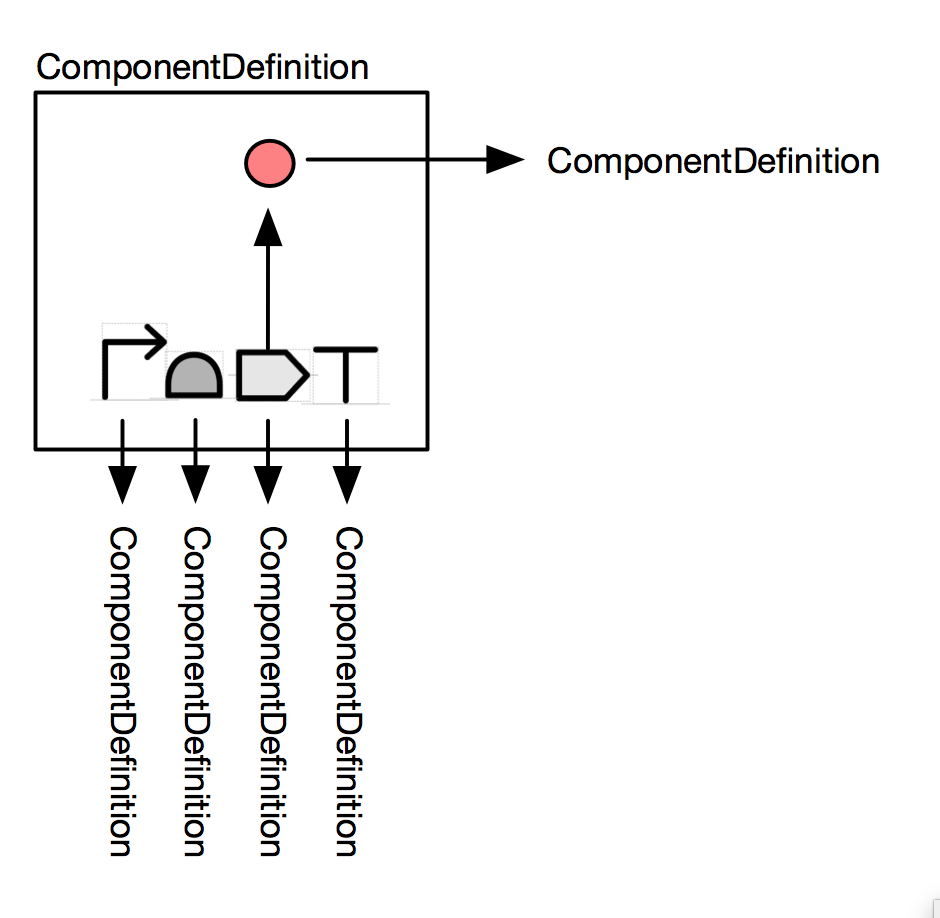
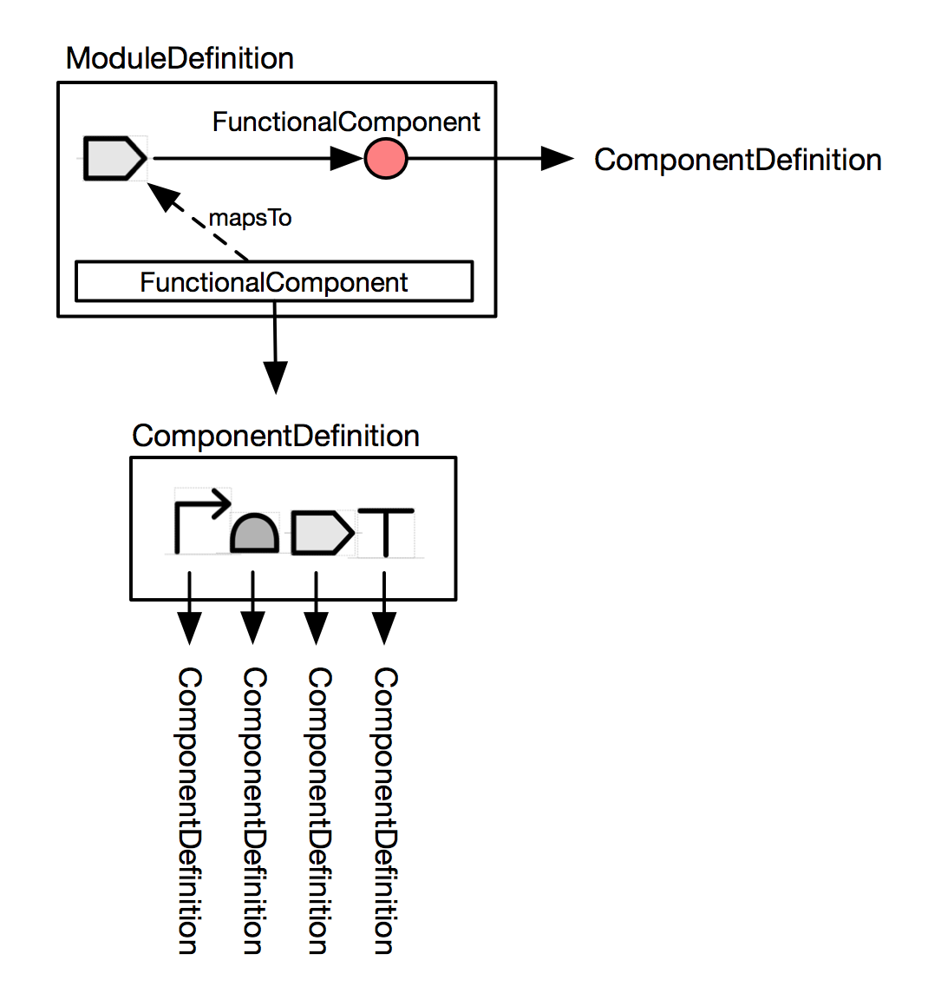

SEP 026 -- Merge ComponentDefinition and ModuleDefinition
===================================

SEP                     | 026
----------------------|--------------
**Title**                | Merge ComponentDefinition and ModuleDefinition
**Authors**           | James Alastair McLaughlin (j.a.mclaughlin@ncl.ac.uk); Chris Myers (myers@ece.utah.edu)
**Editor**            | 
**Type**               | Data Model
**SBOL Version** | 3
**Replaces**        | 
**Status**             | Draft
**Created**          | 21-Jun-2018
**Last modified**  | 21-Jun-2018

## Abstract

This SEP proposes merging ComponentDefinition and ModuleDefinition into a single class. This new, unified class would be able to have both structure (e.g. a sequence), and function (e.g. interactions).

## Motivation

The SBOL2 data model has a split betwen structure, which is represented using ComponentDefinitions, and function, which is represented using ModuleDefinitions. ComponentDefinitions are mostly structural, in that they are intended to represent the primary sequence of a biopolymer and its hierarchical composition*. ModuleDefinitions, constrastingly, are functional groupings and can represent interactions such as genetic production and promoter regulation.

This split causes significant complexity when constructing SBOL objects. For example, figure 1 shows a simple transcriptional unit with a genetic production interaction. This is illegal in SBOL2, and instead a wrapper ModuleDefinition must be created as shown in figure 2.

<i>* This split is not entirely clean: ComponentDefinitions and SequenceAnnotations have sequence ontology roles which are used to express function (e.g. "promoter").</i>
 

 
<i>Figure 1: A transcriptional unit encodes a promoter. This is illegal in SBOL2 because the ComponentDefinition can not contain interactions.</i>

 
<i>Figure 2: A transcriptional unit encodes a promoter in legal SBOL2. The transcriptional unit must be wrapped into a ComponentDefinition and then instantiated in a wrapping ModuleDefinition as a FunctionalComponent. The CDS can then be exposed to the wrapper ModuleDefinition using mapsTo. The protein is also instantiated as a FunctionalComponent, and finally the genetic production interaction can be created.</i>

In this SEP, we are not suggesting that either of these approaches should be *disallowed*. The example in figure 2 remains perfectly valid in a hypothetical SBOL3 where ComponentDefinition and ModuleDefinition are merged; the only difference would be that the class name ModuleDefinition becomes ComponentDefinition. However, the example in figure 1 would now *also* be legal SBOL.

### Advantage: MapsTo comes later

Constructing *any* design in SBOL2 other than composing simple DNA parts nearly always requires a MapsTo. MapsTo should only be necessary when *parts are being incoporated into larger designs*. This SEP would allow many simple parts to be constructed without any use of MapsTo.

### Advantage: Flattening is now possible

"Flattening" operations have often been discussed by the SBOL community. Flattening involves taking a hierarchical design and "compiling" it to a design where everything is at the same depth.  If this SEP is accepted, it will be possible to take a more modular design such as that described by figure 2, and flatten it to a simpler design as in figure 1.  The flattened design provides an instant overview and can be more easily visualized.

### Advantage: The spec gets shorter

Merging MD and CD will simplify the spec considerably. Classes such as FunctionalComponent can finally be removed.

## Specification 

The specification will be modified such that:

* All properties of ModuleDefinition are moved to ComponentDefinition
* FunctionalComponent is removed and any references to it are changed to references to Component (that is, SubComponent if SEP 15 is accepted)
* Module (that is, SubModule if SEP 15 is accepted) is removed and any references to it are changed to references to Component  (that is, SubComponent if SEP 15 is accepted)
* ModuleDefinition is removed

## Backwards Compatibility 

Upconverting from SBOL2 can be implemented by treating both ComponentDefinitions and ModuleDefinitions as the same type when reading SBOL.

Downconverting to SBOL2 would require exporting any SBOL3 ComponentDefinitions with interactions as SBOL2 ModuleDefinitions, and any with a sequence or SequenceConstraints as SBOL2 ComponentDefinitions.

## Discussion 

### 5.1 Related SEPs

## Competing SEPs 

None.

References 
----------------

Copyright 
-------------

  
   
  To the extent possible under law,
  <a rel="dct:publisher"
     href="sbolstandard.org">
    SBOL developers</a>
  has waived all copyright and related or neighboring rights to
  SEP 002.
This work is published from:

  United Kingdom.

