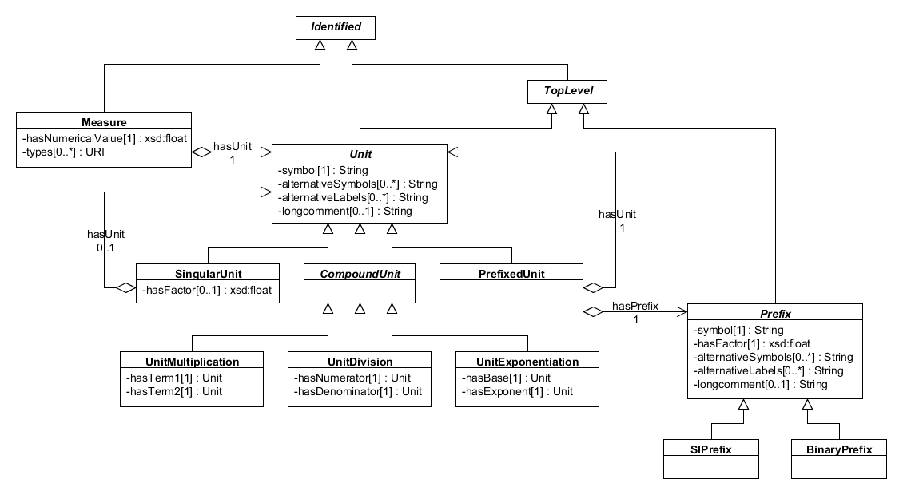

SEP 024 -- Measurements/parameters and Units
=====================================

SEP                   | 028
----------------------|--------------
**Title**             | Measurements/parameters and units
**Authors**           | Jacob Beal (jakebeal@ieee.org) and Nicholas Roehner (nicholas.roehner@raytheon.com)
**Editor**            | 
**Type**              | Data Model
**SBOL Version**      | 2.3
**Replaces**          | 
**Status**            | Draft
**Created**           | 3-Jul-2018
**Last modified**     | 09-Oct-2018
**Issue**             | 

Abstract
-----------

This SEP proposes importing classes from the [Ontology of Units of Measure (OM)](http://www.ontology-of-units-of-measure.org/resource/om-2) into the SBOL data model to represent measurements/parameters and their associated units. This SEP also proposes adding a new OPTIONAL `measure` property to relevant classes in the SBOL data model, including `Interaction`, `Participation`, `FunctionalComponent`, and `Module`.

Table of Contents
---------------------

* [1. Rationale](#rationale)
* [2. Specification](#specification)
 * [2.1 Measurements/Parameters](#measurements)
  * [2.1.1 Measure](#measure)
  * [2.1.2 Unit](#unit)
  * [2.1.3 Prefix](#prefix)
 * [2.2 SBOL Class Extensions](#sbol_extension)
* [3. Example or Use Case](#example)
* [4. Backwards Compatibility](#compatibility)
* [5. Discussion](#discussion)
* [6. Relation to Other SEPs](#relation)
* [References](#references)
* [Copyright](#copyright)

## 1. Rationale 
----------------

TODO

## 2. Specification 
----------------------------------------------

### 2.1 Measurements/Parameters

Numerical measurements and parameters SHOULD be specified as members of the `Measure`, `Unit`, and `Prefix` classes from the [Ontology of Units of Measure (OM)](http://www.ontology-of-units-of-measure.org/resource/om-2). As incorporated into the SBOL data model, `Measure` is a subclass of `Identified`, while `Unit` and `Prefix` are subclasses of `TopLevel` (Figure 1). 

**Figure 1:** Diagram of the `Measure`, `Unit`, and `Prefix` classes and their associated properties.

#### 2.1.1 Measure

The purpose of the `Measure` class is to link a numerical value to a unit of measure. The `hasNumericalValue` property is REQUIRED and MUST contain a single xsd:float. Its `hasUnit` propery is also REQUIRED and MUST contain a single URI that refers to a member of the `Unit` class. Typically this URI will refer to a specific `Unit` that is already documented by OM, such as "gram per liter", but it can also refer to a custom `Unit` that is not covered by OM but is still useful for synthetic biology, such as "molecules of equivalent fluorescein", or "MEFL" for short.

#### 2.1.2 Unit

The purpose of the `Unit` class is to describe a particular unit of measure. The `symbol` property is REQUIRED and MUST contain a String. This String is commonly used to abbreviate the unit of measure's `name`. For example, the unit of measure named "gram per liter" is commonly abbreviated using the String "g/l". Alternative abbreviations can be specified using the `alternativeSymbols` property, which is OPTIONAL and MAY contain zero or more Strings. Similarly, alternative common names can be specified using the `alternativeLabels` property, which is OPTIONAL and MAY contain zero or more Strings. Finally, the `longcomment` property is OPTIONAL and MAY contain a String. A long comment is an alternative description that is expected to be, well, long.

Since the `Unit` class is abstract, specific units of measure are represented as instances of its subclasses: `SingularUnit`, `PrefixedUnit`, `UnitMultiplication`, `UnitDivision`, and `UnitExponentiation`.

The `SingularUnit` class is used to describe a unit of measure that is not explicitly represented as a multiplication, division, or exponentiation of two or more units, but could be equivalent to such a representation. For example, joule is considered a `SingularUnit`, but it is equivalent to the multiplication of a newton and a meter. The 'hasFactor' property of the `SingularUnit` class is OPTIONAL and MAY contain a xsd:float. The `hasUnit` property is also OPTIONAL and MAY contain a single URI that refers to another member of the `Unit` class. These properties can be used in conjunction to specify whether a `SingularUnit` is defined as another `Unit` multiplied by some factor. For example, an angstrom is defined as 10-10 meters. If the `hasFactor` property of a `SingularUnit` is non-empty, then its `hasUnit` property SHOULD also be non-empty.

The `PrefixedUnit` class used to desribe a unit of measure that is explicitly represented as the product of some factor and another `Unit`. Similar to the `SingularUnit` class, the `PrefixedUnit` class includes a `hasUnit` property, but this property is REQUIRED rather than OPTIONAL. Instead of a `hasFactor` property, the `PrefixedUnit` class includes a REQUIRED `hasPrefix` property that MUST contain a single URI that refers to a member of the `Prefix` class (a standard factor).

The `UnitMultiplication` class is used to describe a unit of measure that is the multiplication of two other units of measure. The `hasTerm1` and `hasTerm2` properties are both REQUIRED and MUST each contain a single URI that refers to a member of the `Unit` class. Next, the `UnitExponentiation` class is used to describe a unit of measure that is the exponentiation of one unit of measure by another. The `hasBase` and `hasExponent` properties are both REQUIRED and MUST each contain a single URI that refers to a member of the `Unit` class. Finally, the `UnitDivision` class is used to describe a unit of measure that is the division of one unit of measure by another. The `hasNumerator` and `hasDenominator` properties are both REQUIRED and MUST each contain a single URI that refers to a member of the `Unit` class.

#### 2.1.3 Prefix

The purpose of the `Prefix` class is to describe a standard factor for defining a `Unit` in terms of a multiplication of said factor and another `Unit`. For example, a milligram is defined as the multiplication of a gram and the standard factor 10-3 (milli). The `hasFactor` property is REQUIRED and MUST contain an xsd:float. Much like the `Unit` class, the `Prefix` class also has a  `symbol` property that is REQUIRED and MUST contain a String. This String is commonly used to abbreviate the prefix's `name`. For example, the prefix named "milli" is commonly abbreviated using the String "m". Alternative abbreviations can be specified using the `alternativeSymbols` property, which is OPTIONAL and MAY contain zero or more Strings. Similarly, alternative common names can be specified using the `alternativeLabels` property, which is OPTIONAL and MAY contain zero or more Strings. Finally, the `longcomment` property is OPTIONAL and MAY contain a String.

### 2.2 SBOL Class Extensions

In order for relevant SBOL classes to be linked to parameters or measurements and their associated units, we propose adding an OPTIONAL `measure` property to the `FunctionalComponent`, `Module`, `Interaction`, and `Participation` classes. This property MAY specify a set of `Measure` objects contained by the parent. For example, an `Interaction` that represents a chemical reaction may have parameters added to it and each `Participation` it contains to capture its chemical kinetic rate and the stoichiometries of its reactants and products. A `ModuleDefinition` that represents growth media recipe may have measures added to each `FunctionalComponent` "ingredient" it contains and/or each `Module` "sub-media" that it includes.

## 3. Example or Use Case 
-------------------------------

TODO

## 4. Backwards Compatibility 
-----------------

The best practices in this proposal do not affect backwards compatibility.

## 5. Discussion 
-----------------

_none yet_

## 6. Relation to Other SEPs 
-----------------

_none yet_

References 
----------------

_none_

Copyright 
-------------

  
   
  To the extent possible under law,
  <a rel="dct:publisher"
     href="sbolstandard.org">
    SBOL developers</a>
  has waived all copyright and related or neighboring rights to
  SEP 024.
This work is published from:

  United States.

