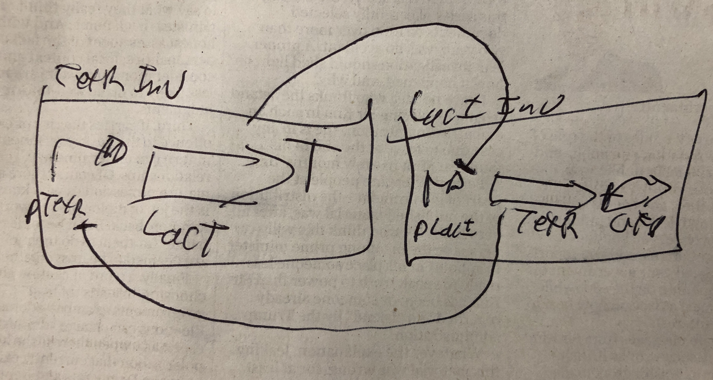
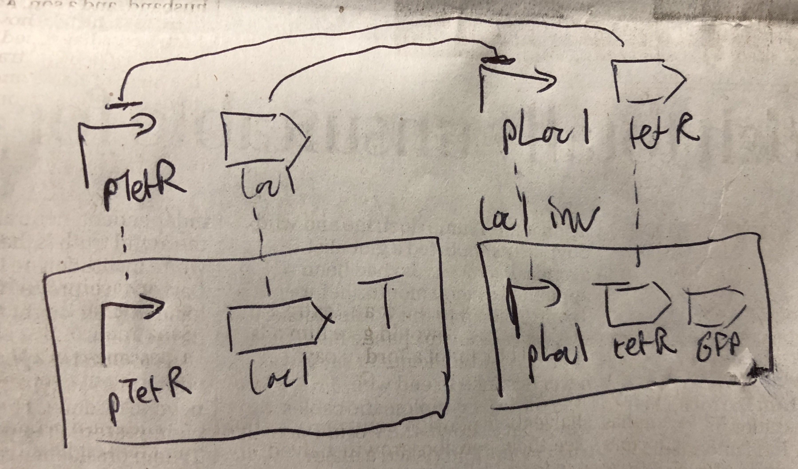

SEP 034 -- Relax rules on interaction participant ownership
===================================

SEP                     | 034
----------------------|--------------
**Title**                | Relax rules on interaction participant ownership
**Authors**           | James Alastair McLaughlin (j.a.mclaughlin@ncl.ac.uk); Bradley Brown (b.bradley2@ncl.ac.uk)
**Editor**            | 
**Type**               | Data Model
**SBOL Version** | 2.4
**Replaces**        | 
**Status**             | Draft
**Created**          | 8-Jul-2019
**Last modified**  | 8-Jul-2019

## Abstract

This SEP proposes relaxing sbol-12003 to allow the participant of an interaction to be any FuntionalComponent contained either directly (as is currently allowed) or transitively (as proposed) by the parent ModuleDefinition.

## Motivation

Despite interactions being introduced with SBOL 2.0, they are still rarely used in practice. This is likely due to the fact that the use of interactions in SBOL is cumbersome, with even the most basic cases requiring the use of MapsTo.

For example, consider a simple lacI/tetR toggle switch divided into a tetR component and a lacI component:

_Without_ the interaction, this could have the following SBOL representation:

* toggle switch: ModuleDefinition
	* tetR inverter: Module
		* pTetR: FunctionalComponent
		* lacI: FunctionalComponent
		* terminator: FunctionalComponent
	* lacI inverter: Module
		* pLacI: FunctionalComponent
		* TetR: FunctionalComponent
		* GFP: FunctionalComponent

		
Intuitively, one would expect to be able to simply introduce the interactions to the toggle switch, as:

	
* toggle switch: ModuleDefinition
	* tetR inverter: Module
		* pTetR: FunctionalComponent
		* lacI: FunctionalComponent
		* terminator: FunctionalComponent
	* lacI inverter: Module
		* pLacI: FunctionalComponent
		* TetR: FunctionalComponent
		* GFP: FunctionalComponent
	* tetR rep pTetR: Interaction
	* lacI rep pLacI: Interaction

However, it is not possible for the interaction to reference the functional components, as they are one level lower in the hierarchy.  Instead, it is necessary to create:

* toggle switch: ModuleDefinition
	* tetR inverter: Module
		* pTetR: FunctionalComponent
		* lacI: FunctionalComponent
		* terminator: FunctionalComponent
	* lacI inverter: Module
		* pLacI: FunctionalComponent
		* TetR: FunctionalComponent
		* GFP: FunctionalComponent
	* pTetR: FunctionalComponent
	* pTetR = tetR inverter -> pTetR (MapsTo)
	* lacI: FunctionalComponent
	* lacI = lacI inverter -> lacI (MapsTo)
	* pLacI: FunctionalComponent
	* pLacI = lacI inverter -> pLacI (MapsTo)
	* tetR: FunctionalComponent
	* tetR = tetR inverter -> tetR (MapsTo)
	* tetR rep pTetR: Interaction
	* lacI rep pLacI: Interaction

which effectively corresponds to the following image:

While the ability to define a generic toggle switch with replaceable inverter components using MapsTo is no doubt useful, it should also be possible to create the interactions directly without any use of MapsTo in order to make simpler cases easier to represent.

## Specification

Change sbol-12003 from:

> The FunctionalComponent referenced by the participant property of a Participation 28 MUST be contained by the ModuleDefinition that contains the Interaction which contains the Participation.

to:

> The FunctionalComponent referenced by the participant property of a Participation 28 MUST be contained by the ModuleDefinition that contains the Interaction which contains the Participation, OR by a ModuleDefinition instantiated by a comprising Module.

## Backwards Compatibility 

All previous SBOL files would be compatible with this change.  Future SBOL files violating the former sbol-12003 would fail to validate in older libraries.

## Discussion 

 
### 5.1 Related SEPs

## Competing SEPs 

None.

References 
----------------

Copyright 
-------------

  
   
  To the extent possible under law,
  <a rel="dct:publisher"
     href="sbolstandard.org">
    SBOL developers</a>
  has waived all copyright and related or neighboring rights to
  SEP 002.
This work is published from:

  United Kingdom.

