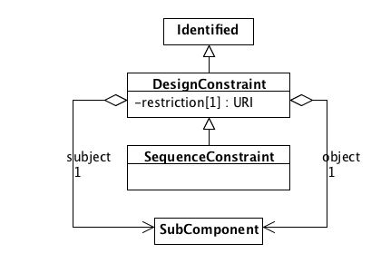

SEP 037 -- Component References
===================================

SEP                     | 037
----------------------|--------------
**Title**                | Component References
**Authors**           | Jacob Beal (<jakebeal@ieee.org>)
**Editor**            | James  McLaughlin
**Type**               | Data Model
**SBOL Version** | 2.4
**Replaces**        | 
**Status**             | Draft
**Created**          | 14-July-2019
**Last modified**  | 24-Nov-2019

## Abstract

This SEP proposes a ComponentReference class, sibling of Componentinstance, that allows a ComponentInstance to be referenced through children, rather than requiring it to be imported as an immediate child of the containing ComponentDefinition or ModuleDefinition.  A new DesignConstraint class (generalizing SequenceConstraint) then takes advantage of this to eliminate the need for MapsTo when linking equivalent components.

## Motivation 

In the current model, a ComponentDefinition or ModuleDefinition that wants to reference an ComponentInstance inside one of its children must import a copy from the child and link the two of them together with a MapsTo.  This is problematic in at least two ways:

1. This creates extra "duplicate" ComponentInstance objects that are confusing and offer extra opportunities for contradictory information to be added.
2. A MapsTo can only reach one level deep, so in order to refer more than one layer, the child definition must be modified as well.

This comes up in two cases: Interactions (in particular, the participant property of Participation), and linking equivalent objects via MapsTo (e.g., when instantiating an abstract component).

This figure shows example of one-layer being required in order to instantiate a genetic production relationship from a CDS in a constitutive expression construct, in which both a MapsTo and a FunctionalComponent must be created:

Here is an example of a two-layer reference, in which two MapsTo objects and two FunctionalComponents must be created, problematically requiring modification to the I13504 object:

Similar problems occur when linking equivalent objects via MapsTo, as shown in this figure:

## Specification 

### Class Structure

In harmony with SEP 015, the new `ComponentReference` class is taken to be a sibling class of `ComponentInstance`, below the new unifying `SubComponent` class.

Per discussion, the `access` field is also dropped as generally unused and redundant with `direction`.

The class diagram below `ComponentInstance` is left untouched, as this SEP leaves resolution of the merger of `ComponentDefinition` and `ModuleDefinition` to SEP 025 and SEP 010.

### ComponentReference

A `ComponentReference` object provides access to `SubComponent` objects that are contained within the children of a `ComponentDefinition` or `ModuleDefinition`.  Its fields are:

- `inChildOf`[1] : URI for a `ComponentInstance`
- `subComponent`[0..1] : URI for a `SubComponent`

The validation rules are:
- `inChildOf` must refer to a `ComponentInstance` pointed directly to by the parent of the `ComponentReference` (i.e., as a `component` of `ComponentDefinition`, a `functionalComponent` of `ModuleDefinition`, or an `inChildOf` of `ComponentReference`)
- If `subComponent` is a `ComponentInstance`, then it must be a child of the `ComponentInstance` pointed to by `inChildOf`

Examples of using `ComponentReference`:

### DesignConstraint

A `DesignConstraint` class allows for linking of `SubComponent` objects in a variety of ways, including asserting that they are identical or that one de facto replaces the other.  The `DesignConstraint` class is a new superclass for `SequenceConstraint`

Its fields are identical to those of SequenceConstraint, but the restriction can be `sbol#verifyIdentical` (from Table 7, `MapsTo` refinements) or `sbol#replaces` (unifying `useLocal` and `useRemote`).

Example of using `DesignConstraint`:

### Adjusted fields for ComponentDefinition, ModuleDefinition, and Participation

Everywhere that we can currently refer to a `ComponentInstance`, we adjust to instead refer to a `SubComponent`, thus allowing it to contain either instances or references.

Note that some properties of a `ComponentInstance` or its subclasses may wish to migrate up to `SubComponent` during resolution of SEP 025, such that they can be applied to a `ComponentReference` as well.

### Removal of MapsTo

The `MapsTo` class is made obsolete by `ComponentReference` and `ComponentEquivalence`. as nearly every `MapsTo` relationship can be transformed into an equivalent set of `ComponentReference` and `DesignConstraint` relationships.

The only exceptions are `MapsTo` objects that use the `merge` value, since the constraint there is ill-defined.  Since these are rarely used and ill-defined, however, their loss is not anticipated to be a problem.

As such, `MapsTo` will be removed SBOL 3.

## Backwards Compatibility 

The immediate changes proposed by this SEP are all backward compatible, as they only add material and do not take anything away.   During a transition to use of `ComponentReference`, dual values for `MapsTo` can be generated as needed.

When SBOL 3 is adopted, `MapsTo` will be removed, which is obviously not backward compatible.

## Discussion 

Discussion considered the potential to have ComponentReference be a completely separate class from ComponentInstance rather than a sibling class. This was considered to introduce additional complexity that was not particularly valuable, whereas both were types of subcomponents.

As part of discussion, it was also noted that:
- the access field on ComponentInstance should probably be dropped
- After Component/Module merging, some of the fields would probably want to be applied to ComponentReference as well.

DesignConstraint was originally a much more restricted n-way ComponentEquivalence, which also preserved the merge type but not the asymmetric replacement relationships. This was generalized and changed after discussion.

## Competing SEPs 

No SEPs are directly competing.

This SEP interacts with SEP 025, which proposes merging components and modules, and with SEP 015, which proposes renaming components and modules.  These will affect details of implementation for this proposal (which assumes some version or each will be adopted), but does not actually oppose any of the changes proposed in either.

Potential interaction with SEP 010 is less clear, and may end up competing with details of this proposal.

References 
----------------

Copyright 
-------------

  
   
  To the extent possible under law,
  <a rel="dct:publisher"
     href="sbolstandard.org">
    SBOL developers</a>
  has waived all copyright and related or neighboring rights to
  SEP 037.
This work is published from:

  United States.

