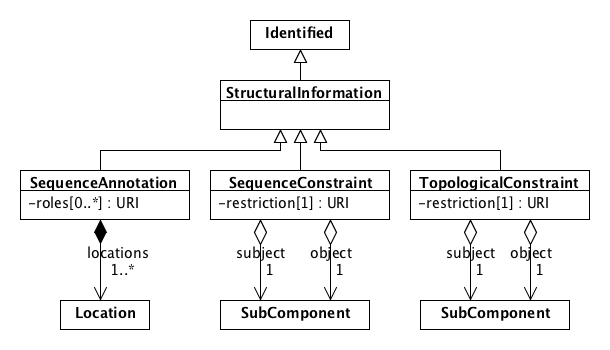

# SEP 044 -- Unify Structural Information

SEP                     | <leave empty>
----------------------|--------------
**Title**                | Unify Structural Information
**Authors**           | Jacob Beal (jakebeal@ieee.org)
**Editor**            | <leave empty>
**Type**               | Data Model
**SBOL Version** | 3.0
**Replaces**        |
**Status**             | Draft
**Created**          | 25-Jan-2020
**Last modified**  | 25-Jan-2020
**Issue**          | 

## Abstract

Currently, information about the physical structure of a Component is dispersed across multiple different places: SequenceAnnotations, SubComponents, SequenceConstraints, and Interactions of type Containment.
This SEP proposes to unify all three of these as subclasses of a single StructuralInformation class, and to generalize containment to a complete set of standard topological constraints.

## 1. Rationale 

At present, we have multiple different ways of representing the physical structure of a Component, all located in different places:

* The exact geometric location of sub-sequences for a Component within a Sequence is expressed in two different ways:
  * with the sequenceAnnotation property of a Component plus the location of the linked SequenceAnnotation. 
  * with the location property of a SubComponent.
* The ordering of SubComponents in a linear structure is expressed with the sequenceConstraint property of a Component.
* The topological containment of one SubComponent within another is expressed with an Interaction of type containment (SBO:0000469).

Assuming the adoption of SEP 025, all of these will be within the same Component class, so it is questionable whether we should keep them separated.  

It is also that case that while every type of Component has geometric or topological structure of interest, many do not have a linear/sequential structure, so it does not make sense for such to have special properties for linking to SequenceConstraints and SequenceAnnotations.

Finally, we are likely to want to add more classes of structural information description in the future, which is made more complicated if we need to add new special properties for each class of structure distribution.

Accordingly, this SEP proposes to create a new StructuralInformation superclass that contains all of these subclasses of information, and to also update properties accordingly.

## 2. Specification 

### StructuralInformation class

`StructuralInformation` is a new class, child to `Identified` and parent to `SequenceAnnotation`, `SequenceConstraint`, and the new `TopologicalRelation` class:

### TopologicalConstraint class

The `TopologicalConstraint` class is nearly identical to `SequenceConstraint`. The difference is that the values for its `restriction` field deal with the spatial relationships of physical objects in general, rather than the special case of directional linear sequences.

These values are based on the set of eight possible topological relationships between two spatial regions without holes [1].
Of these, we derive a set of six restrictions:

* Two relationships are omitted as redundant: `inside` and `coveredBy` are respectively equivalent to `contains` and `covers` with `subject` and `object` swapped.
* The symmetric `equal` relationship is changed to an asymmetric `replaces` relationship, allowing resolution of potentially conflicting definitions.

Restriction URI       | Description
----------------------|--------------
http://sbols.org/v2#disjoint      | `subject` and `object` do not overlap in space.  *Example: a plasmid is disjoint from a chromosome.*
http://sbols.org/v2#contains      | `subject` entirely contains `object`: they do not share a boundary.  *Example: a cell contains a plasmid*
http://sbols.org/v2#replaces      | `subject` and `object` occupy the same in space, . *Example: the J23101 promoter replaces a generic promoter*
http://sbols.org/v2#meet      | `subject` and `object` are connected at a shared boundary. *Example: two strains of adherent cells meet at their membranes*
http://sbols.org/v2#covers      | `subject` contains `object` but also shares a boundary. *Example: a cell covers its transmembrane proteins.*
http://sbols.org/v2#overlap      | `subject` and `object` overlap in space, but portions of each are outside of the other. *Example: a transmembrane protein overlaps the cell membrane*

Note that in most cases, `disjoint` is the expected default and does not need to be explicitly expressed.

*[1] Egenhofer, M. J. and Herring, J. 1991. "Categorizing binary topological relationships between regions, lines, and points in geographic databases", Technical Report, Department of Surveying Engineering University of Maine.*

### Non-Recommendation of Containment Interaction

SEP 030 recommends using an `Interaction` of type `containment` (SBO:0000469) to represent topological containment. Introduction of the `TopologicalConstraint` class renders this obsolete, so this recommentation will be deleted.

The optional use of a `physical compartment` (SBO:0000290) role to explicitly specify where an `Interaction` is taking place, however, is still valid.

### Changes to Component

The `sequenceAnnotation` and `sequenceConstraint` properties of `Component` are removed.

These properties are replaced by `structuralInformation` (cardinality [0..*]) with a domain of `StructuralInformation`. This means that it can point to both `SequenceAnnotation` and `SequenceConstraint` objects, as well as `TopologicalConstraint` objects.

## 3. Examples 

See above examples for `TopologicalConstraint` in its table of restrictions. 

## 4. Backwards Compatibility 

From SBOL 2 to SBOL 3: 

* All `sequenceAnnotation` and `sequenceConstraint` properties are changed into `structuralInformation` properties.
* Any `Interaction` of type `containment` is changed to a set of  `TopologicalConstraint` with restriction `contains`, one for each pair of `Participant` objects with roles `physical compartment` (mapping to `subject`) and `contained` (mapping to `object`).

From SBOL 3 to SBOL 2:

* Any `structuralInformation` relation pointing to a `SequenceAnnotation` can be changed to a `sequenceAnnotation` relation.
* Any `structuralInformation` relation pointing to a `SequenceConstraint` can be changed to a `sequenceConstraint` relation.
* Any `TopologicalConstraint` object, however, does not convert and can only be retained as an annotation.

## 5. Discussion 

An enhancement to consider is that `Location` might be renamed to `SequenceLocation` since the Location class describes only locations on Sequence objects, not other types of geometric locations.  We do not yet have a second type of location information proposed, however, so it is not clear whether this would be useful.

It is also an interesting question whether an analogous transformation or should be made to the `location` and `sourceLocation` properties of `ComponentInstance`.  Right now, these only refer to sequences, which makes them dubious, but if `Location` becomes generalized, then it would be good to keep these properties just as they are.

## 6. Relation to Other SEPs 

This SEP assumes that SEP 025 will be adopted, merging ComponentDefinition and ModuleDefinition into Component.

## Copyright 

  
   
  To the extent possible under law,
  <a rel="dct:publisher"
     href="sbolstandard.org">
    SBOL developers</a>
  has waived all copyright and related or neighboring rights to
  SEP 044.
This work is published from:

  United States.

