SEP 055 -- Representation of Parts and Devices for Build Planning
===================================

SEP                     | <leave empty>
----------------------|--------------
**Title**                | Representation of Parts and Devices for Build Planning
**Authors**           | Jacob Beal (jakebeal@ieee.org), Vinoo Selvarajah, Gael Chambonnier, Traci Haddock-Angelli, Alejandro Vignoni, Gonzalo Vidal, Nicholas Roehner
**Editor**            | 
**Type**               | Data Model
**SBOL Version** | SBOL 3.1
**Replaces**        | None
**Status**             | Draft
**Created**          | 6-Jan-2021
**Last modified**  | 17-Feb-2021
**Issue**          | [#113](https://github.com/SynBioDex/SEPs/issues/113)

Abstract
-----------

This SEP proposes a set of terminology and practices for representing genetic parts and functional devices at various stages of design, synthesis, and assembly. These practices are intended to represent any of the wide array of approaches based on embedding parts in carrier vectors, such as BioBricks, Gateway, MoClo, GoldenBraid, PhytoBricks, and other Type IIS methods.

Table of Contents
---------------------

* [1. Rationale](#rationale)
  * [1.1 Design Goals](#goals)
* [2. Specification](#specification)
  * [2.1 Terminology](#terminology)
  * [2.2 Representation](#representation)
     * [Parts (Unitary, Composite, or Assembled) and Scars](#parts)
     * [Backbones](#backbones)
     * [Assembly](#assembly)
     * [Devices](#devices)
  * [2.3 Use Patterns](#patterns)
* [3. Example or Use Case](#example)
* [4. Backwards Compatibility](#compatibility)
* [5. Discussion](#discussion)
* [6. Competing SEPs](#competing_seps)
* [References](#references)
* [Copyright](#copyright)

## 1. Rationale 

There are often multiple steps to creating and documenting a genetic product from simpler building blocks in a design. For example, a fragment of DNA may be synthesized as an insert into a vector backbone, then digested out of that backbone and assembled together with other fragments to produce a final construct. It is often unclear which stage a given sequence is associated with.

While SBOL has all of the tools necessary to represent such stages and their relationships, no set of recommended terminology and practices has yet been proposed to standardize around. This document aims to propose a set of best practices that are both succinct and applicable to produce unambiguous descriptions of DNA sequences at every stage of design, synthesis, and assembly for a wide variety of approaches based on embedding parts in carrier vectors, such as BioBricks, Gateway, MoClo, GoldenBraid, PhytoBricks, and other Type IIS methods.

The approaches recommended in this proposal may be applicable to other types of molecules besides DNA and methods of building, but those applications are beyond the scope of this proposal.

### 1.1 Design Goals 

All of the activities on the following non-exhaustive list are intended to be supported cleanly with this proposal:

* Identify whether a sequence describes a construct in a vector, after extraction from a vector, after assembly with other constructs, etc.
* Predict the sequence of an assembled construct from the components to be assembled, including scars and drop-outs.
* Determine a plan for assembly of a composite constructs from simpler constructs.
* Produce the same plasmid by either synthesis or assembly
* Determine sequences for a synthesis order
* Determine whether a construct needs to have flanking sequences added to it to enable assembly
* Check whether a construct containes digestion sites that are incompatible with an assembly plan
* Maintain a catalog for a distribution of constructs in backbones.
* Maintain a catalog of the same construct stored in multiple different backbones
* Maintain a catalog of the same construct stored with multiple different flanking sequences for incompatible assembly methods. 

This proposal does not propose any changes to the SBOL data model. Rather, it is intended to only be a set of best practices to follow.

## 2. Specification 

### 2.1 Terminology 

This specification and set of practices for representation of parts and devices for build planning uses the following definitions:

* **Part**: Design for a single contiguous linear DNA construct with a completely specified sequence.

  * **Unitary Part**: Any part that is not designed with reference to an assembly. In many cases a unitary part may also be a device with a function that can be defined simply (e.g., promoter, CDS, terminator), but unitary parts can potentially also be more complex devices, such as a whole functional unit or even an entire gene cluster (this is why "unitary" is used rather than "basic"). The distinction is in whether an assembly is referenced in the design (i.e., a composite part can be transformed into a unitary part by stripping associated assembly information).

  * **Composite Part**: A part that is designed as the composition of two or more other parts through an assembly. Note that samples of a composite part need not actually be produced by its designated assembly process: for example, the part might be implemented directly via synthesis, including the scars that would have been formed as part of assembly.

  * **Assembled Part**: A part, plus any 5' or 3' flanking scars, within the post-assembly context of a composite part.

  * **Scar**: A sequence that is produced by the combination of flanking sequences in an assembly.

* **Backbone**: A DNA construct into which parts are intended to be inserted at one or more designated insertion sites, in order to meet the requirements of an assembly. Precisely one part can be inserted at any given insertion site. In many cases, a backbone will be a circular plasmid with precisly one insertion site, but other types of vector are possible as well, such as linear plasmids, viral replicons, or non-replicating flanking adapters.

  * **Drop-Out Sequence**: A portion of a backbone at an insertion site that is removed when a part is inserted at that site. Some backbones include drop-out parts while others do not.

  * **Part Insert**: A part, plus any 5' and 3' flanking sequences, that is placed into a designated insertion site of a backbone.  

  * **Part in Backbone**: A backbone with at least one insertion site occupied by a part insert. 

  * **Part Extract**: A part, plus any 5' or 3' flanking sequences, that has been extracted from a part in backbone as part of an assembly process. Note that the same extract can be produced from a backbone with flanking sequences and an insert without or a backbone without flanking sequences and an insert that includes them.

* **Assembly**: A plan for combining a set of input parts in order to produce an output of either a single composite part or a library of composite parts. The inputs and output may or may not include backbones, depending on the specifics of the assembly. An assembly plan can be executed by appropriate laboratory protocols.
 
* **Device**: Design for a functional mechanism in some biological context. A device may involve multiple parts, non-DNA elements, and interactions. For example, a small molecule sensor might involve two parts, a constitutive promoter/CDS combination and the promoter it results, as well as the protein product of the CDS, the small molecule inducer it binds to, and the production and regulation interactions. Note that functional characterization information pertains to devices, not parts. Note also that a single device might be instantiated by multiple different parts (e.g., a GFP expression device and several alternative encodings for the CDS implementing the device, all of which are expected to have equivalent expression in the intended biological context).

### 2.2 Representation 

In the representational practices below, note that whenever an ontology term is specified, it should be taken to indicate either that term _or any of its children_.
Any tools implementing these practices SHOULD NOT use strict equality tests that omit relationships between terms, even for ontology terms with no children, because children may be added to terms in future versions of the ontology.

#### Parts (Unitary, Composite, or Assembled) and Scars  

Any part, unitary or composite, is represented by an SBOL `Component` with a `type` property of `SBO:DNA`. As per usual with SBOL, other functional information (e.g., promoter, CDS, complex function) is indicated by a Sequence Ontology term on the `role` property, and sub-structure of the part is indicated by its `feature` properties.  A part MUST have precisely one `sequence` property.

_Example: BBa\_E1010 is a unitary part for an RFP reporter. The BBa\_E1010 part, [https://synbiohub.org/public/igem/BBa\_E1010](https://synbiohub.org/public/igem/BBa_E1010) is a `Component` of type `SBO:DNA` with role `SO:CDS`.  It has a`sequence` linking to [https://synbiohub.org/public/igem/BBa\_E1010\_sequence](https://synbiohub.org/public/igem/BBa_E1010_sequence), which is 706 bp going from start codon to stop codon plus a trailing barcode._

##### Composite Parts

A composite part is represented by a `Component` that has its `prov:wasGeneratedBy` property set to a `prov:Activity` representing a RECOMMENDED assembly plan (see Assembly below).
Note that this implies that a composite part can be converted to a unitary part by removing its assembly plan (and vice versa, for cases in which that is possible).
Likewise, since `prov:wasGeneratedBy` can have multiple values, a composite part MAY record more than one possible alternative assembly plan.

An assembled part within a composite part SHOULD be represented by the composite `Component` including a `feature` that is a `SubComponent` with an `instanceOf` property linking to the part that has been included by assembly.

If the assembly has produced scars in the composite part, each scar SHOULD be indicated in the composite `Component` by a `feature` that is a `SequenceFeature` with role `SO:restriction_enzyme_assembly_scar`. 
A scar SHOULD either meet or overlap an assembled part on both its 5' and 3' sides. 
This SHOULD be indicated explicitly by `Constraints` with the `meets` or `overlaps` restriction and/or implicitly via the values of the features' `hasLocation` properties.

_Example: BBa\_K093005 is a composite part combining the BBa\_B0034 RBS and BBa\_E1010. It is a `Component` of type `SBO:DNA` with role `SO:engineered_region` and `sequence BBa_K093005_sequence`. BBa\_B0034 is a `SubComponent` at bases 1-12 and BBa\_E1010 is a `SubComponent` at bases 19-724.
Between them bases 13-18 should be marked with a `SequenceFeature` of type `SO:restriction_enzyme_assembly_scar` for the BioBrick RBS/CDS "TACTAG" scar.
The composite part should also have a `prov:wasGeneratedBy` indicating BioBrick assembly of BBa\_B0034 and BBa\_E1010._

#### Backbones 

Like a part, a backbone is represented by an SBOL `Component` with a `type` property of `SBO:DNA`. The `role` of a replicating backbone SHOULD be `SO:vector_replicon` or one of its children (e.g., `SO:plasmid_vector`).
A non-replicating backbone, such as used in linear fragments with flanking sequences for restriction, SHOULD instead use `SO:engineered_region`.
As with any `Component`, other information about the structure of the backbone is indicated by its `feature` properties.

Unlike a part, a backbone does not necessarily have to have a `sequence`. 
This is because a backbone is not necessarily retained in the final construct and it is possible to use a backbone "blindly" like a reagent in the assembly process.
It is still RECOMMENDED that a backbone have a `sequence`, however, in order to facilitate better planning, debugging, and quality control.

##### Insertions Sites and Drop-Out Sequences

Each insertion site on a backbone SHOULD be indicated with a `feature` that is a `SequenceFeature` with role `SO:insertion_site`.
For circular plasmids, an insertion site is commonly placed at the start/end of the sequence. In this case, the insertion site SHOULD be placed at 0 rather than at the end of the sequence.

A drop-out sequence in a backbone SHOULD be indicated with a `feature` with a role of `SO:deletion`. Note, however, that a drop-out sequence can be any sort of feature (e.g., the drop-out sequence might be a `SubComponent` for expressing a selection marker). When there is a drop-out sequence, the insertion site SHOULD be indicated at the start of the drop-out sequence (unless the drop-out sequence is at the end of a circular sequence).

A backbone MAY include flanking sequences for assembly at its insertion sites. Each flanking sequence SHOULD be indicated with a `feature` that is a `SequenceFeature` or `SubComponent` with role `SO:restriction_enzyme_region`.

_Example: pSB1C3 is a Chloramphenicol-resistant high-copy plasmid used as a backbone for BioBrick assembly. It is a `Component` of type `SBO:DNA` with role `SO:plasmid_vector`. It should also have type `SO:circular`, since it is a circular plasmid. pSB1C3 includes BioBrick prefix and suffix flanking regions, that should be given role `SO:restriction_enzyme_region`._

_The BioBrick prefix and suffix can be represented by a `SubComponent` that is an `instanceOf` BBa\_G00000, and the suffix be a `SubComponent` that is an `instanceOf`  BBa\_G00001, which in turn should be marked with the the EcoRI, XbaI, SpeI, and PstI recognition and cutting sites should also be marked. For example in BBa\_G00000, a `SequenceFeature` should mark bases 1-6 (gaattc) as with role `SO:restriction_enzyme_recognition_site` and another `SequenceFeature` should mark bases 2-5 (aatt) with the role `SO:five_prime_sticky_end_restriction_enzyme_cleavage_site`._

_Example: A pair of flanking sequences for Type IIS assembly from fragments can be represented as a backbone `Component` of type `SBO:DNA` with role `SO:engineered_region` with three `LocalSubComponent` objects: one for the prefix, one for the insert, and one for the suffix. The prefix and suffix objects have role `SO:restriction_enzyme_recognition_site` and are linked to `Sequence` objects specifying their content. The insert has no information about its content, but is placed between the prefix and suffix by `Constraint` relations with the `meets` restriction._

##### Part in Backbone, Inserts, and Extracts

A part inserted into a backbone is represented by a `Component` that includes both the part insert as a `feature` that is a `SubComponent` and the backbone as another `SubComponent`.

If the backbone includes the flanking sequences or no flanking sequences are needed for assembly, then in the `SubComponent` for the part, the value of its `instanceOf` property SHOULD be the `Component` for the part. The `SubComponent` should also indicate that it is the part insert by adding a `role` of `SO:engineered_insert` and a `roleIntegration` value of `mergeRoles`.

If the backbone does not include flanking sequences and they are needed for assembly, then the part insert SHOULD be a `Component` with role `SO:engineered_insert` that includes both the part and its flanking sequences as features. As with flanking sequences in the backbone, each flanking sequence SHOULD be indicated with a `feature` that is a `SequenceFeature` or `SubComponent` with a role in the  `SO:restriction_enzyme_region` family.
More specifically, in the case of most digestion-based assembly methods, the roles will typically be `SO: restriction_enzyme_five_prime_single_strand_overhang` and `SO: restriction_enzyme_three_prime_single_strand_overhang`

If the insertion site is at the beginning or end of the backbone, then the relationship between the part insert and backbone MAY be indicated by `Constraint` relations with the `meets` or `overlaps` restriction.
Otherwise, the relationship between the part insert and backbone MUST be indicated via the values of their `hasLocation` properties.
Note that any insertion not at the end of a backbone implies that it will have a `hasLocation` for the portion of the backbone 5' of the insertion site and another `hasLocation` for the portion of the backbone 3' the insertion site.

If the part insert replaces a drop-out sequence in the backbone, then the drop-out sequence should be excluded from the part in backbone construct by excluding its range in the `sourceLocation` properties of the backbone `SubComponent`.

The representation of the part extract from a part in backbone is much like that of the part insert. If the part extract has no flanking sequences, then the part extract is simply the `Component` for the part.
If the part extract includes flanking sequences, then the part extract is represented by a `Component` that includes both the part and its flanking sequences as features. In some cases, the part extract is identical to the part insert, in which case the same `Component` can be used to represent both.

#### Assembly 

An assembly plan is represented using a `prov:Activity` object to link between the `Component` for a composite part and another `Component` that describes a sequence of reactions for producing the composite part from a set of input parts.

Specifically, the `Component` for the composite part SHOULD have a `prov:wasGeneratedBy` propert whose value is a `prov:Activity` object with two  values of its `type` property, one being `sbol:design` and the other being the new term `http://sbols.org/v3#assemblyPlan`. The `prov:Activity` SHOULD also have a `prov:qualifiedUsage` property whose value is a `prov:Usage` with a `prov:entity` of a `Component` describing the assembly plan and a `prov:hadRole` of `sbol:design`.

The assembly plan component SHOULD have a `SubComponent` for the composite part and for each part used in its assembly.
Typically, however, these parts must be in backbone in order for the assembly to take place.
As such, the assembly plan `Component` SHOULD have a `SubComponent` for the composite part in backbone and a `SubComponent` for each part in backbone that is used in the assembly.
To indicate the relationship between each part and that part in backbone, the assembly plan SHOULD contain a `Constraint` with a `type` value of `contains`, the part in backbone as the value of `subject`, and the composite part produced as the value of `object`.

The assembly of the composite part in backbone starting other parts in backbone is described with a set of `Interaction` objects describing digestion to produce part extracts and ligation to produce one or more composite parts in backbone.
The assembly plan `Component` SHOULD also abstractly describe the assembly by an `Interface` that indicates each part used in the assembly as an `input` and the composite part as an `output`.

Specifically, a digestion step is represented by on `Interaction` of type `SBO:cleavage`. Each input vector or enzyme is indicated using a `Participation` object with a `role` property of value `SBO:reactant` and `participant` property whose value is the `Feature` for the vector or enzyme. Each part extract is also indicated using a `Participation`, except that the `role` value is `SBO:product`. 
A ligation step is the same as a digestion step, except that the `type` of the interaction is `SBO:conversion` (NOTE: this should change to `SBO:ligation` on resolution of [this SBO issue](https://github.com/EBI-BioModels/SBO/issues/3)) and the part extracts are the reactants while the composite part is the product.

While many composite parts will be described with just one digestion/ligation stage, an assembly MAY have any number of digestion and ligation stages to produce the ultimately intended composite part.

An assembly plan MAY produce multiple composite parts outputs. 
For example some intermediate products may be used in multiple composites or may themselves be considered ouputs.
In this case, the `Interface` will have multiple `output` values, one for each composite part that points to the assembly plan with its its `prov:wasGeneratedBy`.

An assembly can be validated by checking whether the features with  `SO:restriction_enzyme_region` in the reactants and products of its interactions have the appropriate patterns for the enzymes.

_Example: A `Component` describing an iGEM standard assembly producing to BBa\_K093005 by combining BBa\_B0034 and BBa\_E1010 would contain a `SubComponent` for each of those three components. If the parts are all in the pSB1C3 vector, then the assembly plan will also include a `SubComponent` for "BBa\_K033005 in pSB1C3" and a `Constraint` indicating that BBa\_K033005 is contained in "BBa\_K033005 in pSB1C3"), and similar for the other two._

_The assembly is described with three `Interaction` objects. One has a `type` value of `SBO:cleavage` with BBa\_B0034, EcoRI, and SpeI in `Participation` object with a `role` of `SBO:reactant` and a `LocalSubComponent` for "BBA\_B0034 extract" as the `SBO:product`. Another with a `type` of `SBO:cleavage` has BBa\_E1010, EcoRI, and XbaI with a `role` of `SBO:reactant` and a `LocalSubComponent` for "BBA\_E1010 extract". The third `Interaction` has a `type` of `SBO:conversion`, a "BBA\_B0034 extract" and "BBA\_E1010 extract" with `role` of `SBO:reactant` and "BBa\_K033005 in pSB1C3" with a role of `SBO:product`._

#### Devices  

A device with precisely one instantiation via parts is represented by a `Component` object with a `type` of `SBO:Functional Entity`. Each part used is indicated via a `SubComponent` feature. Conversely, the device MUST NOT contain any other DNA-typed feature.

A device with multiple parts might end up with those parts being placed at different locations within a single plasmid or being placed on more than one different plasmid. In order to allow flexibility in how a device is used, the device `Component` SHOULD allow for either option unless there is a functional reason to constrain designs otherwise (e.g., some recombinase devices require parts to be on the same strand). 

A device with multiple possible instantiations via parts is represented instead by a `CombinatorialDerivation` object, with the logical device being its `template` and the part options being indicated by `VariableFeature` objects. Note that if the device involves multiple parts and there are non-trivial constraints on part combinations, the representation may be complex. Accordingly, it is currently NOT RECOMMENDED that parts be combined together into devices in this manner.

_Example: A device for mRFP1 expression could be implemented with a `Component` using two `SubComponent` features, one that is an `instanceOf` BBa\_K093005, the other an `instanceOf` a `Component` for the mRFP1 protein. The relation between the two is expressed with an `Interaction` whose `type` has value `SBO:genetic production`, in which a `ComponentReference` for BBa\_E1010 inside of BBa\_K093005 is linked from a `Participation` with a `role` of `SBO:template` and the `SubComponent` for mRFP1 is linked from a `Participation` with a role of `SBO:product`. Additional measurement and modeling information about the effective translation rate in this device may be added to this `Interaction` via `hasMeasure` properties linking to `om:Measurement`, or by the `hasModel` property on the device. Information about mRFP1's fluorescence, decay rates, etc. would be kept on the `Component` for mRFP1._

### Use Patterns 

#### Maintain a catalog of available parts in backbones

A catalog of available parts in backbones, such as would be found in the iGEM distribution, can be implemented in terms of two `Collection` objects, one for all of the parts and one for all of the parts in backbone (possibly annotated with additional information, such as the location that the part in backbone should be able to be found in the distribution plates).

These part in backbone collection can be queried to find all of the part in backbones containing a given part P by searching the part in backbone collection for all `Components` that (recursively) contain a `SubComponent` whose `instanceOf` value is P.

#### Export a sequence for synthesis

Given a `Collection` of parts in backbone, the sequences needing to be synthesized into each backbone can be exported by searching each part in backbone `Component` for all of the `SubComponent` objects whose effective role in context contains a value of `SO:engineered_insert`. 
Each such sequence needs to be synthesized and inserted at the adjacent insertion site on the backbone.

#### Check assembly compatibility for a part in backbone

To check assembly compatibility for a part in backbone, one needs to check that the part has appropriate flanking sequences and that there are no illegal restriction sites.

A generic assembly template can be generated as a `Component` with digestion and ligation reactions, restriction enzyme recognition sites. The parts to be assembled, however, have only fully specified flanking sequence features with `meet` constraints on an undefined part feature. Likewise, the composite part has fully specified flanking sequence features and scars with `meet` constraints on undefined part features.

To check the part in backbone, create an assembly `Component` with `SubComponent` objects for the part the generic assembly template and add an `equals` constraint between the part in backbone and the undefined part in the template. Once this is done, attempt to calculate the sequence of the `Component`: if there is a conflict between the part in backbone and the flanking sequences of the generic assembly template, then the part in backbone does not have compatible flanking sequences.

Once the sequence has calculated, check for illegal restriction sites by scanning for all locations with sequences that match the recognition sites in the flanking sequences. Any such location that is not fully contained within a flanking sequence means that the part in backbone is not compatible with the assembly.

The fully computed assembly `Component` can serve as a validation record for assembly compatibility, if desired.

#### Design a composite part via an assembly plan

To design a composite part by assembling together parts, use a generic assembly template as when checking assembly compatibility. In this case, however, all of the parts to be assembled should be specified, not just one in the role being checked. Following the equality constraints should then allow the sequence of the composite part to be calculated.

## 3. Example or Use Case 

Examples and use cases are embedded in the specification material given above. There are additional examples illustrated below using UML diagrams. In addition, Figure 1 shows how we have chosen to simplify the visual representation of some of the common patterns within these diagrams.

#### Diagram Abstractions 

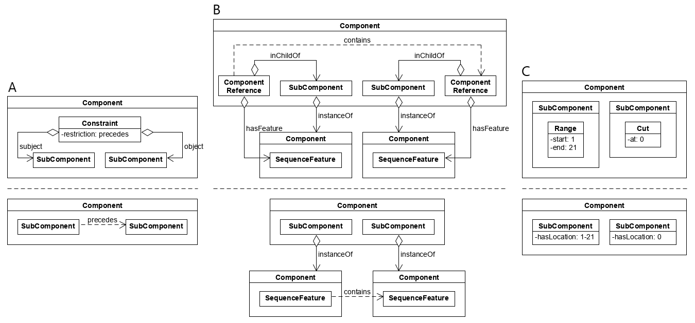

**Figure 1:** Common visual abstractions in UML diagrams, including **(A)** representation of a `Constraint` between two `Features` (in this case, `SubComponents`), **(B)** representation of a `Constraint` between two `ComponentReferences` to `Features` (in this case, `SequenceFeatures`), and **(C)** representation of two different types of `Location`.

#### Composite Part 

Figure 2 and Figure 3 illustrate two ways of representing the composite part BBa_K093005, one with `Locations` and one with `Constraints`. BBa_K093005 is a product of assembling the RBS BBa_B0034 and CDS BBa_E1010 in accordance with the BioBrick RFC10 standard. A scar is formed between the parts as a result of their assembly. 

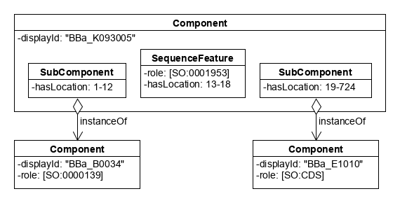

**Figure 2:** Composite part example UML diagram with `Locations`. 

**Figure 3:** Composite part example UML diagram with `Constraints`.

#### Backbone 

Figure 4 and Figure 5 illustrate two ways of representing the plasmid vector pSB1C3, one with `Locations` and one with `Constraints`. pSB1C3 includes the prefix and suffix of the BioBrick RFC 10 assembly standard (BBa_G00000 and BBa_G00001, respectively) and an insertion site between these flanking sequences. 

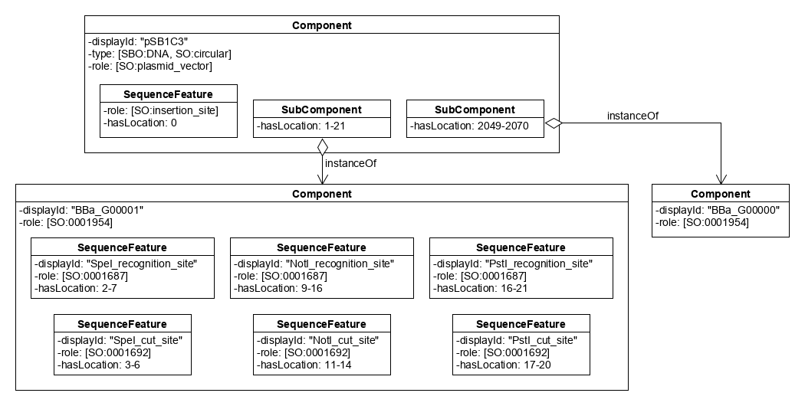

**Figure 4:** Backbone example UML diagram with flanking sequences and `Locations`. The contents of BBa_G00000 are purposefully omitted for simplicity of presentation.

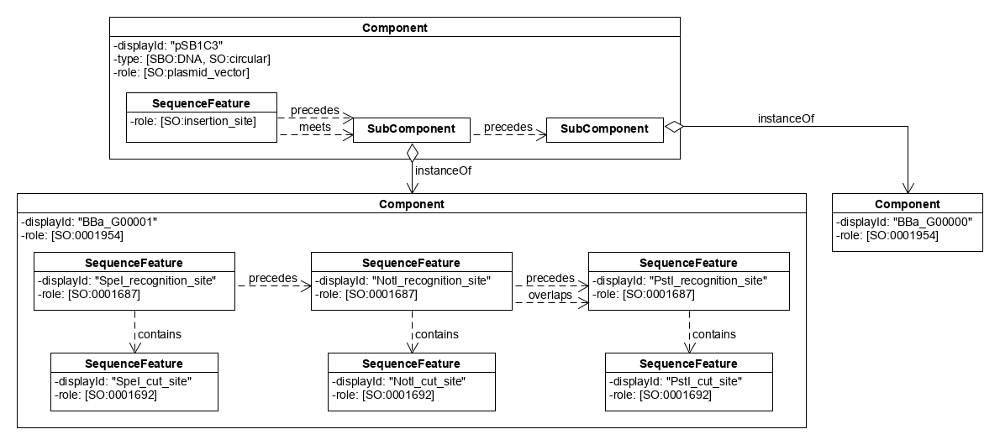

**Figure 5:** Backbone example UML diagram with flanking sequences and `Constraints`. The contents of BBa_G00000 are purposefully omitted for simplicity of presentation.

#### Part in Backbone 

Figures 6, 7, 8, and 9 illustrate different ways of representing the plasmid vector pSB1C3 with a BBa_E1010 insert. Figure 6 and Figure 7 show how to represent BBa_E1010 in pSB1C3 with `Locations` and `Constraints`, respectively.

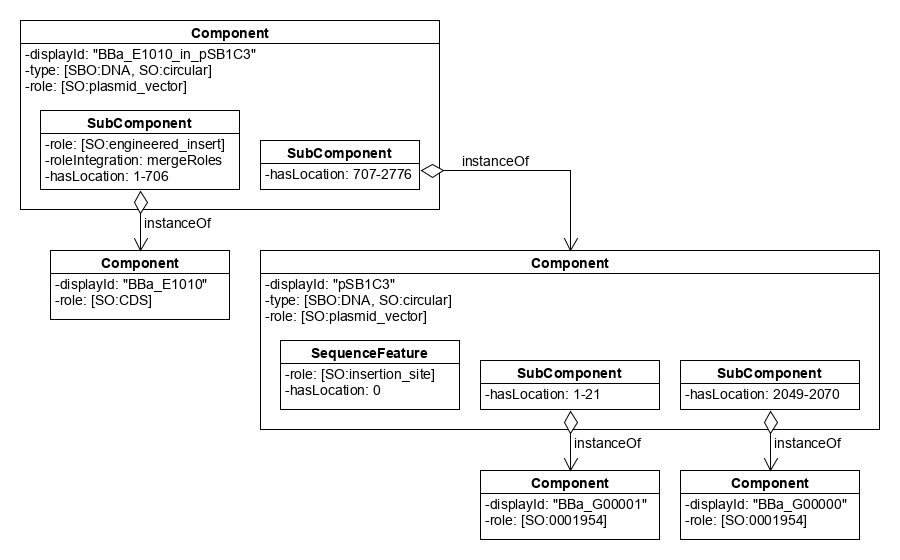

**Figure 6:** Part in backbone example UML diagram with flanking sequences in backbone and `Locations`. The contents of BBa_G00000 and BBa_G00001 are purposefully omitted for simplicity of presentation.

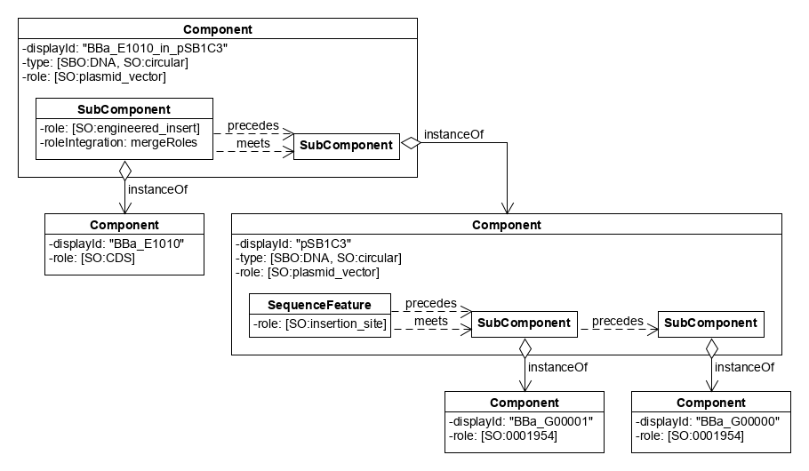

**Figure 7:** Part in backbone example UML diagram with flanking sequences in backbone and `Constraints`. The contents of BBa_G00000 and BBa_G00001 are purposefully omitted for simplicity of presentation.

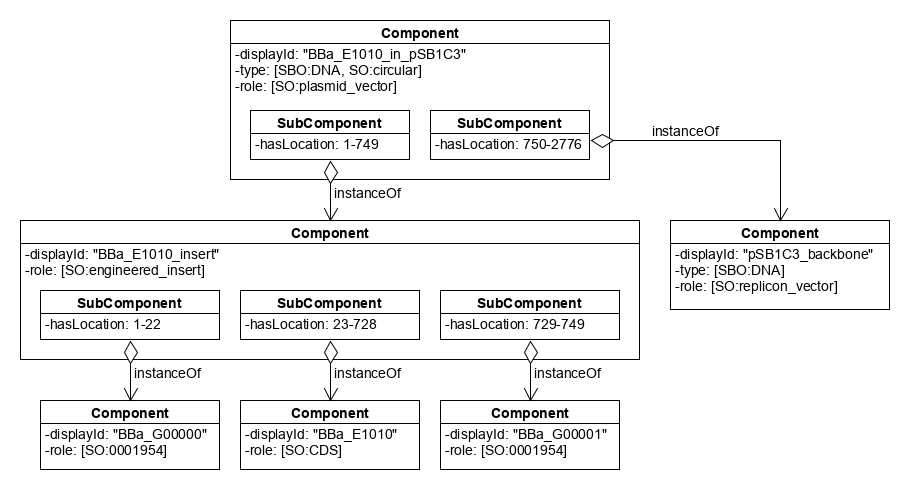

By contrast, Figure 8 and Figure 9 show two ways to represent the assembly flanking sequences as part of the BBa_E101 insert instead of the pSB1C3 backbone. In Figure 8, these flanking sequences are the BioBrick RFC 10 prefix and suffix, but in Figure 9 they are overhangs resulting from cleaving the prefix and suffix with the restriction enzymes XbaI and PstI. Note that these overhangs are still contained by the RFC 10 prefix and suffix in the context of the overall "part in backbone" representation in Figure 9.

**Figure 8:** Part in backbone example UML diagram with flanking sequences in part insert and `Locations`. The contents of BBa_G00000 and BBa_G00001 are purposefully omitted for simplicity of presentation.

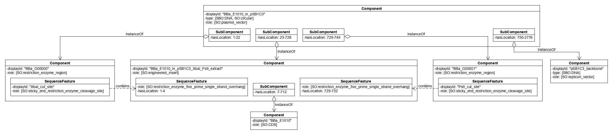

**Figure 9:** Part in backbone example UML diagram with flanking sequences in part insert/extract and `Locations`. The contents of BBa_G00000 and BBa_G00001 are purposefully omitted for simplicity of presentation.

#### Part Extract 

Figure 10 and Figure 11 illustrate two ways of representing the result of extracting a BBa_E1010 insert from pSB1C3, one with `Locations` and one with `Constraints`. Extraction was done using the XbaI and PstI restriction enzymes.

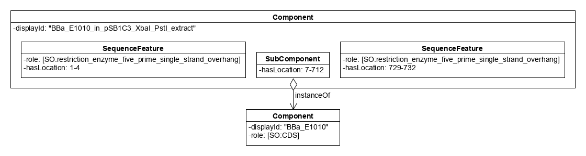

**Figure 10:** Part extract example UML diagram with `Locations`.

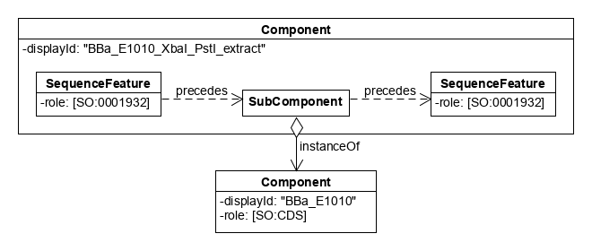

**Figure 11:** Part extract example UML diagram with `Constraints`.

#### Assembly 

Figure 12 illustrates one way of representing the assembly of BBa_B0034 and BBa_E1010 into BBa_K093005 in accordance with the BioBrick RFC10 standard. Extraction of BBa_B0034 its part in backbone is represented with the EcoRI and SpeI restriction enzymes as participants, while extraction of BBa_E1010 is represented with the XbaI and PstI restriction enzymes as participants. The resulting part extracts with the appropriate overhangs are then represented as participants in their ligation into BBa_K093005. The positions of features within all parts and backbones are specified using `Locations`, and parts in backbones are represented with the flanking sequences for assembly placed in the pSB1C3 backbone as opposed to their engineering inserts.

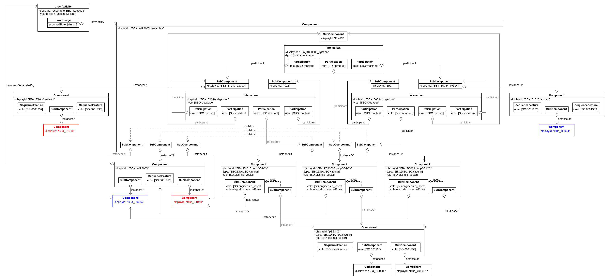

**Figure 12:** Assembly example UML diagram with flanking sequences in backbone and `Locations`. The contents of BBa_G00000 and BBa_G00001 are purposefully omitted for simplicity of presentation. Objects are color-coded based on what they represent: orange is for the assembly plan, blue is for backbone, green is for part in backbone, yellow is for composite part, and pink is for part extract.

## 4. Backwards Compatibility 

This SEP does not modify any existing definitions, and is thus backward compatible with SBOL 3.0.1

## 5. Discussion 

It would be desirable to link assembly more explicitly to protocols using the PAML protocol representation ([http://bioprotocols.org](http://bioprotocols.org)).
The recommendations in this SEP for representing assembly may be updated or followed by another SEP as that work becomes more mature.

Although representation of genomic integration is not explicitly within scope of this SEP, in many cases genomic integration can be represented in the same was as insertion of a part into a backbone. This can be done simply by substituting the genome for the backbone.

Specific recommendations regarding device measurements are out of scope of this SEP.

## 6. Competing SEPs 

None at present

References 
----------------

[pip]: https://pip.pypa.io/
[npm]: https://www.npmjs.com/
[Maven]: https://maven.apache.org/
[apt]: https://manpages.debian.org/bullseye/apt/apt.8.en.html

Copyright 
-------------

  
   
  To the extent possible under law,
  <a rel="dct:publisher"
     href="sbolstandard.org">
    SBOL developers</a>
  has waived all copyright and related or neighboring rights to
  SEP 055.
This work is published from:

  United States.

